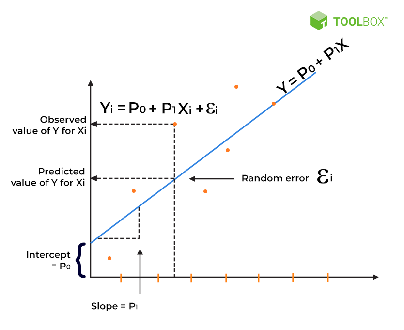
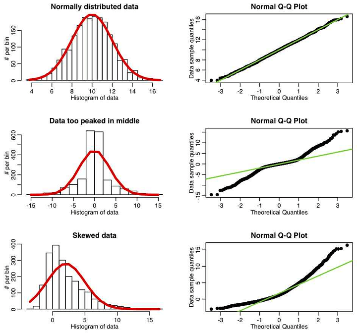
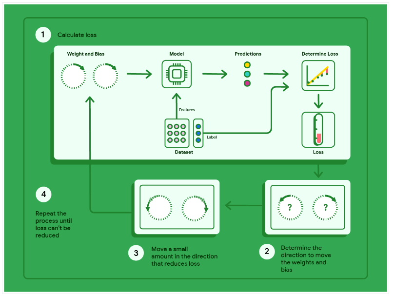

# Tema 2. Sistemas de aprendizaje automático supervisado

## 4. Regresión Lineal

1. Introducción a la regresión lineal
2. Fundamentos matemáticos de la regresión lineal
3. Optimización mediante mínimos cuadrados (OLS)
4. Comparación entre el método OLS y el descenso de gradiente en regresión lineal
5. Variantes de la función de pérdida
6. Evaluación y métricas del modelo de regresión
7. Generalización y regularización en modelos de regresión
8. Diagnóstico y gráficos interpretativos
9. Ejemplo práctico en Python

---

### Introducción a la regresión lineal

La regresión lineal es una técnica básica en el aprendizaje supervisado y la estadística, ampliamente utilizada para analizar y modelar relaciones entre variables. En su forma más simple, la regresión lineal busca establecer una relación lineal entre una variable dependiente o respuesta (y) y una o más variables independientes o predictoras (x). **Este modelo se basa en la premisa de que los cambios en las variables independientes pueden explicar o predecir cambios en la variable de interés mediante una relación lineal.**

La popularidad de la regresión lineal en el ámbito de la Inteligencia Artificial y la ciencia de datos se debe a su simplicidad, interpretabilidad y eficiencia computacional. La regresión lineal no solo permite obtener predicciones numéricas sino que, al mismo tiempo, facilita la interpretación de las relaciones entre las variables. Este aspecto interpretativo es crucial en aplicaciones donde se requiere transparencia y comprensión del modelo.

#### Motivación y aplicaciones prácticas

La regresión lineal es particularmente útil en aplicaciones de negocio, ciencia e ingeniería, en situaciones en las que se desea **modelar tendencias, realizar proyecciones o identificar patrones subyacentes en los datos**. Algunos ejemplos de uso incluyen la predicción de ventas en función de factores de mercado, el análisis de precios de viviendas según características físicas y geográficas, o la estimación de valores financieros como los ingresos de una empresa a partir de su desempeño anterior.

> **Ejemplo**: En el contexto de la predicción de precios de viviendas, se puede emplear un modelo de regresión lineal para predecir el precio de una casa ($Y$) en función de características como el tamaño ($X_1$), el número de habitaciones ($X_2$), o la edad del inmueble ($X_3$). El modelo permite no solo hacer estimaciones del precio en función de estos factores, sino también interpretar cómo cada característica afecta el valor, ayudando a los agentes inmobiliarios a tomar decisiones informadas.

#### La importancia de los datos y la selección de características

Para que la regresión lineal sea efectiva, la calidad de los datos y la elección de las variables predictoras son factores determinantes. La precisión del modelo dependerá en gran medida de la relevancia de las variables seleccionadas y de la calidad de los datos empleados para entrenarlo. En la práctica, esto implica asegurar que las variables utilizadas estén realmente relacionadas con la variable de salida y que los datos estén libres de sesgos, valores atípicos o errores.

La selección de características es una etapa crítica, ya que incluir variables irrelevantes puede reducir la precisión del modelo y aumentar su complejidad, generando resultados engañosos o difíciles de interpretar. Para ello, se recomienda realizar un análisis exploratorio de datos (EDA) antes de proceder al modelado, a fin de identificar las variables más significativas y excluir las que no aportan valor predictivo.

**Para reflexionar…**

> **¿Qué limitaciones puede presentar un modelo de regresión lineal cuando se utiliza con datos de baja calidad o cuando las variables predictoras no están adecuadamente seleccionadas?**
> **Clave**: Considera cómo la regresión lineal asume una relación lineal y se ve afectada por datos sesgados o variables irrelevantes.


> [!important]
>
> En resumen, la regresión lineal es una técnica versátil y accesible que permite modelar relaciones lineales y hacer predicciones basadas en datos históricos. Sin embargo, para aprovechar al máximo esta técnica, es fundamental seleccionar cuidadosamente las variables predictoras y garantizar la calidad de los datos.

### Fundamentos matemáticos de la regresión lineal

La regresión lineal se basa en la construcción de una relación matemática entre una variable dependiente $y$ y una o varias variables independientes $x_i$. En su forma más simple, conocida como regresión lineal simple, el modelo relaciona $y$ con una sola variable $x$. El objetivo es encontrar una función lineal que minimice la diferencia entre los valores observados de $y$ y los valores predichos por el modelo.

#### Representación algebraica del modelo de regresión lineal

Como se ha comentado, en la regresión lineal simple, la relación entre $y$ y $x$ se modela mediante la siguiente ecuación:

$$
y = \beta_0 + \beta_1 x + \epsilon
$$

donde:

- $y$ es la variable dependiente o de respuesta.
- $x$ es la variable independiente o predictora.
- $\beta_0$ es el intercepto (valor de $y$ cuando $x = 0$), y representa el punto en el que la recta de regresión corta el eje $y$.
- $\beta_1$ es la pendiente de la recta, que indica el cambio esperado en $y$ por cada incremento unitario en $x$. Un valor positivo implica que $y$ aumenta a medida que $x$ aumenta, y un valor negativo indica lo contrario.
- $\epsilon$ representa el término de error o residuo, **que captura la variabilidad en $y$ que no puede explicarse por $x$.**



Pero en su caso más general, la regresión lineal se define como una técnica estadística que modela la relación entre **una variable dependiente $y$ y una o más variables independientes $x_i$.** La expresión más frecuente modela la relación para cada observación $y_i$ de la siguiente forma:

$$
y_i = \beta_0 + \beta_1 x_{i1} + \beta_2 x_{i2} + \dots + \beta_p x_{ip} + \epsilon_i
$$

En esta ecuación, el término $\epsilon_i$ representa el error o residuo, que refleja la diferencia entre el valor observado y el valor estimado por el modelo. Este término recoge el efecto de todas las variables que influyen en $y$ pero no están incluidas en el modelo como predictores.

Al igual que en el caso más simple se tiene que:

- **Intercepto ($\beta_0$)**: Representa el valor promedio de la variable respuesta $y$ cuando todas las variables predictoras son cero. Es el punto donde la línea de regresión cruza el eje $y$. En algunos casos, este valor puede no tener una interpretación práctica significativa si $x = 0$ está fuera del rango de datos observado. Sin embargo, es fundamental para definir la posición de la línea de regresión en el espacio de datos.
- **Coeficientes parciales de regresión ($\beta_j$)**: Cada coeficiente $\beta_j$ refleja el cambio promedio en $y$ asociado a un incremento de una unidad en la variable predictora correspondiente $x_j$, manteniéndose constantes el resto de variables. Si $\beta_j$ es positivo, significa que existe una relación directa entre $x_{ij}$ e $y_i$ (a medida que $x$ aumenta, $y$ también tiende a aumentar). Si es negativo, indica una relación inversa (a medida que $x$ aumenta, $y$ tiende a disminuir). Un valor de $\beta_1$ igual a cero implica que no existe una relación lineal entre entre $x_{ij}$ e $y_i$.
- **Error o residuo ($\epsilon$)**: Es la diferencia entre el valor observado $y_i$ y el valor predicho por el modelo. Representa el efecto de variables no incluidas en el modelo y su influencia en $y$.

#### Supuestos del modelo de regresión lineal

Para que el modelo de regresión lineal sea efectivo y válido en la práctica, deben cumplirse ciertos supuestos. Estos supuestos permiten que los estimadores no sean sesgados, eficientes y consistentes:

1. **Linealidad**: Existe una relación lineal entre la variable dependiente y las variables independientes. Esto implica que el cambio en $y$ es proporcional al cambio en $x$, y la relación se puede expresar mediante una línea recta.

2. **Independencia de los errores**: Los términos de error ($\epsilon$) son independientes entre sí. En particular, no deben existir correlaciones temporales ni espaciales en los errores, lo que significa que el error asociado a una observación no debe influir en los errores de otras observaciones.

   > **Ejemplo:** Supongamos que estamos modelando el número de accidentes de tráfico en una carretera en función de variables como el tráfico y las condiciones meteorológicas. Si los accidentes de tráfico tienen una dependencia temporal (por ejemplo, un accidente grande podría causar una congestión que aumenta la probabilidad de otro accidente poco tiempo después), los errores en las predicciones de nuestro modelo no serían independientes. Esto es porque el error asociado a un accidente en un momento dado influye en el error de la predicción del siguiente accidente, creando una correlación entre los errores de las observaciones consecutivas.
   >
   > Este problema es común en series temporales, donde los eventos pasados pueden influir en los futuros. Si nuestro modelo no tiene en cuenta esta dependencia, podría presentar errores correlacionados que violan el supuesto de independencia.

3. **Homocedasticidad**: La varianza de los errores es constante para todos los valores de $x$. Esto se conoce como homocedasticidad. Si la varianza de los errores cambia con los valores de $x$ (es decir, si hay *heterocedasticidad*), el modelo puede ser ineficiente y producir estimaciones erróneas de la significancia de las variables.

   > **Ejemplo:** Supongamos que estamos estudiando el efecto del número de horas de estudio en el rendimiento académico de los estudiantes en un examen. Hemos ajustado un modelo de regresión lineal que predice la puntuación del examen en función del número de horas de estudio.
   >
   > Si el modelo muestra homocedasticidad, los residuos (las diferencias entre las puntuaciones observadas y las predichas por el modelo) deben tener una varianza constante a lo largo de todos los niveles de la variable independiente (número de horas de estudio).
   >
   > Esto significa que tanto para los estudiantes que estudiaron pocas horas como para los que estudiaron muchas horas, los residuos deberían dispersarse de manera similar alrededor de la línea de regresión. Un gráfico de residuos en este caso mostraría una nube de puntos aleatorios distribuidos uniformemente alrededor de la línea de cero, sin patrones visibles.

4. **Normalidad de los errores**: Los errores ($\epsilon$) deben seguir una distribución normal con media cero. Este supuesto es importante para la inferencia estadística y las pruebas de hipótesis. Si los errores no son normales, el modelo aún puede ser válido, pero las pruebas de significancia pueden ser menos confiables.

   > **Ejemplo:** Al predecir el peso de una persona según su altura, los errores de predicción deberían distribuirse normalmente alrededor de cero. Esto permite aplicar pruebas de significancia confiables y construir intervalos de confianza para los coeficientes del modelo.


> [!note]
>
> El supuesto de normalidad es fundamental en la regresión lineal para llevar a cabo **inferencias estadísticas y pruebas de hipótesis** confiables. La normalidad de los errores permite que se apliquen ciertos métodos estadísticos para evaluar la significancia de los coeficientes del modelo o calcular intervalos de confianza. 
>
> Si los errores no siguen una distribución normal, el modelo de regresión lineal aún puede ajustarse y realizar predicciones, pero los resultados de las pruebas de significancia y los intervalos de confianza pueden ser menos precisos. La falta de normalidad en los errores suele indicar que el modelo puede no capturar toda la estructura de los datos, o que ciertos valores extremos (outliers) afectan a los errores. En estos casos las pruebas de significancia y los intervalos de confianza pueden ser **conservadores o inexactos**, haciendo que los resultados del modelo sean menos confiables. Existen métodos de regresión robusta o transformaciones de datos que pueden ayudar a corregir estos problemas si los errores presentan una distribución sesgada o contienen outliers.
>
> 


> [!Note]
>
> Una **prueba de significancia** es una forma de comprobar si los resultados que ves en tus datos tienen sentido y no son solo una coincidencia. Es como si estuvieras tratando de decidir si una tendencia observada es real o si simplemente ocurrió por casualidad.
>
> Supongamos que tienes un dado y quieres saber si es justo (es decir, que todos los números tienen la misma probabilidad de salir). Tiras el dado muchas veces y notas que el número 6 sale mucho más de lo esperado. Ahora, te preguntas: **¿Es esto una prueba de que el dado está cargado, o podría ser solo una casualidad?**
>
> Aquí es donde entra una prueba de significancia:
> - **Hipótesis nula ($H_0$)**: El dado es justo.
> - **Hipótesis alternativa ($H_a$)**: El dado no es justo (hay un sesgo que favorece al 6).
>
> La prueba de significancia te ayuda a decidir si puedes confiar en tus resultados para rechazar la hipótesis nula y aceptar que el dado probablemente no es justo. Lo haces calculando un **valor p**, que te dice qué tan probable es obtener tus resultados por pura casualidad. Si este valor es muy pequeño (por ejemplo, menor al 5%, que es un umbral común), decides que el resultado es significativo y que el dado podría estar cargado.
>
> **Cuando construyes un modelo de regresión**, quieres saber si cada variable que has incluido realmente tiene un impacto en el resultado. Por ejemplo, si estás prediciendo el precio de una casa, podrías preguntarte si el número de baños realmente importa.
>
> - **Hipótesis nula ($H_0$)**: El número de baños no tiene un impacto significativo en el precio de la casa.
> - **Hipótesis alternativa ($H_a$)**: El número de baños sí tiene un impacto significativo.
>
> Usas una prueba de significancia para cada variable. Si el valor p asociado con la variable "número de baños" es menor que el umbral que has establecido (digamos, 0.05), puedes decir con bastante confianza que el número de baños es importante para predecir el precio.
>
> El **valor p** es una forma de medir cuán raro es tu resultado si la hipótesis nula fuera cierta. Un valor p bajo (por ejemplo, 0.01) significa que hay solo un 1% de probabilidad de que tus resultados sean una coincidencia si la hipótesis nula fuera verdadera. Por eso, si el **valor p** es menor que tu nivel de significancia (como 0.05), tienes suficiente evidencia para rechazar la hipótesis nula y pensar que tu resultado es significativo.
>

**Para reflexionar…**

> **¿Por qué es importante verificar los supuestos del modelo de regresión lineal antes de interpretarlo?**
> **Clave**: Reflexiona sobre cómo el incumplimiento de los supuestos de linealidad, independencia y homocedasticidad puede afectar la validez de las inferencias obtenidas del modelo.

#### Conclusión

> [!important]
>
> El modelo de regresión lineal simple, aunque sencillo, proporciona una herramienta poderosa para identificar y cuantificar relaciones lineales entre variables. La comprensión y verificación de los supuestos subyacentes, así como la interpretación precisa de los coeficientes, son pasos críticos para asegurar que el modelo sea robusto y confiable. Este rigor matemático y estadístico subyace en el éxito de la regresión lineal en aplicaciones prácticas en inteligencia artificial y ciencia de datos.

### Optimización mediante mínimos cuadrados (OLS)

En regresión lineal, el objetivo principal es ajustar un modelo que minimice la diferencia entre los valores observados de la variable dependiente $y$ y los valores predichos por el modelo. Unos de los procesos más utilizados en regresión lineal para este menester se conoce con la denominación de **ajuste de mínimos cuadrados** y permite encontrar los valores óptimos de los coeficientes del modelo, tanto en la regresión lineal simple como en la regresión lineal múltiple.

#### Introducción: Optimización en regresión lineal simple

Para ilustrar el concepto, comenzamos con el caso de la **regresión lineal simple**, en el que se ajusta una línea recta para modelar la relación entre una variable dependiente $y$ y una única variable independiente $x$. En este caso, la ecuación del modelo es:

Para resolver el problema de mínimos cuadrados ordinarios (OLS, por sus siglas en inglés) en un modelo de **regresión lineal simple**, partimos de la ecuación:

$$
y = \beta_0 + \beta_1 x + \epsilon
$$

El objetivo es encontrar los valores de $\beta_0$ y $\beta_1$ que minimicen la **suma de los errores cuadráticos** entre los valores observados $y_i$ y los valores predichos $\hat{y}_i$, calculados con el modelo:

$$
\text{Suma de errores cuadráticos} = \sum_{i=1}^n (y_i - \hat{y}_i)^2
$$

donde $n$ es el número de observaciones.

##### Desarrollo del método OLS

###### Paso 1: Expresión del valor predicho

Para cada observación $i$, el valor predicho $\hat{y}_i$ se calcula mediante la ecuación del modelo:

$$
\hat{y}_i = \beta_0 + \beta_1 x_i
$$

Por lo tanto, el error (o residuo) para cada observación $i$ es la diferencia entre el valor observado $y_i$ y el valor predicho $\hat{y}_i$:

$$
\epsilon_i = y_i - \hat{y}_i = y_i - (\beta_0 + \beta_1 x_i)
$$

###### Paso 2: Definición de la función de pérdida

La función de pérdida para OLS es la **suma de los errores cuadráticos**, que se define como:

$$L(\beta_0, \beta_1) = \sum_{i=1}^{n}(y_i - \hat{y}_i)^2 = \sum_{i=1}^{n} (y_i - (\beta_0 + \beta_1 x_i))^2$$

L(β₀, β₁) = Σ(i=1 to n) (yᵢ - (β₀ + β₁xᵢ))²

El objetivo es encontrar los valores de $\beta_0$ y $\beta_1$ que minimicen esta función de pérdida $L(\beta_0, \beta_1)$.

###### Paso 3: Derivación parcial de la función de pérdida

Para minimizar $L(\beta_0, \beta_1)$, tomamos las derivadas parciales de $L$ con respecto a $\beta_0$ y $\beta_1$, y las igualamos a cero.

1. Derivada parcial con respecto a $\beta_0$:

$$
   \frac{\partial L}{\partial \beta_0} = -2 \sum_{i=1}^n (y_i - \beta_0 - \beta_1 x_i)
$$

2. Derivada parcial con respecto a $\beta_1$:

$$
   \frac{\partial L}{\partial \beta_1} = -2 \sum_{i=1}^n x_i (y_i - \beta_0 - \beta_1 x_i)
$$

Igualando estas derivadas a cero, obtenemos el **sistema de ecuaciones normales**:

$$
\sum_{i=1}^n y_i = n \beta_0 + \beta_1 \sum_{i=1}^n x_i
$$

$$
\sum_{i=1}^n x_i y_i = \beta_0 \sum_{i=1}^n x_i + \beta_1 \sum_{i=1}^n x_i^2
$$

###### Paso 4: Resolución del sistema de ecuaciones normales

Despejamos $\beta_0$ y $\beta_1$ a partir del sistema:

1. Calculamos $\beta_1$:

$$
   \beta_1 = \frac{\sum_{i=1}^n (x_i - \bar{x})(y_i - \bar{y})}{\sum_{i=1}^n (x_i - \bar{x})^2}
$$

   donde $\bar{x} = \frac{1}{n} \sum_{i=1}^n x_i$ y $\bar{y} = \frac{1}{n} \sum_{i=1}^n y_i$ son las medias de $x$ e $y$, respectivamente.

2. Calculamos $\beta_0$:

$$
   \beta_0 = \bar{y} - \beta_1 \bar{x}
$$

- La **pendiente** $\beta_1$ mide el cambio en $y$ por cada cambio unitario en $x$.
- El **intercepto** $\beta_0$ es el valor de $y$ cuando $x = 0$.

Estos valores de $\beta_0$ y $\beta_1$ son los que minimizan la suma de los errores cuadráticos, proporcionando la mejor línea de ajuste según el método de mínimos cuadrados.

#### Generalización a regresión lineal múltiple

En la regresión lineal múltiple, se extiende el modelo a más variables independientes $x_1, x_2, \dots, x_p$, y el sistema de ecuaciones normales se resuelve **utilizando álgebra matricial** para encontrar los valores óptimos de todos los coeficientes $\beta_j$.

$$
y = \beta_0 + \beta_1 x_1 + \beta_2 x_2 + \dots + \beta_p x_p + \epsilon
$$

O lo que es lo mismo, **para cada observación ($i$)** tendremos que:

$$
y_i = \beta_0 + \sum_{j=1}^{p}{\beta_jx_{ij}} + \epsilon_i
$$

El objetivo es estimar los coeficientes $\beta_0, \beta_1, \dots, \beta_p$ de manera que la ecuación prediga $y$ de forma óptima en función de las variables independientes $x_1, x_2, \dots, x_p$.

En esta ocasión, el problema de mínimos cuadrados se define como:

$$
L(\beta_j) = \sum_{i=1}^n (y_i - \hat{y}_i)^2
$$

donde:
- $y_i$ es el valor observado de $y$ para la observación $i$.
- $\hat{y}_i$ es el valor predicho de $y$ para la observación $i$, calculado con la ecuación del modelo.
- $n$ es el número total de observaciones.

Minimizar esta suma implica ajustar la línea o el plano de regresión que minimice la distancia cuadrática entre los valores observados y predichos.

##### Formulación matricial de OLS en regresión múltiple

En la regresión lineal múltiple, el cálculo de los coeficientes se simplifica utilizando una representación matricial. Definimos:

- $y = \begin{bmatrix} y_1 \\ y_2 \\ ... \\ y_n \end{bmatrix}$ como el vector de la variable dependiente.
- $X = \begin{bmatrix} 1 & x_{11} & x_{12} & \dots & x_{1p} \\ 1 & x_{21} & x_{22} & \dots & x_{2p} \\ \vdots & \vdots & \vdots & \ddots & \vdots \\ 1 & x_{n1} & x_{n2} & \dots & x_{np} \end{bmatrix}$ como la matriz de diseño que incluye un vector de unos para el intercepto.
- $\beta = \begin{bmatrix} \beta_0 \\ \beta_1 \\ \vdots \\ \beta_p \end{bmatrix}$ como el vector de coeficientes.
- $\epsilon = \begin{bmatrix} \epsilon_1 \\ \epsilon_2 \\ \vdots \\ \epsilon_n \end{bmatrix}$ como el vector de errores.

Entonces, la ecuación de regresión múltiple se puede escribir como:

$$
y = X \beta + \epsilon
$$

Para deducir el valor óptimo de $\beta$ en el caso de la **regresión lineal múltiple**, partimos de la función de pérdida que representa la **suma de los errores cuadráticos** en notación matricial. El objetivo es minimizar esta función para obtener los coeficientes $\hat{\beta}$ que mejor se ajusten a los datos.

En notación matricial, la función de pérdida $L(\beta)$ para mínimos cuadrados ordinarios se podría escribir como:

$$
L(\beta) = (y - X \beta)^T (y - X \beta)
$$

Expandiendo esta expresión, obtenemos:

$$
L(\beta) = y^T y - 2 y^T X \beta + \beta^T X^T X \beta
$$

Para encontrar el valor de $\beta$ que minimiza $L(\beta)$, tomamos la derivada parcial de $L(\beta)$ con respecto a $\beta$ y la igualamos a cero. Esto se expresa como:

$$
\frac{\partial L(\beta)}{\partial \beta} = -2 X^T y + 2 X^T X \beta
$$

Igualando esta derivada a cero para encontrar el mínimo:

$$
-2 X^T y + 2 X^T X \beta = 0
$$

Simplificamos nos quedaría que:

$$
X^T X \beta = X^T y
$$

Esta es la **ecuación normal** de mínimos cuadrados. Para despejar $\beta$, multiplicamos ambos lados por la inversa de $X^T X$ (asumiendo que $X^T X$ es invertible):

$$
\beta = (X^T X)^{-1} X^T y
$$

Este resultado nos da la estimación de $\beta$ que minimiza la suma de los errores cuadráticos:

$$
\hat{\beta} = (X^T X)^{-1} X^T y
$$

donde:

- $X^T$ es la transpuesta de $X$, que convierte las filas en columnas y viceversa.
- $(X^T X)^{-1}$ es la inversa de la matriz $X^T X$, permitiendo resolver la ecuación para $\beta$.

> [!important]
>
> La expresión $\hat{\beta} = (X^T X)^{-1} X^T y$ representa los **coeficientes de regresión estimados** que mejor se ajustan a los datos en el sentido de mínimos cuadrados, minimizando la suma de los errores cuadráticos entre los valores observados y los valores predichos por el modelo.

> ##### Ejemplo de cálculo manual de los coeficientes en regresión lineal múltiple
>
> Imaginemos un modelo simple de regresión múltiple que predice el precio de una vivienda ($y$) en función de dos variables independientes: el tamaño de la vivienda ($x_1$) y el número de habitaciones ($x_2$). 
>
> Supongamos que los datos son los siguientes:
> 
>$$
> \begin{array}{ccc}
> \text{Tamaño (m}^2\text{)} & \text{Habitaciones} & \text{Precio (en miles)} \\
> 50 & 1 & 100 \\
> 80 & 2 & 150 \\
> 100 & 3 & 200 \\
> \end{array}
>$$
> 
> En este caso:
>
> 1. Construimos la matriz de diseño $X$:
>
>$$
> X = \begin{bmatrix} 1 & 50 & 1 \\ 1 & 80 & 2 \\ 1 & 100 & 3 \end{bmatrix}
>$$
>
> 2. Definimos el vector de la variable dependiente $y$:
>
>$$
>    y = \begin{bmatrix} 100 \\ 150 \\ 200 \end{bmatrix}
>$$
>
> 3. Calculamos $X^T X$ y $X^T y$:
>
>$$
>    X^T X = \begin{bmatrix} 3 & 230 & 6 \\ 230 & 13300 & 310 \\ 6 & 310 & 14 \end{bmatrix}
>$$
>    
>$$
>X^T y = \begin{bmatrix} 450 \\ 23300 \\ 510 \end{bmatrix}
>$$
>
> 4. Faltaría sustituir y calcular para $\hat{\beta}$:
>
>$$
>\hat{\beta} = (X^T X)^{-1} X^T y
>$$
>
> El resultado de este cálculo proporciona los valores de los coeficientes estimados, que minimizan el error cuadrático entre los valores predichos y observados, permitiendo así que el modelo sea lo más preciso posible.
>

> [!important]
>
> El método de mínimos cuadrados ordinarios permite optimizar el modelo de regresión lineal, minimizando los errores de predicción. La formulación matricial en la regresión múltiple hace que el proceso sea más eficaz, proporcionando una herramienta para estimar con precisión los efectos de múltiples variables independientes sobre la variable dependiente.

### Comparación entre el método de mínimos cuadrados ordinarios (OLS) y el descenso de gradiente en regresión lineal

En los modelos de **regresión lineal**, una de las principales tareas es ajustar los parámetros o coeficientes $\beta$ para minimizar el error de las predicciones. Existen distintos métodos para realizar este ajuste, siendo los dos más relevantes el **método de mínimos cuadrados ordinarios (OLS)** y el **descenso de gradiente**. En esta sección se exploran ambos métodos en profundidad, considerando sus ventajas y limitaciones en el contexto de modelos de regresión lineal.

Como ya hemos visto en la sección anteior, en regresión lineal, el **método de mínimos cuadrados ordinarios** permite obtener una **solución exacta** para los coeficientes del modelo mediante una fórmula directa. Este método se basa en minimizar el **Error Cuadrático Medio (MSE)**, que mide el promedio de los errores al cuadrado entre los valores predichos y los valores observados.

OLS presenta importantes **ventajas** cuando se aplica a modelos de regresión lineal. Una de sus características principales es su **exactitud**, ya que **proporciona una solución cerrada**: calcula el valor exacto de los coeficientes que minimizan el error cuadrático medio (MSE) en una única operación. Este método es particularmente eficiente en conjuntos de datos de tamaño pequeño o mediano, donde el cálculo es rápido y computacionalmente barato. Además, OLS es un método estable que garantiza una convergencia rápida y precisa hacia el mínimo global, siempre que la matriz $X^T X$ sea invertible.

Sin embargo, OLS también tiene ciertas **limitaciones**. Su escalabilidad es un desafío cuando se aplica a volúmenes de datos grandes, ya que el cálculo de la matriz inversa $(X^T X)^{-1}$ puede ser muy costoso en términos de tiempo y memoria. Otra limitación importante es su aplicabilidad en entornos de datos en flujo o streaming, ya que el método requiere que todos los datos estén disponibles de antemano, restringiendo su uso en sistemas que manejan datos continuos. Estas limitaciones hacen que OLS no siempre sea adecuado en escenarios de datos masivos o en tiempo real, donde otros métodos, como el descenso de gradiente, pueden resultar más adecuados.

#### Descenso de gradiente “al rescate”

El **descenso de gradiente** es un **método iterativo** de optimización que ajusta los coeficientes en pequeños pasos, acercándose progresivamente a la solución óptima. En cada iteración, el descenso de gradiente ajusta los coeficientes en función del gradiente de la función de pérdida con respecto a cada coeficiente:

$$
\beta_j^i = \beta_j^{i-1} - \alpha \frac{\partial L}{\partial \beta_j^{i-1}}
$$

donde:
- $L$ es la función de pérdida (en este caso, el MSE).
- $\alpha$ es la tasa de aprendizaje, que controla el tamaño de los pasos de ajuste.
- $\frac{\partial L}{\partial \beta_j}$ es el gradiente de la función de pérdida respecto al coeficiente $\beta_j$.

Es importante que en este caso la función de pérdida que estamos considerando es del tipo MSE y se define como: 

$$
L(\beta_0,\beta_1)=\frac{1}{n}\sum_{i=1}^{n}{(y_i−\hat{y}_i)^2}
$$

> [!note]
>
> Existen variantes del descenso de gradiente, como el **descenso de gradiente estocástico (SGD)**, que actualiza los coeficientes con cada observación o en lotes pequeños de datos (minibatches). Estas variantes son útiles en situaciones de grandes volúmenes de datos.



**El descenso de gradiente ofrece varias ventajas importantes** en contextos de datos complejos. Su capacidad de escalabilidad lo hace adecuado para conjuntos de datos grandes, ya que evita el cálculo directo de la inversa de matrices, una operación costosa en términos de tiempo y recursos en casos de gran volumen. Esta técnica también aporta flexibilidad en entornos de datos en flujo continuo, permitiendo la actualización de los coeficientes en tiempo real a medida que se incorporan nuevos datos. Además, el descenso de gradiente es adaptable a sistemas distribuidos, ya que puede ejecutarse en múltiples nodos de procesamiento, lo que lo convierte en una herramienta útil en infraestructuras de gran capacidad y grandes volúmenes de datos.

Sin embargo, **el método también presenta algunas limitaciones**. Al ser un proceso iterativo, el descenso de gradiente puede requerir un número elevado de iteraciones para alcanzar una solución óptima, lo que puede ser un inconveniente en términos de tiempo de cálculo. Otro factor importante es su sensibilidad a la tasa de aprendizaje ($\alpha$), cuya elección es crucial: si $\alpha$ es demasiado baja, la convergencia puede ser lenta, mientras que si es demasiado alta, el modelo puede no converger. A diferencia del método OLS, el descenso de gradiente **proporciona una solución aproximada en lugar de una exacta**, y su precisión depende tanto de la tasa de aprendizaje como del número de iteraciones realizadas.

> ##### Ejemplo: Descenso de Gradiente en Regresión Lineal
>
> Vamos a utilizar un conjunto de datos simple con tres puntos que siguen aproximadamente la relación lineal $y = 2x + 1$.
>
>$$
> \begin{array}{cc}
> x & y \\
> 1 & 3 \\
> 2 & 5 \\
> 3 & 7 \\
> \end{array}
>$$
>
> El objetivo es encontrar los valores óptimos de los coeficientes $\beta_0$ (intercepto) y $\beta_1$ (pendiente) para que el modelo $y = \beta_0 + \beta_1 x$ se ajuste lo mejor posible a los datos, minimizando el **Error Cuadrático Medio (MSE)**.
>
> **Paso inicial**: Establecemos valores iniciales de los coeficientes:
> 
>$$
> \beta_0 = 0, \quad \beta_1 = 0
>$$
>
> **Parámetros del modelo**:
>
> - **Tasa de aprendizaje**: $\alpha = 0.1$
> - **Número de iteraciones**: 2
>
> ###### Primera Iteración
>
> 1. **Calcular las predicciones** usando los valores iniciales $\beta_0 = 0$ y $\beta_1 = 0$:
> 
>$$
> \hat{y}_1 = 0 + 0 \cdot 1 = 0, \quad \hat{y}_2 = 0 + 0 \cdot 2 = 0, \quad \hat{y}_3 = 0 + 0 \cdot 3 = 0
>$$
>
> 2. **Calcular el error** para cada punto:
> 
>$$
> e_1 = y_1 - \hat{y}_1 = 3 - 0 = 3, \\ e_2 = y_2 - \hat{y}_2 = 5 - 0 = 5, \\ e_3 = y_3 - \hat{y}_3 = 7 - 0 = 7
>$$
>
> 3. **Calcular el gradiente** de la función de pérdida (MSE, en este caso) con respecto a $\beta_0$ y $\beta_1$:
>- Gradiente para $\beta_0$ (promedio de los errores) para el conjunto de observaciones ($i=1,2,3$):
> 
>    $$
>     \frac{\partial L}{\partial \beta_0} = -\frac{2}{n} \sum_{i=1}^n e_i = -\frac{2}{3} (3 + 5 + 7) = -\frac{2}{3} \cdot 15 = -10
> $$
>  - Gradiente para $\beta_1$ (promedio de los productos de error por $x$):
> $$
>     \frac{\partial L}{\partial \beta_1} = -\frac{2}{n} \sum_{i=1}^n x_i e_i = -\frac{2}{3} (1 \cdot 3 + 2 \cdot 5 + 3 \cdot 7) = -\frac{2}{3} (3 + 10 + 21) = -\frac{2}{3} \cdot 34 = -22.67
> $$
> 4. **Actualizar los coeficientes** usando la tasa de aprendizaje $\alpha = 0.1$:
> $$
>  \beta_0 = \beta_0 - \alpha \cdot \frac{\partial L}{\partial \beta_0} = 0 - 0.1 \cdot (-10) = 1
>$$
> 
> $$
>   \beta_1 = \beta_1 - \alpha \cdot \frac{\partial L}{\partial \beta_1} = 0 - 0.1 \cdot (-22.67) = 2.267
> $$
>  Después de la primera iteración:
> $$
>   \beta_0 = 1, \quad \beta_1 = 2.267
> $$
>###### Segunda Iteración
> 
> 1. **Calcular las predicciones** usando los nuevos valores de $\beta_0$ y $\beta_1$:
> $$
>   \hat{y}_1 = 1 + 2.267 \cdot 1 = 3.267, \quad \hat{y}_2 = 1 + 2.267 \cdot 2 = 5.534, \quad \hat{y}_3 = 1 + 2.267 \cdot 3 = 7.801
> $$
>2. **Calcular el error** para cada punto con las nuevas predicciones:
>$$
> e_1 = y_1 - \hat{y}_1 = 3 - 3.267 = -0.267, \\ e_2 = y_2 - \hat{y}_2 = 5 - 5.534 = -0.534, \\ e_3 = y_3 - \hat{y}_3 = 7 - 7.801 = -0.801
>$$
> 3. **Calcular el gradiente** de la función de pérdida con los nuevos errores:
> 
>   - Gradiente para $\beta_0$:
> $$
>    \frac{\partial L}{\partial \beta_0} = -\frac{2}{n} \sum_{i=1}^n e_i = -\frac{2}{3} (-0.267 - 0.534 - 0.801) = \frac{2}{3} \cdot 1.602 = 1.068
>$$
>   - Gradiente para $\beta_1$:
> $$
>    \frac{\partial L}{\partial \beta_1} = -\frac{2}{n} \sum_{i=1}^n x_i e_i = -\frac{2}{3} (1 \cdot -0.267 + 2 \cdot -0.534 + 3 \cdot -0.801) = \frac{2}{3} \cdot 3.738 = 2.492
> $$
>4. **Actualizar los coeficientes**:
>$$
>   \beta_0 = \beta_0 - \alpha \cdot \frac{\partial L}{\partial \beta_0} = 1 - 0.1 \cdot 1.068 = 0.8932
> $$
> 
> $$
>   \beta_1 = \beta_1 - \alpha \cdot \frac{\partial L}{\partial \beta_1} = 2.267 - 0.1 \cdot 2.492 = 2.0178
> $$
>  Después de la segunda iteración:
> $$
>   \beta_0 = 0.8932, \quad \beta_1 = 2.0178
> $$
> 
> Después de dos iteraciones, el modelo ha ajustado sus coeficientes de $\beta_0$ y $\beta_1$ acercándose a los valores que mejor se ajustan a los datos. En cada iteración, el gradiente proporciona la dirección para ajustar los coeficientes, y con una tasa de aprendizaje controlada, el modelo se aproxima gradualmente a los valores óptimos de los parámetros.

#### ¿Cuándo tiene sentido aplicar descenso de gradiente en regresión lineal?

El descenso de gradiente es especialmente útil en conjuntos de datos extremadamente grandes, donde el tamaño de los datos hace que la inversión de matrices sea costosa en términos de tiempo y memoria. En estos casos, el descenso de gradiente, especialmente en variantes como el **descenso de gradiente estocástico (SGD)**, permite trabajar en pequeños lotes de datos, optimizando la eficiencia computacional.

También es ventajoso en situaciones de datos en flujo o en streaming, en las que los datos llegan de forma continua o en tiempo real. Aquí, el descenso de gradiente permite actualizar el modelo sin necesidad de recalcular una solución exacta cada vez que llega un nuevo dato, adaptándose mejor a la naturaleza dinámica del entorno.

En entornos distribuidos, como grandes clusters o sistemas de procesamiento paralelo, el descenso de gradiente permite dividir el proceso de optimización en varios nodos, lo cual facilita el entrenamiento con grandes volúmenes de datos y mejora la escalabilidad del modelo.

> **Ejemplo**: En un modelo de predicción del precio de acciones en tiempo real, los datos de precios llegan continuamente en forma de flujo. En este caso, el descenso de gradiente permite ajustar el modelo conforme llegan los datos, proporcionando actualizaciones rápidas sin necesidad de esperar a recopilar todo el conjunto de datos.

#### ¿Cuándo es preferible el método OLS?

Para conjuntos de datos de tamaño pequeño o mediano, o en aquellos casos donde se conoce el conjunto completo de datos desde el inicio, el método OLS es la opción preferible. Su eficiencia y precisión lo hacen ideal para situaciones en las que se requiere una solución exacta en un conjunto de datos accesible. Además, es adecuado cuando el volumen de datos es manejable y no justifica el uso de un método iterativo. En contextos donde la precisión en la minimización del error es crítica, el cálculo directo de la solución mediante OLS resulta viable y efectivo.

> [!important]
>
> En regresión lineal, el **método OLS** y el **descenso de gradiente** representan enfoques distintos para ajustar los coeficientes del modelo. OLS proporciona una solución exacta y eficiente para conjuntos de datos de tamaño pequeño o medio, mientras que el descenso de gradiente es más adecuado en situaciones donde el volumen de datos es muy grande, los datos llegan en tiempo real o se dispone de infraestructura distribuida. La elección entre OLS y descenso de gradiente depende de las características de los datos y de los requisitos específicos del proyecto, en particular en cuanto a eficiencia computacional y precisión en el ajuste del modelo.

### Variantes de la función de pérdida

Como ya sabemos, en regresión lineal la **función de pérdida** cuantifica el error entre los valores predichos por el modelo y los valores observados, guiando el proceso de ajuste de los coeficientes para minimizar este error. A continuación se describen a título ilustrativo las funciones de pérdida más comunes en regresión lineal:

#### Error Cuadrático Medio (MSE)

Ya la hemos visto anteriormente. El **Error Cuadrático Medio (MSE)** es la función de pérdida más utilizada en regresión lineal. Esta función mide el promedio de los cuadrados de los errores (diferencias entre valores observados y predichos), penalizando los errores grandes más que los pequeños debido a la elevación al cuadrado:

$$
\text{MSE} = \frac{1}{n} \sum_{i=1}^n (y_i - \hat{y}_i)^2
$$

donde:
- $y_i$ es el valor observado de la variable dependiente en la observación $i$.
- $\hat{y}_i$ es el valor predicho por el modelo para la observación $i$.
- $n$ es el número total de observaciones.

Minimizar el MSE ayuda a obtener una línea de regresión que pase lo más cerca posible de todos los puntos de datos, pero el cuadrado de los errores significa que esta función de pérdida es sensible a los **valores atípicos (outliers)**.

#### Error Absoluto Medio (MAE)

El **Error Absoluto Medio (MAE)** es otra función de pérdida común que mide el promedio de los valores absolutos de los errores:

$$
\text{MAE} = \frac{1}{n} \sum_{i=1}^n |y_i - \hat{y}_i|
$$

A diferencia del MSE, el MAE no eleva los errores al cuadrado, por lo que trata todos los errores de forma lineal y es menos sensible a valores atípicos. Minimizar el MAE produce una línea de regresión que reduce las desviaciones promedio de los valores observados, pero el resultado puede no ser tan suave como el obtenido al minimizar el MSE.

#### Raíz del Error Cuadrático Medio (RMSE)

La **Raíz del Error Cuadrático Medio (RMSE)** es la raíz cuadrada del MSE:

$$
\text{RMSE} = \sqrt{\frac{1}{n} \sum_{i=1}^n (y_i - \hat{y}_i)^2}
$$

El RMSE tiene las mismas unidades que la variable dependiente $y$, lo que facilita la interpretación del error en términos absolutos. Minimizar el RMSE da resultados similares a minimizar el MSE, ya que ambos penalizan los errores grandes. Sin embargo, el RMSE es más intuitivo cuando se necesita interpretar el error en la misma escala que los datos originales.

#### Error Cuadrático Medio Logarítmico (MSLE)

El **Error Cuadrático Medio Logarítmico (MSLE)** es una función de pérdida que mide el MSE después de aplicar un logaritmo a los valores observados y predichos:

$$
\text{MSLE} = \frac{1}{n} \sum_{i=1}^n \left( \log(1 + y_i) - \log(1 + \hat{y}_i) \right)^2
$$

El MSLE es útil cuando se desea penalizar más las desviaciones relativas que las absolutas. Minimizar el MSLE es especialmente adecuado cuando se trabaja con datos en los que los errores relativos son más importantes que los absolutos, como en problemas de crecimiento exponencial.

#### Error Huber

El **Error Huber** es una función de pérdida híbrida entre el MSE y el MAE. Define un umbral $\delta$ y utiliza el MSE para errores pequeños y el MAE para errores grandes. Su fórmula es:

$$
L_{\delta}(y, \hat{y}) = \begin{cases} 
      \frac{1}{2} (y - \hat{y})^2 & \text{si } |y - \hat{y}| \leq \delta \\
      \delta |y - \hat{y}| - \frac{1}{2} \delta^2 & \text{si } |y - \hat{y}| > \delta 
   \end{cases}
$$

El Error Huber penaliza los errores grandes de manera lineal, lo que lo hace más robusto frente a valores atípicos. Minimizar esta función es útil cuando se desea una función de pérdida que combine la suavidad del MSE y la robustez del MAE.

> [!important]
>
> Cada función de pérdida ofrece ventajas en diferentes contextos y la elección depende de la naturaleza de los datos y del tipo de error que se desea minimizar.
>
> - **MSE**: Penaliza grandes errores, muy común en regresión.
> - **MAE**: Menos sensible a outliers, trata todos los errores de forma lineal.
> - **RMSE**: Interpretable en la misma escala que los datos, similar al MSE.
> - **MSLE**: Penaliza más los errores relativos, útil en problemas de crecimiento exponencial.
> - **Error Huber**: Combina la robustez del MAE y la suavidad del MSE, ideal para datos con outliers.

### Evaluación y métricas del modelo de regresión

En la evaluación de un modelo de **regresión lineal**, las métricas de error permiten cuantificar la precisión de las predicciones y la capacidad del modelo para generalizar a datos no vistos. Las métricas más utilizadas son el **Error Cuadrático Medio (MSE)**, el **Error Absoluto Medio (MAE)** y el **Coeficiente de Determinación ($R^2$)**, cada una con propiedades que aportan distintas perspectivas sobre el rendimiento del modelo. Ya hemos visto en el anterior apartado qué forma tienen el MSE y el MAE. Vamos a centrarnos ahora en el **Coeficiente de Determinación ($R^2$)**.

Para entender este coeficiente hay que empezar por entender qué entendemos por ***variabilidad***. Dicho término hace referencia a la dispersión en los valores de la **variable dependiente** (la que queremos predecir), es decir, qué tan lejos están los valores de la variable dependiente respecto a su promedio. Proporciona una idea de la **cantidad de fluctuación o cambio** en esos valores. En términos estadísticos, la variabilidad mide la **dispersión de los valores** de los datos alrededor de un centro (en este caso, el promedio $\bar{y}$).

En la regresión lineal, esta variabilidad total se cuantifica mediante la **Suma Total de los Cuadrados (SST)**:

$$
\text{SST} = \sum_{i=1}^n (y_i - \bar{y})^2
$$

donde:
- $y_i$ es el valor observado de la variable dependiente para cada observación,
- $\bar{y}$ es el promedio de los valores observados,
- $n$ es el número total de observaciones.

Esta fórmula muestra cómo cada valor $y_i$ se desvía del promedio $\bar{y}$, y al elevar cada diferencia al cuadrado, se evita que las diferencias negativas se cancelen con las positivas. Así, la SST nos da una **medida agregada de la dispersión** de todos los valores observados respecto al promedio.

En el contexto de un modelo de regresión lineal, la variabilidad en la variable dependiente se puede descomponer en dos partes:

1. **Variabilidad Explicada (SSR)**: Es la parte de la variabilidad total que el modelo logra explicar a través de las variables independientes. Representa la capacidad del modelo para captar la tendencia o estructura de los datos.

$$
   \text{SSR} = \sum_{i=1}^n (\hat{y}_i - \bar{y})^2 
$$

   donde $\hat{y}_i$ es el valor predicho por el modelo para la observación $i$. La SSR mide cuánto se acercan las predicciones del modelo al promedio de los datos observados, representando la variabilidad que el modelo puede explicar en función de las variables independientes.

2. **Variabilidad No Explicada (SSE)**: Es la variabilidad en los datos que el modelo no logra capturar, también llamada **Suma de los Errores al Cuadrado**. Representa la parte de la variabilidad que queda en los residuos o errores del modelo:

$$
   \text{SSE} = \sum_{i=1}^n (y_i - \hat{y}_i)^2 
$$

   Esta métrica mide la diferencia entre los valores observados y los valores predichos por el modelo, indicando cuánto se desvía el modelo de los datos reales. 

A partir de este punto ya podemos definir el **coeficiente de determinación $R^2$** como una medida de en qué proporción de la **variabilidad total (SST)** de la variable dependiente es explicada por el modelo (SSR) en comparación con la variabilidad no explicada (SSE). Es decir:

$$
R^2 = \frac{\text{SSR}}{\text{SST}} = 1 - \frac{\text{SSE}}{\text{SST}}
$$

Un valor alto de $R^2$ significa que el modelo explica gran parte de la variabilidad en la variable dependiente, mientras que un valor bajo indica que el modelo no captura adecuadamente las tendencias de los datos. El valor de $R^2$ varía entre 0 y 1, de modo que un $R^2$ cercano a 1 indica que el modelo explica bien la variabilidad en los datos, mientras que un $R^2$ cercano a 0 sugiere que el modelo no captura adecuadamente la variabilidad de la variable dependiente.

A diferencia del MSE y MAE, que son métricas absolutas, el $R^2$ ofrece una medida relativa de la calidad del ajuste del modelo en comparación con un modelo sin predictivos. Es especialmente útil para evaluar el grado en que el modelo se ajusta a los datos, aunque debe interpretarse con precaución en situaciones de sobreajuste, donde el modelo puede capturar ruido en lugar de patrones reales.

> ##### Selección de métricas según el objetivo
>
> La elección entre MSE, MAE y $R^2$ depende de los objetivos específicos del análisis y de las características de los datos:
> - El **MSE** es adecuado para problemas donde los errores grandes son particularmente indeseables y se requiere un ajuste fino en las predicciones.
> - El **MAE** es más robusto frente a outliers y útil cuando el objetivo es minimizar errores medianos de manera uniforme.
> - El **$R^2$** es una medida útil para evaluar el ajuste relativo del modelo y su capacidad para capturar la variabilidad de la variable dependiente.
>

### Generalización y regularización en modelos de regresión

En el análisis de modelos de regresión, la capacidad de **generalización** es fundamental para asegurar que un modelo funcione bien con datos nuevos y no solo en el conjunto de entrenamiento. Para evaluar y mejorar esta capacidad de generalización, es importante entender los problemas de subajuste y sobreajuste, así como saber aplicar técnicas como la validación cruzada y la regularización. En esta sección se explica cada uno de estos conceptos con el objeto de obtener un modelo robusto y confiable.

En un contexto de regresión lineal, un modelo con buena generalización captura los patrones o tendencias subyacentes de los datos sin adaptarse en exceso al conjunto de entrenamiento. La evaluación de la capacidad de generalización de un modelo es clave para evitar errores que surgen de dos problemas comunes: el subajuste y el sobreajuste.

En varias ocasiones se ha insistido en que el **subajuste** ocurre cuando un modelo es demasiado simple para capturar la relación entre las variables independientes y la variable dependiente. En este caso, el modelo no logra aprender la estructura subyacente en los datos, lo que resulta en un alto error tanto en el conjunto de entrenamiento como en los datos nuevos. Por ejemplo, intentar ajustar una línea recta a datos que presentan una relación no lineal, va a producir subajuste debido a que la simplicidad del modelo va a impedir una captura adecuada de los patrones de los datos.

Por otro lado, sabemos que el **sobreajuste** aparece cuando el modelo es excesivamente complejo y se adapta demasiado a los datos de entrenamiento, tomando en cuenta el ruido o detalles específicos del conjunto de datos. El error va a ser bajo en el proceso de entrenamiento, pero el rendimiento será deficiente cuando usemos datos nuevos. Un modelo de alta complejidad, como puede ser un polinomio de alto grado, ajusta datos relativamente simples, capturando variaciones específicas que no van a replicarse con nuevos conjuntos de datos

Ambos problemas comprometen la capacidad de generalización del modelo y pueden ser mitigados mediante técnicas de validación y regularización, que ayudan a encontrar el equilibrio adecuado entre simplicidad y precisión, evitando que el modelo sea insuficiente o excesivamente específico.

#### Validación cruzada: Método k-Fold

La **validación cruzada** es una técnica utilizada para evaluar la capacidad de generalización de un modelo de manera robusta, dividiendo los datos en múltiples subconjuntos para evitar que el rendimiento del modelo dependa de una sola partición. Al probar el modelo en diferentes subconjuntos, se obtiene una evaluación más representativa del rendimiento general en datos no vistos.

Uno de los métodos más comunes de validación cruzada es la **validación cruzada k-fold**. En este método, el conjunto de datos se divide en $k$ subconjuntos o *folds* de tamaño similar. El proceso de validación se desarrolla en varias etapas:

1. En cada iteración, uno de los $k$ subconjuntos se usa como conjunto de validación, mientras que los $k-1$ subconjuntos restantes se utilizan como conjunto de entrenamiento.
2. El modelo se entrena en el conjunto de entrenamiento y luego se evalúa en el conjunto de validación para medir su error.
3. Este proceso se repite $k$ veces, de modo que cada subconjunto funcione como conjunto de validación una vez.

Al final de las $k$ iteraciones, se promedian las métricas de error obtenidas en cada partición para proporcionar una **estimación del rendimiento del modelo** más robusta y menos sensible a cómo se dividen los datos.

> **Ejemplo**: Imaginemos un conjunto de datos con 10 observaciones y que queremos aplicar una validación cruzada de 5 folds ($k = 5$). Dividimos el conjunto de datos en 5 subconjuntos de tamaño 2. En cada iteración:
>
> 1. En la primera iteración, usamos el primer subconjunto como conjunto de validación y entrenamos el modelo en los 8 puntos restantes.
> 2. En la segunda iteración, usamos el segundo subconjunto como conjunto de validación, entrenando en los 8 puntos restantes, y así sucesivamente.
>
> Para cada iteración, obtenemos una métrica de error (por ejemplo, MSE o MAE). Al final de las 5 iteraciones, promediamos los errores obtenidos para obtener una estimación del rendimiento del modelo.
>

La validación cruzada k-fold tiene varias ventajas importantes:

- **Robustez en la evaluación**: Al calcular el rendimiento promedio del modelo en varias divisiones de los datos, se reduce la sensibilidad a cualquier partición específica.
- **Mejor estimación del rendimiento en datos no vistos**: Como el modelo se entrena y evalúa en diferentes subconjuntos de datos, la evaluación resultante es más representativa de su comportamiento general.
- **Identificación de problemas de generalización**: La validación cruzada permite detectar problemas de subajuste o sobreajuste mediante el análisis de la varianza entre las métricas obtenidas en cada iteración.

##### Identificación de Subajuste y Sobreajuste mediante Validación Cruzada

La validación cruzada k-fold es útil para detectar problemas de subajuste y sobreajuste analizando el **comportamiento de la varianza y el error** entre los diferentes folds.

El **sobreajuste** se presentará cuando el modelo muestre una **alta varianza** en las métricas de error entre los distintos folds, es decir, el error variará considerablemente entre las iteraciones. Esto resultado se relaciona con el hecho de que el modelo se ajusta excesivamente a los datos de entrenamiento en ciertos subconjuntos, aprendiendo detalles específicos de algunos folds que no se generalizan bien a otros datos.

> **Ejemplo**: En una validación cruzada de 5 folds, si el modelo obtiene errores del tipo $0.5$, $0.6$, $0.7$, $3.0$, y $2.8$, esta variabilidad indica que el modelo captura detalles específicos en algunas particiones que no son comunes al resto del conjunto de datos, lo que es un signo de sobreajuste.

Por otro lado, el **subajuste**, se identificará cuando el modelo presente **alto error** en cada uno de los folds, indicando que no es lo suficientemente complejo para capturar los patrones subyacentes en los datos.

> **Ejemplo**: Si en una validación cruzada de 5 folds el modelo obtiene errores similares y altos, como $1.5$, $1.6$, $1.5$, $1.4$, y $1.6$, esto sugiere que el modelo es demasiado simple para la tarea, ya que no logra capturar la estructura de los datos en ninguna partición.

##### Comparación entre k-Fold y otros métodos de validación cruzada

Además de k-fold, existen otras variantes de validación cruzada que pueden ser útiles según el contexto:

Por ejemplo, en la **validación cruzada Leave-One-Out (LOOCV)**, el valor de $k$ es igual al número total de observaciones en el conjunto de datos. En cada iteración, se utiliza solo una observación como conjunto de validación, mientras que el resto de las observaciones se emplean para entrenar el modelo. Este enfoque es especialmente exhaustivo y proporciona una evaluación detallada, ya que el modelo se prueba en todas las observaciones de manera individual. Sin embargo, el LOOCV puede resultar computacionalmente costoso en grandes conjuntos de datos, dado que requiere entrenar el modelo tantas veces como observaciones existan en el conjunto, lo que implica una elevada carga de procesamiento.

La **validación cruzada estratificada** es útil en problemas de clasificación o regresión en los que existen grupos o clases en los datos, como distintas categorías o rangos específicos de valores. Este método garantiza que cada fold mantenga una representación proporcional de estos grupos, asegurando que la estructura de la distribución original esté presente en cada subconjunto. La estratificación mejora la representatividad de cada fold y reduce la variabilidad en las métricas de error entre los distintos folds, proporcionando así una evaluación más equilibrada del rendimiento del modelo en contextos con datos distribuidos de forma no uniforme.

> [!important]
>
> La validación cruzada k-fold es una técnica esencial en la evaluación de modelos de regresión, proporcionando una visión completa de la capacidad de generalización del modelo. Al evaluar el rendimiento del modelo en múltiples subconjuntos, es posible detectar problemas de subajuste y sobreajuste, y tomar decisiones informadas sobre la complejidad del modelo. Además, al calcular el rendimiento promedio y la variabilidad entre los folds, se obtiene una estimación de error robusta, que es clave para evaluar modelos en datos no vistos.

#### Regularización

La **regularización** es una técnica que ayuda a reducir el riesgo de sobreajuste **penalizando la complejidad del modelo**, es decir, limitando el tamaño o la magnitud de los coeficientes de las variables independientes. Las dos técnicas de regularización más comunes en regresión lineal son la **Ridge Regression** (o regresión de cresta) y la **Lasso Regression** (o regresión de mínimos absolutos). La idea en ambos métodos es añadir un término dependiente de los coeficientes de las variables independientes a la función de pérdida. Al agregar un término dependiente de los coeficientes a la función de pérdida, el proceso de minimización se convierte en un "reparto" entre los dos términos: el ajuste al conjunto de datos (medido en el caso de los modelos de regresión por el MSE) y la regularización (el término de penalización). Esto crea un balance en el que ambos términos buscan su optimización, y el resultado es que los coeficientes de las variables menos relevantes tienden a reducirse. Dicho de otra manera: El MSE (Error Cuadrático Medio) incentiva al modelo a ajustar los datos de entrenamiento lo mejor posible, lo cual, en ausencia de regularización, haría que el modelo trate de captar toda la variabilidad en los datos, incluso el ruido, llevando al sobreajuste. El término de regularización introduce una penalización proporcional a la magnitud de los coeficientes. Los distintos métodos se diferencian en cuál es la forma del término de penalización en cuestión. En cualquier caso este término incentiva a que los coeficientes de las variables menos útiles se reduzcan de forma importante.

La regularización actúa como un "filtro", en el que el proceso de minimización favorece la reducción de aquellos coeficientes que contribuyen poco a la disminución del error. Así, el modelo "reparte" el ajuste: el término MSE se enfoca en capturar la estructura de los datos y el término de penalización evita que el modelo dependa de variables que aportan poco valor, mejorando así la generalización.

Este equilibrio es lo que permite que estas técnicas actúen también como **un método de selección de características**: Cuando una variable tiene poca influencia en la reducción del error, el término de penalización "absorbe" el ajuste de esa variable, llevando su coeficiente a valores pequeños. En cambio, las variables que contribuyen significativamente al ajuste se mantienen, aunque con coeficientes algo más reducidos.

##### Trade-off Sesgo-Varianza

Una idea importante que subyace a estas técnicas es que son mecanismos que aumentan el **sesgo** y disminuyen la **varianza** del modelo. Esta es una de las ideas centrales en el **trade-off entre sesgo y varianza** en el aprendizaje automático, y la regularización se emplea precisamente para mejorar la generalización del modelo a costa de un pequeño aumento en el sesgo. Veamos un poco más detalladamente de qué estamos hablando.

El **trade-off entre sesgo y varianza** es un concepto clave en el aprendizaje automático que describe el equilibrio que se debe alcanzar entre dos tipos de errores que afectan el rendimiento de un modelo: el **sesgo** y la **varianza**. Ambos términos representan diferentes fuentes de error en un modelo, y **ajustar uno generalmente afecta al otro**, lo que implica que deben ser gestionados cuidadosamente para maximizar la capacidad de generalización del modelo en datos nuevos.

Recordemos que el **sesgo** se refiere a los errores sistemáticos en el modelo debido a su simplicidad o a una suposición incorrecta sobre la estructura de los datos. Un modelo con alto sesgo tiende a **subajustarse** (underfitting), ya que no logra capturar los patrones relevantes en los datos, y comete errores tanto con el conjunto de entrenamiento y como con los datos de prueba. Este problema surge, por ejemplo, al usar un modelo lineal para datos con una relación no lineal. Por otro lado, teníamos que la **varianza** mide la sensibilidad del modelo a las variaciones de los datos de entrenamiento. Un modelo con alta varianza tiende a **sobreajustarse** (overfitting), ya que captura no solo los patrones relevantes, sino también el ruido específico del conjunto de entrenamiento. Esto provoca un bajo rendimiento del modelo con datos nuevos, pues el modelo no generaliza bien.

Así pues, el **trade-off entre sesgo y varianza** describe la relación inversa entre ambos errores en la construcción de un modelo. En términos generales:

- Un modelo más complejo tiene **menor sesgo** (es más flexible y puede capturar patrones complejos), pero esto incrementa la **varianza**, ya que el modelo se ajusta más al conjunto de entrenamiento y puede capturar ruido.
- Un modelo más simple tiene **mayor sesgo** (es menos flexible y no captura todos los patrones), pero esto reduce la **varianza**, ya que el modelo es menos sensible a las peculiaridades del conjunto de entrenamiento.

> **Ejemplo**: Imaginemos que tenemos un conjunto de datos que sigue una relación cuadrática, pero intentamos ajustar diferentes modelos:
>
> - Un **modelo lineal** (simple) tendrá un alto sesgo, ya que no puede capturar la curva en los datos, pero tendrá una baja varianza. El modelo será consistente, pero sus predicciones serán incorrectas, mostrando un subajuste.
> - Un **modelo polinómico de alto grado** tendrá bajo sesgo, ya que puede capturar perfectamente la forma de la curva en el conjunto de entrenamiento. Sin embargo, este modelo tendrá alta varianza, ya que se ajustará no solo a la estructura, sino también al ruido específico del conjunto de datos, lo que lo llevará a sobreajustarse.
>

Al final, de lo que se trata, es de encontrar un **balance entre sesgo y varianza** que permita un buen rendimiento del modelo en datos nuevos, maximizando la capacidad de generalización. Este equilibrio se logra ajustando la complejidad del modelo: no debe ser tan simple que incurra en alto sesgo, ni tan complejo que tenga alta varianza. Es aquí donde técnicas como la **regularización** (Ridge, Lasso), la **validación cruzada** o la **selección de características** pueden utilizarse para gestionar este trade-off.

Concretamente, en el caso de las técnicas de regularización, tendremos que provocan **una disminución de la varianza**. En efecto, al penalizar la magnitud de los coeficientes, los métodos de regularización limitan la complejidad del modelo. Esto reduce la sensibilidad del modelo a las fluctuaciones en los datos de entrenamiento y se puede controlar el problema de sobreajuste. Por otra parte, también es cierto que las técnicas de regularización producen un **aumento del sesgo**. Al restringir los coeficientes, la regularización introduce una cierta simplificación en el modelo, que puede llevar a que no capture completamente la estructura de los datos. Sin embargo, este aumento en el sesgo suele ser pequeño y controlado, especialmente cuando el parámetro de regularización $\lambda$ se elige adecuadamente.

> [!tip]
>
> ##### Por qué el trade-off entre sesgo y varianza es beneficioso
>
> El objetivo de la regularización es encontrar un equilibrio adecuado entre sesgo y varianza. Al reducir la varianza y permitir un ligero aumento en el sesgo, el modelo se vuelve más robusto y generaliza mejor en datos nuevos, minimizando el error total en datos no vistos. Este equilibrio se logra ajustando el parámetro de regularización $\lambda$:
>
> - **Con un $\lambda$ pequeño**, el modelo es más complejo, lo que reduce el sesgo pero aumenta la varianza, y puede llevar al sobreajuste.
> - **Con un $\lambda$ moderado**, el modelo encuentra un balance adecuado, logrando un bajo error en los datos de prueba sin ajustarse demasiado al conjunto de entrenamiento.
> - **Con un $\lambda$ muy alto**, el modelo se simplifica demasiado, lo que aumenta el sesgo y puede llevar al subajuste, pero reduce drásticamente la varianza.
>

##### Lasso Regression

La **Lasso Regression**, o **regresión Lasso** (Least Absolute Shrinkage and Selection Operator), es una técnica de regularización que aplica una penalización proporcional a la **suma de los valores absolutos** de los coeficientes, conocida como **norma L1**. A diferencia de otros métodos, Lasso tiene la capacidad de forzar algunos coeficientes a cero, lo que efectivamente elimina ciertas variables del modelo. Esto convierte a Lasso en una técnica ideal para la **selección de características** en problemas de regresión, especialmente cuando se tiene un gran número de variables **y se desea obtener un modelo más simple**.

La función de pérdida en Lasso Regression combina el **Error Cuadrático Medio (MSE)** con un término de penalización basado en la suma de los valores absolutos de los coeficientes:

$$
L(\beta) = \text{MSE} + \lambda \sum_{j=1}^p |\beta_j|
$$

donde:
- $L(\beta)$ es la función de pérdida total del modelo,
- $\text{MSE} = \frac{1}{n} \sum_{i=1}^n (y_i - \hat{y}_i)^2$ es el error cuadrático medio,
- $\lambda$ es el parámetro de regularización que controla el grado de penalización,
- $\sum_{j=1}^p |\beta_j|$ es el término de penalización, que suma los valores absolutos de los coeficientes.

El parámetro $\lambda$ en Lasso controla la magnitud de los coeficientes de una manera que permite tanto la regularización como la selección de características.

##### Ridge Regression

También conocida como **regresión de cresta** o **regularización L2**, es una técnica de regresión que añade una penalización proporcional **al cuadrado de los coeficientes** al término de error del modelo. Este método es especialmente útil para prevenir el **sobreajuste** en modelos de regresión lineal, en particular cuando se trabaja con un gran número de variables predictoras, algunas de las cuales pueden estar altamente correlacionadas entre sí. Como en otras técnicas similares, la regularización mediante Ridge ayuda a estabilizar el modelo reduciendo la magnitud de los coeficientes, lo cual mejora la generalización del modelo en datos no vistos.

La función de pérdida en Ridge Regression combina el **Error Cuadrático Medio (MSE)** con un término de penalización que depende de la magnitud del cuadrado de los coeficientes:

$$
L(\beta) = \text{MSE} + \lambda \sum_{j=1}^p \beta_j^2
$$

donde:

- $L(\beta)$ es la función de pérdida total del modelo,
- $\text{MSE} = \frac{1}{n} \sum_{i=1}^n (y_i - \hat{y}_i)^2$ es el error cuadrático medio,
- $\lambda$ es el parámetro de regularización que controla el grado de penalización, y
- $\sum_{j=1}^p \beta_j^2$ es el término de penalización que suma los cuadrados de todos los coeficientes.

Cuando el valor de $\lambda$ es alto, la penalización se incrementa, forzando a los coeficientes $\beta_j$ a acercarse a cero, lo que reduce la complejidad del modelo. Si $\lambda = 0$, Ridge Regression se convierte en una regresión lineal estándar sin regularización.

##### Comparación entre las dos técnicas

A diferencia de Ridge Regression, que reduce la magnitud de todos los coeficientes sin eliminarlos, Lasso tiene la capacidad de realizar **selección de características** al reducir algunos coeficientes exactamente a cero. Ridge es útil cuando el objetivo es estabilizar los coeficientes sin realizar selección de características. Sin embargo, si es fundamental simplificar el modelo y eliminar variables no relevantes, Lasso es preferible.

> [!important]
>
> El uso de técnicas como la validación cruzada y la regularización es esencial para evaluar y mejorar la capacidad de generalización en los modelos de regresión lineal. La validación cruzada ofrece una evaluación robusta del rendimiento del modelo, mientras que la regularización ayuda a controlar la complejidad del modelo para reducir el riesgo de sobreajuste. La combinación de estos métodos permite obtener modelos más equilibrados y efectivos, que mantengan un buen desempeño tanto en el conjunto de entrenamiento como en datos nuevos.

### Diagnóstico y gráficos interpretativos

En el análisis de modelos de regresión, los gráficos de diagnóstico proporcionan una visión profunda de la calidad del ajuste y permiten evaluar los supuestos fundamentales del modelo, como la homocedasticidad o la normalidad de los residuos. Por ejemplo, a través de gráficos como el **Residual Plot** o el **QQ Plot**, es posible identificar problemas en el modelo y mejorar su interpretación. Además, el análisis de valores atípicos o de observaciones influyentes permiten detectar puntos que pueden afectar significativamente el rendimiento del modelo.

#### Gráficos de residuos para evaluación del modelo

Los residuos son las diferencias entre los valores observados y los valores predichos por el modelo, y su análisis es crucial para entender el ajuste y los posibles problemas de generalización. En un modelo bien ajustado, los residuos deben mostrar ciertas características, como homocedasticidad y normalidad, que pueden ser visualizadas a través de gráficos de diagnóstico.

##### Residual Plot

El **Residual Plot** muestra los residuos en función de las predicciones o de los valores de las variables independientes. Es útil para verificar el supuesto de **homocedasticidad**, es decir, que la variabilidad de los residuos sea constante a lo largo del rango de predicciones. En un modelo de regresión ideal, los residuos deben distribuirse de manera aleatoria alrededor de cero y no mostrar patrones visibles. Si el **Residual Plot** muestra una dispersión constante de los residuos a lo largo de las predicciones, podemos asumir homocedasticidad. Sin embargo, si los residuos muestran una estructura o patrón (por ejemplo, una forma de embudo), esto indica heterocedasticidad, lo cual sugiere que el modelo no ajusta consistentemente a lo largo de todo el rango de valores. La heterocedasticidad puede llevar a estimaciones ineficientes de los coeficientes y afectar la validez de las inferencias estadísticas.

> **Ejemplo**: Si en el **Residual Plot** observamos que los residuos se dispersan más a medida que aumentan los valores predichos, esto indicaría una variabilidad creciente y un posible problema de heterocedasticidad.

##### QQ Plot

El **QQ Plot** (Quantile-Quantile Plot) compara la distribución de los residuos con una distribución normal teórica, lo que permite evaluar el supuesto de **normalidad** de los residuos. Este gráfico muestra los cuantiles de los residuos en el eje vertical frente a los cuantiles de una distribución normal en el eje horizontal. En un modelo bien ajustado, los puntos en el QQ Plot deben alinearse aproximadamente sobre una línea recta, lo que sugiere que los residuos siguen una distribución normal. Si los puntos en el **QQ Plot** se desvían sistemáticamente de la línea recta (por ejemplo, se curvan o muestran colas), esto indica que los residuos no siguen una distribución normal. La falta de normalidad en los residuos puede afectar las inferencias estadísticas y la validez de los intervalos de confianza para los coeficientes.

> **Ejemplo**: En un QQ Plot de un modelo con residuos no normales, los puntos pueden mostrar una curva hacia arriba en las colas, lo que sugiere una distribución leptocúrtica (colas más gruesas) y la presencia de valores atípicos en los datos.

#### Análisis de valores atípicos y observaciones influyentes

Los valores atípicos y las observaciones influyentes son puntos de datos que, por su naturaleza o posición en el espacio de predictores, pueden afectar de manera significativa el ajuste y la interpretación del modelo de regresión.

Ya sabemos que los **valores atípicos** quedan representados por puntos que tienen residuos grandes, lo cual indica que están lejos de la predicción del modelo. Los valores atípicos pueden aparecer por errores en la recolección de datos o por variaciones extremas naturales en los datos. Aunque algunos valores atípicos pueden ser manejados por el modelo sin problemas, un número excesivo de ellos o valores con alta magnitud pueden afectar el ajuste y la estabilidad del modelo. En estos casos el trabajo realizado en la fase de preprocesamiento es fundamental.

Las **observaciones influyentes** se representan por puntos que afectan significativamente los coeficientes del modelo. Esto ocurre cuando una observación tiene un alto **leverage** (es decir, una posición lejana del centro del espacio de predictores) y un gran residuo. Los puntos con alta influencia pueden sesgar los coeficientes y llevar a conclusiones erróneas si no se detectan y se manejan adecuadamente.

##### Herramientas visuales y cuantitativas para detectar valores atípicos e influyentes

La **Distancia de Cook** es una medida que permite evaluar el impacto de cada observación en los coeficientes del modelo. Cuando la distancia de Cook es alta, indica que una observación influye de forma significativa en los coeficientes, lo que puede llevar a distorsiones en el modelo. Un gráfico de la distancia de Cook permite visualizar cada observación, facilitando la identificación de aquellas con mayor influencia en el ajuste del modelo y que, por tanto, podrían ser influyentes.

Por otro lado, el **Leverage Plot** es una herramienta visual que ayuda a identificar las observaciones con alto leverage, es decir, aquellas que se encuentran alejadas del centro del espacio de los predictores. Estas observaciones, al estar en los extremos del espacio de las variables independientes, pueden ejercer una gran influencia en el modelo. Cuando una observación tiene alto leverage y también muestra residuos grandes, puede ser especialmente influyente, impactando de forma notable en el ajuste y en la estabilidad del modelo.

> [!important]
>
> El uso de gráficos de diagnóstico, como el **Residual Plot** y el **QQ Plot**, permite evaluar visualmente los supuestos de homocedasticidad y normalidad, fundamentales para un buen ajuste de la regresión. Además, identificar valores atípicos y observaciones influyentes mediante herramientas como la distancia de Cook y el leverage ayuda a mejorar la robustez del modelo y a prevenir interpretaciones erróneas de los coeficientes.

### Ejemplo práctico

En esta sección, se desarrollará un ejemplo práctico de regresión lineal utilizando `Scikit-Learn`, cubriendo los pasos de construcción, entrenamiento, evaluación e interpretación del modelo. También se explorarán algunas métricas de rendimiento y se ajustarán hiperparámetros básicos para optimizar el modelo. Finalmente, reflexionaremos sobre las limitaciones de la regresión lineal y consideraremos alternativas no lineales para situaciones en las que el modelo lineal no es suficiente.

#### Construcción y entrenamiento del modelo

Para este ejemplo, usaremos el conjunto de datos de **California Housing**. Este conjunto de datos contiene información sobre características de viviendas en California, y la variable de salida es el valor medio de las casas en cada bloque, lo cual convierte el problema en una tarea de regresión.

```python
# Importar bibliotecas necesarias
import numpy as np
import pandas as pd
from sklearn.datasets import fetch_california_housing
from sklearn.model_selection import train_test_split
from sklearn.linear_model import LinearRegression
from sklearn.metrics import mean_squared_error, mean_absolute_error, r2_score
import matplotlib.pyplot as plt

# Cargar el conjunto de datos California Housing
data = fetch_california_housing()
X, y = data.data, data.target

# Dividir los datos en conjunto de entrenamiento y prueba
X_train, X_test, y_train, y_test = train_test_split(X, y, test_size=0.2, random_state=42)

# Inicializar el modelo de regresión lineal
model = LinearRegression()

# Entrenar el modelo
model.fit(X_train, y_train)
```

#### Evaluación del modelo

Después de entrenar el modelo, evaluaremos su rendimiento en el conjunto de prueba utilizando varias métricas de error: el **Error Cuadrático Medio (MSE)**, el **Error Absoluto Medio (MAE)** y el **Coeficiente de Determinación ($R^2$)**. Estas métricas permiten interpretar la precisión del modelo y su capacidad para explicar la variabilidad de los datos.

```python
# Realizar predicciones en el conjunto de prueba
y_pred = model.predict(X_test)

# Calcular métricas de rendimiento
mse = mean_squared_error(y_test, y_pred)
mae = mean_absolute_error(y_test, y_pred)
r2 = r2_score(y_test, y_pred)

# Imprimir los resultados
print(f"Error Cuadrático Medio (MSE): {mse:.2f}")
print(f"Error Absoluto Medio (MAE): {mae:.2f}")
print(f"Coeficiente de Determinación (R2): {r2:.2f}")
```

#### Interpretación de las métricas

El **Error Cuadrático Medio (MSE)** proporciona una medida general de la magnitud de los errores de predicción, penalizando especialmente aquellos más grandes. Un MSE bajo sugiere que el modelo ajusta bien los datos, mientras que un MSE alto indica posibles errores en las predicciones.

El **Error Absoluto Medio (MAE)** muestra el error promedio en términos absolutos, proporcionando una medida menos sensible a valores atípicos que el MSE. Es útil para obtener una idea de la magnitud típica de los errores de predicción del modelo.

El **Coeficiente de Determinación ($R^2$)** mide la proporción de la variabilidad en la variable de salida que el modelo es capaz de explicar. Un valor de $R^2$ cercano a 1 indica un buen ajuste, mientras que valores bajos sugieren que el modelo no captura adecuadamente la relación entre las variables independientes y la dependiente.

#### Reflexión sobre las limitaciones y alternativas

La regresión lineal tiene limitaciones importantes en ciertos tipos de problemas. Dado que este modelo asume una relación lineal entre las variables independientes y la variable dependiente, puede fallar en capturar patrones complejos en los datos que no sigan una estructura lineal. Además, en presencia de variables correlacionadas, el modelo puede ser inestable o sesgado, afectando la interpretación de los coeficientes.

En situaciones donde la relación entre las variables es no lineal o hay una alta interdependencia entre las variables, pueden considerarse **modelos no lineales** o **modelos regularizados**. Entre las alternativas no lineales se encuentran los modelos de **regresión polinómica**, los **árboles de decisión** o los **modelos de bosques aleatorios**, que son más flexibles y pueden capturar relaciones más complejas en los datos. 

Estos enfoques permiten manejar mejor la complejidad de los datos en casos donde la regresión lineal no es suficiente. Sin embargo, siempre es importante balancear la capacidad de ajuste del modelo con su capacidad de generalización para evitar el sobreajuste.

### Visualización de predicciones vs valores Reales

Un gráfico de dispersión que muestre las predicciones frente a los valores reales puede ser útil para evaluar visualmente el rendimiento del modelo.

```python
# Gráficos de predicciones vs valores reales
plt.figure(figsize=(8, 6))
plt.scatter(y_test, y_pred, alpha=0.5)
plt.plot([y_test.min(), y_test.max()], [y_test.min(), y_test.max()], 'r--', lw=2)
plt.xlabel("Valores Reales")
plt.ylabel("Predicciones")
plt.title("Predicciones vs Valores Reales")
plt.show()
```

En este gráfico, una alineación cercana de los puntos con la línea diagonal indica que las predicciones del modelo están cerca de los valores reales. Si los puntos se desvían significativamente, esto sugiere que el modelo tiene errores considerables en ciertas predicciones, lo cual puede ser una señal para considerar alternativas más complejas o realizar ajustes adicionales.


> [!important]
>
> Este ejemplo práctico demuestra los pasos fundamentales para construir, entrenar y evaluar un modelo de regresión lineal en `Scikit-Learn`. El análisis de las métricas de rendimiento y la visualización de predicciones frente a valores reales permiten comprender la calidad del ajuste del modelo y detectar posibles limitaciones. En casos donde la regresión lineal muestra limitaciones significativas, modelos alternativos no lineales pueden ofrecer una mayor flexibilidad y mejor capacidad para capturar relaciones complejas en los datos.

