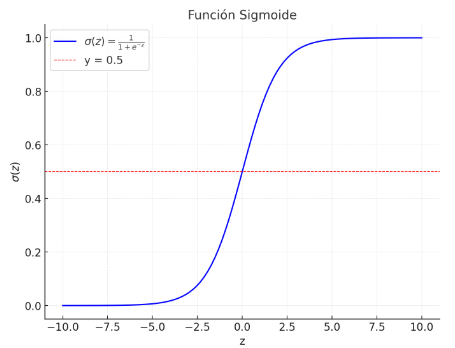

# Tema 2. Sistemas de aprendizaje automático supervisado

# Regresión Logística

## Contenidos

> 1. Introducción
> 2. Fundamentos matemáticos y estadísticos
> 3. Comparación con el modelo de regresión lineal
> 4. Evaluación del modelo
> 5. Condiciones de aplicabilidad del modelo de regresión logística
> 6. Extensiones del modelo de regresión logística
> 7. Ejemplo ilustrativo

---

## Introducción

La **regresión logística** es un modelo estadístico ampliamente utilizado en **machine learning** para abordar problemas de **clasificación**, donde el objetivo principal es predecir una etiqueta o categoría basada en un conjunto de características o variables independientes.

A diferencia de la regresión lineal, que se utiliza para predecir valores continuos, la regresión logística transforma su salida en una **probabilidad** que permite asignar clases discretas, como "aprobado/suspenso", "fraudulento/no fraudulento" o "positivo/negativo".

Este enfoque se fundamenta en la aplicación de la **función sigmoide**, que asegura que las predicciones se mantengan dentro del rango [0, 1], interpretándolas como la probabilidad de que una observación pertenezca a una categoría específica.

La simplicidad y efectividad de este modelo lo han convertido en una herramienta básica en proyectos de clasificación, especialmente cuando se prioriza la interpretabilidad. La regresión logística permite comprender la relación entre las características de entrada y la salida gracias a sus coeficientes, que pueden interpretarse como el impacto relativo de cada variable en la probabilidad de un evento. Por ejemplo, en el análisis de datos médicos, este modelo puede indicar cómo factores como la edad, el peso o el nivel de actividad física influyen en la probabilidad de padecer una enfermedad.

En el contexto de machine learning, la regresión logística compite con otros modelos de clasificación como los **árboles de decisión**, las **máquinas de soporte vectorial** (SVM) y las **redes neuronales**. A diferencia de los árboles de decisión, que dividen el espacio de datos en regiones basadas en reglas, la regresión logística genera una frontera de decisión suave y continua. Esto la hace particularmente adecuada para datos linealmente separables. Por otro lado, aunque modelos más complejos como las redes neuronales pueden ofrecer mayor precisión en tareas complejas, la regresión logística destaca por su eficiencia computacional y facilidad de entrenamiento, siendo ideal para conjuntos de datos pequeños o moderados. Además, la interpretabilidad inherente de este modelo lo diferencia de técnicas como las redes neuronales profundas, que, como ya se ha comentado, a menudo son criticadas por funcionar como "cajas negras".

La regresión logística ha encontrado aplicaciones en diversos sectores gracias a su versatilidad. En el ámbito financiero, se emplea en **sistemas de detección de fraudes**, identificando patrones atípicos en transacciones que podrían indicar actividades ilícitas. En la medicina, se utiliza para el **diagnóstico de enfermedades**, como la predicción de la probabilidad de que un paciente padezca diabetes basándose en medidas clínicas. En marketing, este modelo ayuda a **predecir el comportamiento del consumidor**, como la probabilidad de que un cliente realice una compra o cancele un servicio. Incluso en campos como la política, la regresión logística ha sido usada para predecir resultados electorales a partir de encuestas y datos demográficos.

En conclusión, la regresión logística es una herramienta fundamental dentro de un arsenal de machine learning, especialmente cuando nos enfrentamos a problemas de clasificación binaria. Su equilibrio entre simplicidad, interpretabilidad y eficiencia la hace una elección preferida para tareas donde los resultados comprensibles y accionables son una prioridad.

A lo largo de este tema, exploraremos sus fundamentos matemáticos, métodos de ajuste, métricas de evaluación y ejemplos prácticos, lo que permitirá comprender su poder y sus limitaciones en el contexto de machine learning.

## Fundamentos estadísticos y matemáticos

### Contexto histórico

Los fundamentos de la técnica de la **regresión logística** hay que buscarlos en la estadística o la probabilidad, y su desarrollo está estrechamente vinculado a la evolución del análisis matemático en estos campos. Este modelo, que hoy se considera fundamental en machine learning para tareas de clasificación, comenzó como **una herramienta estadística para estudiar y modelar relaciones no lineales en datos categóricos.**

El término "logística" proviene de la **función logística**, que fue introducida por el matemático Pierre François Verhulst en 1838 para modelar el crecimiento poblacional. Verhulst propuso que el crecimiento poblacional sigue un patrón sigmoide debido a la interacción entre el incremento exponencial inicial y la limitación eventual impuesta por recursos finitos. Esta función logística se define como:

$$
\sigma(z) = \frac{1}{1 + e^{-z}}
$$

Donde $z$ es una combinación lineal de las variables explicativas,

Podemos comprobar en la figura anterior la forma característica en "S", la cual resulta útil para modelar **fenómenos que se estabilizan en un rango definido**, como una probabilidad en el intervalo [0, 1].

A finales del siglo XIX y principios del XX, los conceptos de la probabilidad comenzaron a aplicarse al análisis estadístico. En 1944, Joseph Berkson introdujo formalmente el término **regresión logística** en un contexto biométrico, extendiendo el uso de la función logística a problemas de clasificación en biología. Berkson planteó que este enfoque ofrecía ventajas sobre otros modelos usados hasta entonces, ya que la función logística destacaba por su simplicidad matemática y su eficiencia en los cálculos.

Sin embargo sería Sir David Cox el que desempeñara un papel fundamental en el desarrollo de la **regresión logística** al formalizar sus bases teóricas y extender su aplicabilidad a diversos campos. En 1958, Cox publicó un artículo seminal titulado *"The Regression Analysis of Binary Sequences"*, en el cual proporcionó un marco matemático riguroso para el análisis de datos binarios utilizando un modelo logístico. Este trabajo se considera uno de los hitos clave en la evolución de la regresión logística tal como la conocemos hoy.

Cox presentó el modelo logístico como una solución robusta para analizar datos categóricos, específicamente para predecir la probabilidad de eventos binarios (por ejemplo, éxito/fallo, sí/no). Su enfoque combinó la simplicidad matemática de la **función logística** con la flexibilidad de los métodos como el de máxima verosimilitud, permitiendo estimar los coeficientes del modelo de manera eficiente.

Si bien su trabajo original se centró en casos binarios, el enfoque de Cox allanó el camino para extensiones como la **regresión logística multinomial** (para múltiples clases) y la **regresión logística ordinal** (para datos con categorías ordenadas).

### Definición matemática

Matemáticamente, la regresión logística es un modelo estadístico basado en la **función logística** (o sigmoide), que es capaz de transformar una serie de datos de entrada correspondientes a la variable independiente en una probabilidad acotada entre 0 y 1.

Dado un conjunto de datos con $n$ observaciones, cada una definida por un vector de características  $\mathbf{x} = (x_1, x_2, \dots, x_p)$, el modelo de regresión logística predice la probabilidad condicional de que la variable dependiente $y$ tome el valor 1, es decir:
$$
P(y=1|\mathbf{x}) = \frac{1}{1 + e^{-z}}
$$
donde:
- $z = \beta_0 + \beta_1 x_1 + \beta_2 x_2 + \dots + \beta_p x_p$ es la combinación lineal de las variables independientes.
- $\beta_0, \beta_1, \dots, \beta_p$ son los parámetros del modelo que deben ser estimados a partir de las observaciones.

Esta función sigmoide transforma el valor de $z$ en una probabilidad que se interpreta como $P(y=1|\mathbf{x})$. Para la otra clase ($y=0$), la probabilidad se calcularía como:
$$
P(y=0|\mathbf{x}) = 1 - P(y=1|\mathbf{x})
$$

Para asignar una clase a una observación, se utiliza un umbral $t$ (generalmente $t=0.5$). Si la probabilidad predicha $P(y=1|\mathbf{x})$ supera $t$, la observación se clasifica como $y=1$; de lo contrario, como $y=0$. Esto podría expresarse como:
$$
\hat{y} = 
\begin{cases} 
1 & \text{si } P(y=1|\mathbf{x}) \geq t, \\
0 & \text{si } P(y=1|\mathbf{x}) < t.
\end{cases}
$$

La **regresión logística** asume que cada observación en los datos es **independiente** de las demás. Además, establece que la relación entre las características explicativas (o variables independientes) y la probabilidad de que ocurra el evento de interés puede expresarse mediante una fórmula conocida como ***logit***.

El *logit* conecta las probabilidades con las variables explicativas a través de la siguiente ecuación:
$$
\log \left( \frac{p}{1 - p} \right) = \beta_0 + \beta_1 x_1 + \beta_2 x_2 + \dots + \beta_p x_p
$$
En la expresión anterior:

- $p$ representa la probabilidad de que ocurra el evento que estamos tratando de predecir (por ejemplo, que una persona sea diagnosticada con una enfermedad).
- Al término $\frac{p}{1 - p}$ se le denomina llama ***odds ratio***, que es una medida que compara la probabilidad de que ocurra el evento ($p$) frente a la probabilidad de que no ocurra $(1-p)$.
- El logaritmo natural de este odds ratio convierte esta relación no lineal en una forma lineal, lo que facilita el análisis.

A partir de los trabajos de Cox, ya en la segunda mitad del siglo XX, la regresión logística se popularizó gracias a los avances en el uso de computadoras. En los inicios, ajustar este modelo a los datos era un proceso matemáticamente complicado, pero las herramientas computacionales modernas hicieron posible resolver el modelo de manera eficiente, incluso para grandes cantidades de datos. Como en otros modelos, la clave está en minimizar lo que se denomina una ***función de pérdida***, y ello, en el caso de la regresión logística, puede abordarse a través de métodos como el de **descenso del gradiente**, ya visto en regresión lineal o el de **máxima verosimilitud**, más común en estos casos.

### Estimación de coeficientes por máxima verosimilitud

La **regresión logística** habitualmente utiliza el método de **máxima verosimilitud** para estimar sus coeficientes. El método de máxima verosimilitud no es un método exacto porque depende de la ejecución de aproximaciones iterativas para calcular los coeficientes. Ello es debido a **la naturaleza no lineal** de la regresión logística. Sí que está basado en la **minimización de una función de pérdida**, que en este caso es la log-verosimilitud negativa. Este enfoque asegura una convergencia robusta hacia los coeficientes que maximizan la probabilidad de observar los datos y producen un modelo bien ajustado para tareas de clasificación.

#### Definición de la función de verosimilitud

la **verosimilitud** se refiere a la **probabilidad de observar unos datos (D) dados ciertos valores de los parámetros ($\theta$) del modelo**. Es el mismo concepto que ya aparece en el contexto del teorema de Bayes, solo que en el caso de la regresión logística se convierte en la función objetivo que hay que maximizar para ajustar el modelo.

Dado un conjunto de datos de entrenamiento $\{(\mathbf{x}_i, y_i)\}_{i=1}^n$, donde:
- $\mathbf{x}_i = (x_{i1}, x_{i2}, \dots, x_{ip})$ representa el vector de características de la $i$-ésima observación.
- $y_i \in \{0, 1\}$ es la clase asociada a esa observación.

El modelo de regresión logística predice la probabilidad de que $y_i = 1$ como:
$$
P(y_i = 1|\mathbf{x}_i) = \frac{1}{1 + e^{-z_i}}, \quad \text{donde } z_i = \beta_0 + \beta_1 x_{i1} + \dots + \beta_p x_{ip}.
$$

La función verosimilitud (es decir, la probabilidad conjunta de todas las observaciones) se define como:
$$
L(\beta_0, \beta_1, \dots, \beta_p) = \prod_{i=1}^n P(y_i|\mathbf{x}_i) = \prod_{i=1}^n \left[ P(y_i=1|\mathbf{x}_i)^{y_i} \cdot (1 - P(y_i=1|\mathbf{x}_i))^{1-y_i} \right].
$$

#### Log-verosimilitud: Función de pérdida en regresión logística

Para simplificar el cálculo y optimización, se utiliza el logaritmo de la función de verosimilitud, obteniendo la **log-verosimilitud**:
$$
\ell(\beta_0, \beta_1, \dots, \beta_p) = \sum_{i=1}^n \left[ y_i \log(P(y_i|\mathbf{x}_i)) + (1 - y_i) \log(1 - P(y_i|\mathbf{x}_i)) \right].
$$

El objetivo es **maximizar esta función**, lo que equivale a encontrar los coeficientes $\beta_0, \beta_1, \dots, \beta_p$ que hacen que los datos observados sean más probables bajo el modelo.

En términos de optimización, esto se traduce en minimizar la función de pérdida derivada de la log-verosimilitud negativa:
$$
J(\beta_0, \beta_1, \dots, \beta_p) = -\ell(\beta_0, \beta_1, \dots, \beta_p),
$$
que es convexa, y por tanto asegura la existencia de un único mínimo global.

##### Interpretación de la función de pérdida

La **función de pérdida** en la regresión logística, basada en la log-verosimilitud negativa, evalúa qué tan bien los parámetros del modelo ajustan las probabilidades predichas ($P(y_i|\mathbf{x}_i)$) a las etiquetas reales ($y_i$). Su interpretación se puede descomponer en **dos términos clave**. En primer lugar el que corresponde a la **penalización de las predicciones incorrectas para $y=1$**. En efecto, el término $y_i \log(P(y_i|\mathbf{x}_i))$ se activa cuando $y_i = 1$, ya que $y_i$ actúa como un multiplicador. Este término **premia predicciones correctas** con probabilidades altas cercanas a 1, pero **penaliza fuertemente** cuando $P(y_i|\mathbf{x}_i)$ es bajo. Es decir, si el modelo asigna una probabilidad baja a la clase positiva, este término generará una pérdida significativa. En segundo lugar, el que corresponde a la **penalización de las predicciones incorrectas para $y=0$**. De forma similar, el término $(1-y_i) \log(1-P(y_i|\mathbf{x}_i))$ se activa cuando $y_i = 0$, y de forma parecida al caso anterior, **premia predicciones correctas** con probabilidades $1 - P(y_i|\mathbf{x}_i)$ cercanas a 1, pero **penaliza con fuerza** cuando el modelo asigna una probabilidad alta a la clase positiva ($P(y_i|\mathbf{x}_i)$) para datos cuya etiqueta real es $y=0$.

Al final, esta estructura garantiza que el modelo ajuste sus parámetros de manera que maximice las probabilidades asignadas a las etiquetas correctas ($y=1$ o $y=0$), y minimice las probabilidades asignadas a las etiquetas incorrectas. Como el modelo se entrena para predecir probabilidades que sean lo más cercanas posible a las etiquetas reales (ajustando los parámetros $\beta_0, \beta_1, \dots, \beta_p$ en función de estas penalizaciones), se asegurará que las predicciones sean consistentes con los datos observados.

#### Mecanismos de optimización

La minimización de la función de pérdida en la regresión logística implica ajustar los coeficientes del modelo de **forma iterativa** utilizando técnicas numéricas. El método más habitual es el del **descenso de gradiente**

Como se vio en el caso de la regresión lineal, la función de pérdida se minimiza actualizando los coeficientes $\beta_j$ en la dirección opuesta al gradiente de la función $J(\beta)$:
$$
\beta_j^{(t+1)} = \beta_j^{(t)} - \eta \frac{\partial J}{\partial \beta_j},
$$
donde $\eta$ es la tasa de aprendizaje.

El gradiente de la función de pérdida para $\beta_j$ se calculará como:
$$
\frac{\partial J}{\partial \beta_j} = -\sum_{i=1}^n (y_i - P(y_i|\mathbf{x}_i)) x_{ij}.
$$

##### **Métodos avanzados de optimización**

Existen mecanismos de optimización alternativos, de entre los que se pueden citar:

- **Gradiente estocástico (SGD)**: En lugar de utilizar todo el conjunto de datos en cada iteración, actualiza los coeficientes usando una muestra aleatoria, lo que acelera la convergencia.
- **Método de Newton-Raphson**: Utiliza la matriz Hessiana (construida con las segundas derivadas parciales) para calcular actualizaciones más precisas, si bien es computacionalmente más costoso.
- **Método de optimización adaptativa (Adam)**: Ajusta dinámicamente la tasa de aprendizaje, combinando las ventajas del gradiente estocástico con un control adaptativo de los pasos.

> [!important]
>
> La máxima verosimilitud permite ajustar los parámetros de la regresión logística de forma consistente con la naturaleza probabilística del problema. La función de pérdida derivada de este método asegura que las predicciones sean confiables y restringidas al rango [0, 1]. Además, el marco de optimización numérica, como el descenso de gradiente y sus variantes, proporciona herramientas robustas para minimizar la pérdida, garantizando un modelo bien ajustado y eficaz en tareas de clasificación binaria. Por esto es por lo que la máxima verosimilitud se convierte en el estándar para la regresión logística, destacando su flexibilidad y precisión en problemas prácticos.

## Comparación con el modelo de regresión lineal

### Naturaleza del problema: Predicción continua vs clasificación

La regresión lineal y la regresión logística, aunque comparten fundamentos conceptuales dentro del aprendizaje supervisado, se aplican a problemas con características distintas que determinan su utilidad.

La regresión lineal se utiliza en contextos donde el objetivo principal es la predicción de valores continuos. Un ejemplo típico es la estimación del precio de una vivienda, basada en factores como el tamaño del inmueble o su ubicación. Este modelo genera una salida numérica que proporciona una estimación específica de la variable dependiente, lo que lo hace adecuado para tareas que requieren precisión cuantitativa.

Por otro lado, la regresión logística está diseñada para abordar problemas de clasificación, donde se busca predecir la pertenencia de una observación a una categoría o clase. Por ejemplo, en la detección de correos electrónicos spam, el modelo evalúa la probabilidad de que un correo pertenezca a la clase "spam" considerando características como el contenido o el remitente. A partir de esta probabilidad, se asigna una clase específica según un umbral establecido.

> [!important]
>
> Recuerda, mientras la regresión lineal ofrece una herramienta poderosa para modelar relaciones continuas mediante un ajuste lineal, la regresión logística transforma la salida para representar probabilidades, lo que permite abordar problemas de clasificación con eficacia.

### Ecuación de salida y su interpretación

La ecuación de salida, así como su interpretación difieren significativamente ya sea cuando nos referimos a la regresión lineal o a la regresión logística. Ello es debido fundamentalmente a la naturaleza de los problemas que resuelve cada técnica.

En el caso de la regresión lineal, la ecuación de predicción toma la forma:
$$
y = \beta_0 + \beta_1 x_1 + \beta_2 x_2 + \dots + \beta_p x_p
$$
Aquí, $y$ representa un valor continuo que corresponde a la salida estimada. Los coeficientes ($\beta_0, \beta_1, \dots, \beta_p$) describen cómo cambia el valor esperado de $y$ ante un cambio unitario en cada variable independiente ($x_1, x_2, \dots, x_p$), asumiendo que las demás variables se mantienen constantes. Esta interpretación directa y lineal facilita su aplicación en problemas donde se requiere predecir valores numéricos precisos.

Por otro lado, la regresión logística aplica una transformación que ajusta la salida al rango de 0 a 1, muy adecuada para representar probabilidades. Su ecuación se expresa como:
$$
p(y=1|x) = \frac{1}{1 + e^{-(\beta_0 + \beta_1 x_1 + \beta_2 x_2 + \dots + \beta_p x_p)}}
$$
En este caso, $p(y=1|x)$ describe la probabilidad de que la observación pertenezca a la clase objetivo (por ejemplo, $y=1$). Dicha probabilidad se calcula a partir de la combinación lineal de las variables independientes, transformada mediante la función sigmoide. Si se establece un umbral, por ejemplo, $0,5$ el modelo asignará la clase correspondiente según si la probabilidad es mayor o menor que el umbral. Por esto es por lo que la regresión logística es especialmente útil en tareas de clasificación. Porque proporciona salidas que son directamente interpretables como probabilidades. 

> [!important]
>
> En ambos casos, las ecuaciones reflejan el propósito fundamental del modelo: la regresión lineal genera una predicción continua, mientras que la logística adapta esta predicción para expresar probabilidades y asignar clases.

### Limitaciones de la regresión lineal en problemas de clasificación

La regresión lineal presenta importantes limitaciones cuando se intenta aplicar a problemas de clasificación. Ello es debido fundamentalmente a que este modelo no está diseñado para manejar las características propias de este tipo de tareas, lo que, a su vez, restringe su efectividad y aplicabilidad en comparación con métodos más adecuados, como sería en este caso la regresión logística.

Una de las principales limitaciones radica en los rangos de salida. La regresión lineal puede generar valores que exceden el intervalo $[0, 1]$, lo que resulta problemático al interpretar la salida como una probabilidad, ya que estas deben estar acotadas dentro de ese rango para tener sentido estadístico. Este comportamiento contrasta con la regresión logística, que ajusta las salidas utilizando una **función sigmoide** que asegura valores dentro del rango apropiado.

Además, la regresión lineal carece de la capacidad para modelar relaciones no lineales entre las variables independientes y las clases. En los problemas de clasificación, estas relaciones suelen ser intrínsecamente complejas, y es precisamente en estos casos donde la regresión logística, **gracias a su transformación no lineal**, permite capturar patrones que la lineal no puede representar.

Por último, la interpretación de los coeficientes en la regresión lineal es menos clara en un contexto de clasificación. Aunque son fácilmente entendibles en términos de cambios continuos, resultan poco intuitivos cuando se utilizan para asignar clases. Por esto es por lo que la regresión logística resulta más adecuada, ya que traduce estos coeficientes en probabilidades directamente interpretables. Ello facilita la comprensión y la toma de decisiones en tareas de clasificación.

> #### Ejemplo ilustrativo de ambas regresiones aplicadas a un conjunto de datos simple
>
> Para entender las diferencias entre la regresión lineal y la regresión logística, consideremos un conjunto de datos sencillo que analiza la puntuación obtenida en un examen ($x$) y dos objetivos distintos: predecir la nota media esperada en otro examen relacionado y determinar si el estudiante aprobará o no. Estos objetivos reflejan los escenarios típicos para cada tipo de regresión, siendo el primero un problema de predicción continua y el segundo uno de clasificación binaria.
>
> ##### Datos utilizados
>
> El conjunto de datos incluye una única variable independiente, $x$, que mide la puntuación obtenida en un examen. La salida para la regresión lineal corresponde a la nota media esperada ($y$), mientras que, para la regresión logística, se interpreta como si el estudiante aprobó ($y=1$) o no ($y=0$). La tabla siguiente ilustra este escenario:
>
> | Puntuación ($x$) | Nota media ($y$ para regresión lineal) | Aprobado ($y$ para regresión logística) |
> | ---------------- | -------------------------------------- | --------------------------------------- |
> | 40               | 4,5                                    | 0                                       |
> | 50               | 5,0                                    | 0                                       |
> | 60               | 6,0                                    | 1                                       |
> | 70               | 7,0                                    | 1                                       |
> | 80               | 8,0                                    | 1                                       |
>
> ##### Aplicación de la regresión lineal
>
> En este caso, la regresión lineal ajusta una ecuación que modela la relación entre la puntuación del examen ($x$) y la nota media esperada ($y$):
> $$
> y = -1 + 0,1x
> $$
> Esta ecuación indica que por cada incremento de 10 puntos en la puntuación del examen, se espera un aumento promedio de 1 punto en la nota media. Por ejemplo, para un estudiante con $x = 60$, el modelo predice que la nota media será:
> $$
> y = -1 + 0,1(60) = 5
> $$
>
> ##### Aplicación de la regresión logística
>
> Para abordar el problema de clasificación, la regresión logística ajusta una curva sigmoide que predice la probabilidad de aprobar en función de $x$:
> $$
> p(y=1|x) = \frac{1}{1 + e^{-(-12 + 0,2x)}}
> $$
> La interpretación de este modelo se basa en la probabilidad de que un estudiante con una puntuación específica apruebe el examen. Para una puntuación de $x = 60$, la probabilidad estimada de aprobación es:
> $$
> p(y=1|x=60) = \frac{1}{1 + e^{-(-12 + 0,2(60))}} = 0,73
> $$
> Esto indica que, según el modelo, existe un 73% de probabilidad de que un estudiante con una puntuación de 60 apruebe. Este tipo de salida probabilística es particularmente útil para tareas de clasificación, ya que no solo predice una clase, sino que también proporciona una medida de confianza en la predicción.
>
> ##### Conclusión
>
> Ambos modelos destacan en sus respectivos dominios: la regresión lineal permite realizar estimaciones continuas precisas, mientras que la regresión logística aborda eficazmente problemas de clasificación mediante la modelización de probabilidades. El ejemplo anterior, aunque excesivamente simple, subraya cómo cada técnica está diseñada para responder a necesidades específicas, enfatizando su aplicabilidad práctica en diferentes contextos.
>

##### Para reflexionar...

> **¿Qué ventajas aporta la regresión logística frente a la lineal en problemas de clasificación binaria?**
> **Clave**: Reflexiona sobre las limitaciones de la regresión lineal en términos de rangos de salida, interpretabilidad probabilística y manejo de relaciones no lineales.

## Evaluación del modelo

La evaluación de un modelo de clasificación, como la regresión logística, es esencial para medir su rendimiento y adecuación al problema planteado. Esto se realiza utilizando métricas específicas que cuantifican diferentes aspectos del desempeño del modelo en un conjunto de datos de prueba. A continuación, se presentan las principales métricas y herramientas gráficas.

### Métricas asociadas a la matriz de confusión

La matriz de confusión es una herramienta fundamental en la evaluación de modelos de clasificación. Proporciona una representación tabular que compara las predicciones realizadas por el modelo con las etiquetas reales, permitiendo calcular métricas clave para analizar el rendimiento global y específico en cada clase.

#### Estructura de la matriz de confusión

Para un problema binario, la matriz de confusión se organiza de la siguiente manera:

|                          | **Clase predicha: Positiva** | **Clase predicha: Negativa** |
| ------------------------ | ---------------------------- | ---------------------------- |
| **Clase real: Positiva** | Verdaderos positivos (TP)    | Falsos negativos (FN)        |
| **Clase real: Negativa** | Falsos positivos (FP)        | Verdaderos negativos (TN)    |

Los valores en cada celda permiten definir un conjunto de métricas asociadas al desempeño del modelo. 

#### Exactitud (Accuracy)

La **exactitud** es una métrica global que mide la proporción de predicciones correctas realizadas por un modelo en relación con el total de instancias evaluadas. Es ampliamente utilizada como una medida general del desempeño de modelos de clasificación.

La exactitud se define como:
$$
\text{Exactitud} = \frac{\text{TP} + \text{TN}}{\text{TP} + \text{TN} + \text{FP} + \text{FN}}
$$

Donde:
- **TP (Verdaderos positivos)**: Número de instancias positivas correctamente clasificadas.
- **TN (Verdaderos negativos)**: Número de instancias negativas correctamente clasificadas.
- **FP (Falsos positivos)**: Número de instancias negativas clasificadas incorrectamente como positivas.
- **FN (Falsos negativos)**: Número de instancias positivas clasificadas incorrectamente como negativas.

La exactitud representa el porcentaje de predicciones correctas del modelo considerando ambas clases (positiva y negativa). Una alta exactitud indica que el modelo clasifica correctamente la mayoría de las instancias.

> ##### Ejemplo:
>
> Consideremos un modelo de clasificación aplicado a un conjunto de datos de 100 instancias, con la siguiente matriz de confusión:
>
> |                    | **Predicha: Positiva** | **Predicha: Negativa** |
> | ------------------ | ---------------------- | ---------------------- |
> | **Real: Positiva** | TP = 40                | FN = 10                |
> | **Real: Negativa** | FP = 5                 | TN = 45                |
>
> La exactitud del modelo se calcula como:
> $$
> \text{Exactitud} = \frac{\text{TP} + \text{TN}}{\text{TP} + \text{TN} + \text{FP} + \text{FN}} = \frac{40 + 45}{40 + 45 + 5 + 10} = 0,85 \; (85\%).
> $$
>

La exactitud es una métrica fácil de interpretar, lo que la convierte en una herramienta práctica para evaluar modelos en escenarios donde las clases están balanceadas. Su simplicidad la hace ampliamente utilizada en tareas generales de clasificación, proporcionando una medida rápida del desempeño global del modelo. Sin embargo, presenta limitaciones importantes en conjuntos de datos desbalanceados. En estos casos, un modelo que favorezca siempre la clase mayoritaria puede obtener una alta exactitud sin ser verdaderamente útil para capturar las instancias de la clase minoritaria. Por ejemplo, en un conjunto donde el 95% de las instancias pertenecen a la clase negativa, un modelo que siempre prediga "negativo" alcanzaría una exactitud del 95%, pero sería ineficaz para identificar instancias positivas. Por ello, aunque es una métrica valiosa, la exactitud debe interpretarse con cautela en problemas con distribuciones de clases desiguales.

En cualquier caso, **para problemas desbalanceados**, la exactitud debe complementarse con métricas como precisión, recall o F1-score, que proporcionan una evaluación más específica del desempeño del modelo en cada clase. En estos casos, confiar únicamente en la exactitud puede conducir a decisiones subóptimas o erróneas sobre la calidad del modelo.

#### Métricas relacionadas con la clase positiva

Estas métricas evalúan el desempeño del modelo para identificar correctamente las instancias de la clase positiva ($y=1$):

La **precisión** mide la proporción de predicciones positivas correctas respecto al total de predicciones positivas realizadas:
$$
\text{Precisión} = \frac{\text{TP}}{\text{TP} + \text{FP}}
$$

Es útil en escenarios donde los falsos positivos tienen un costo elevado, como en detección de fraudes o clasificación de enfermedades graves.

##### Recall (Sensibilidad o Tasa de verdaderos positivos)

El **recall** (**sensibilidad** o tasa de verdaderos positivos) mide la proporción de instancias positivas correctamente identificadas por el modelo:
$$
\text{Recall} = \frac{\text{TP}}{\text{TP} + \text{FN}}
$$

Es crucial en problemas donde los falsos negativos son especialmente costosos, como en diagnósticos médicos.

Es posible combinar las dos métricas anteriores en una sola. El **F1-score** refleja el equilibrio entre ambas. Se calcula como la media armónica de estas dos métricas:
$$
F1 = 2 \cdot \frac{\text{Precisión} \cdot \text{Recall}}{\text{Precisión} + \text{Recall}}
$$

Es especialmente útil en escenarios con datos desbalanceados, donde una alta precisión o recall por sí sola podría no ser representativa.

#### Métricas relacionadas con la clase negativa

Estas métricas se centran en evaluar la capacidad del modelo para clasificar correctamente las instancias de la clase negativa ($y=0$):

En primer lugar, la **especificidad** mide la proporción de instancias negativas correctamente clasificadas:
$$
\text{Especificidad} = \frac{\text{TN}}{\text{TN} + \text{FP}}
$$

Evalúa la capacidad del modelo para evitar falsos positivos, siendo relevante en problemas donde clasificar erróneamente como positivo tiene un alto costo (por ejemplo, etiquetar a individuos sanos como enfermos).

Por su parte, la **tasa de falsos positivos** mide la proporción de instancias negativas que son clasificadas erróneamente como positivas:
$$
\text{FPR} = \frac{\text{FP}}{\text{TN} + \text{FP}}
$$

La especificidad y la FPR están **inversamente relacionadas** ya que se puede comprobar como:
$$
\text{Especificidad} = 1 - \text{FPR}.
$$

> ##### Ejemplo de cálculo
>
> Supongamos que un modelo de clasificación genera la siguiente matriz de confusión a partir de 100 instancias de prueba:
>
> |                    | **Predicha: Positiva** | **Predicha: Negativa** |
> | ------------------ | ---------------------- | ---------------------- |
> | **Real: Positiva** | TP = 40                | FN = 10                |
> | **Real: Negativa** | FP = 5                 | TN = 45                |
>
> Calculamos las métricas asociadas:
>
> - **Precisión**:
>   $$
>   \text{Precisión} = \frac{\text{TP}}{\text{TP} + \text{FP}} = \frac{40}{40 + 5} = 0,89 \; (89\%).
>   $$
>
> - **Recall**:
>   $$
>   \text{Recall} = \frac{\text{TP}}{\text{TP} + \text{FN}} = \frac{40}{40 + 10} = 0,8 \; (80\%).
>   $$
>
> - **F1-score**:
>   $$
>   F1 = 2 \cdot \frac{\text{Precisión} \cdot \text{Recall}}{\text{Precisión} + \text{Recall}} = 2 \cdot \frac{0,89 \cdot 0,8}{0,89 + 0,8} = 0,84 \; (84\%).
>   $$
>
> - **Especificidad**:
>   $$
>   \text{Especificidad} = \frac{\text{TN}}{\text{TN} + \text{FP}} = \frac{45}{45 + 5} = 0,9 \; (90\%).
>   $$
>
> - **Tasa de falsos positivos (FPR)**:
>   $$
>   \text{FPR} = \frac{\text{FP}}{\text{TN} + \text{FP}} = \frac{5}{45 + 5} = 0,1 \; (10\%).
>   $$
>

> [!important]
>
> La matriz de confusión y sus métricas asociadas, como precisión, recall, especificidad, F1-score y exactitud, proporcionan una evaluación detallada y balanceada del desempeño de un modelo de clasificación. Es importante seleccionar las métricas adecuadas según el contexto y los costos asociados a los errores de clasificación, asegurando que el modelo sea efectivo para el problema específico que aborda. Por esto es por lo que una evaluación exhaustiva es fundamental para garantizar resultados fiables en problemas de clasificación.

### Curva ROC y al área bajo la curva (AUC)

La **curva ROC** (***Receiver Operating Characteristic***) es una herramienta gráfica ampliamente utilizada para evaluar la capacidad de un modelo de clasificación para discriminar entre clases. Este análisis se basa en la variación del umbral de clasificación y cómo afecta a la relación entre la tasa de verdaderos positivos (TPR) y la tasa de falsos positivos (FPR).

Vimos en el apartado anterior como la **TPR**, también conocida como sensibilidad, se calcula como:
$$
\text{TPR} = \frac{\text{TP}}{\text{TP} + \text{FN}},
$$
mientras que la **FPR** se definía como:
$$
\text{FPR} = \frac{\text{FP}}{\text{FP} + \text{TN}}.
$$
La **curva ROC** representa la **tasa de verdaderos positivos (TPR)** en el eje $y$ frente a la **tasa de falsos positivos (FPR)** en el eje $x$, evaluando estas métricas para diferentes umbrales de clasificación. Este enfoque permite analizar cómo cambia el balance entre sensibilidad y especificidad del modelo según se ajusta el umbral.

En un modelo ideal esta curva tendería a pasar muy cerca de un punto cercano a la esquina superior izquierda del gráfico, lo que indicaría una alta sensibilidad acompañada de una baja tasa de falsos positivos y por tanto un desempeño excelente en la discriminación entre clases.

La curva se traza a partir de los pares ($FPR, TPR$) a medida que el umbral de decisión varía entre 0 y 1, proporcionando una visión completa del desempeño del modelo en diferentes escenarios de clasificación. Por esto, el análisis ROC es especialmente útil para identificar el punto óptimo en el que se maximiza la **TPR** mientras se minimiza la **FPR**, dependiendo de los costos asociados a los errores de clasificación en el problema particular.

#### Construcción de la curva ROC

La curva ROC se genera evaluando el desempeño del modelo a través de diferentes valores del umbral $t$, generalmente variando de 0 a 1. Para cada umbral, se comparan las probabilidades predichas $P(y=1|\mathbf{x})$ con $t$ para decidir si una instancia se clasifica como positiva ($y=1$) o negativa ($y=0$). Es decir, si $P(y=1|\mathbf{x}) \geq t$, se asigna la clase positiva, y de lo contrario, la clase negativa. A partir de estas clasificaciones, se calculan la tasa de verdaderos positivos (TPR) y la tasa de falsos positivos (FPR) usando las fórmulas ya conocidas:
$$
\text{TPR} = \frac{\text{TP}}{\text{TP} + \text{FN}}, \quad \text{FPR} = \frac{\text{FP}}{\text{FP} + \text{TN}}.
$$

El desempeño del modelo en cada umbral se representa gráficamente como un par $(\text{FPR}, \text{TPR})$, que constituye un punto en el plano de la curva ROC. Al conectar estos puntos, se construye la curva completa, que describe cómo cambia la sensibilidad frente a la tasa de falsos positivos al ajustar el umbral de clasificación.

Esta representación gráfica permite interpretar el comportamiento del modelo bajo diferentes configuraciones. Un modelo ideal tendría una curva que pasa cerca del punto $(0, 1)$, lo que indica una sensibilidad alta con una baja tasa de falsos positivos. Por otro lado, una curva cercana a la diagonal ($\text{FPR} = \text{TPR}$) sugiere un modelo con capacidad de discriminación similar a la de una clasificación aleatoria.

> [!important]
>
> ###### Relación entre el umbral y la curva ROC
>
> - La curva ROC no representa una sola predicción o configuración específica del modelo, sino una **evaluación global del desempeño del modelo** a través de todos los umbrales posibles.
> - Cada punto en la curva corresponde a un valor específico de $t$. Cambiar el umbral simplemente mueve el punto de evaluación a lo largo de la curva.
>
>  la curva ROC es una representación completa del desempeño del modelo en términos de **TPR** y **FPR** para **todos los posibles valores del umbral**. Por esto es por lo que la curva ROC es una herramienta tan poderosa: proporciona una evaluación global del modelo sin depender de un umbral específico.

#### Área bajo la curva (AUC)

El **área bajo la curva** (AUC, por sus siglas en inglés) es una métrica global que complementa la curva ROC al proporcionar un valor numérico que resume la **capacidad discriminativa** del modelo. El AUC mide el **área bajo la curva ROC**, que representa gráficamente la relación entre la tasa de verdaderos positivos (TPR) y la tasa de falsos positivos (FPR) a través de todos los posibles umbrales de decisión. Este valor cuantifica qué tan bien el modelo puede distinguir entre las clases positiva y negativa.

Un AUC de 0,5 indica que el modelo no tiene capacidad discriminativa y se comporta como un clasificador aleatorio, lo que significa que su capacidad para separar las clases es equivalente al azar. Por otro lado, un AUC de 1,0 representa un modelo ideal que discrimina perfectamente entre ambas clases, asignando probabilidades más altas a todas las instancias de la clase positiva que a las de la clase negativa.

La utilidad del AUC es particularmente relevante en problemas donde los costos asociados a los falsos positivos y los falsos negativos son asimétricos. A diferencia de métricas como la precisión o el recall, que evalúan el modelo en un único umbral de decisión, el AUC ofrece una evaluación global al considerar todos los posibles umbrales. Esto lo convierte en una herramienta valiosa para comparar modelos de clasificación, especialmente cuando se busca un modelo robusto que mantenga un buen desempeño en un rango amplio de umbrales.

En el contexto de las métricas de evaluación, el AUC se complementa con otras como la precisión, el recall y el F1-score, que evalúan aspectos específicos del rendimiento del modelo. Mientras que estas métricas proporcionan información detallada sobre el balance entre los verdaderos positivos y los errores, el AUC resume la capacidad general del modelo para priorizar correctamente las instancias de una clase sobre las de la otra. En casos con conjuntos de datos desbalanceados, donde una alta precisión o recall podría ser engañosa, el AUC ayuda a identificar modelos que efectivamente diferencian entre las clases.

## Condiciones de aplicabilidad del modelo de regresión logística

La regresión logística, aunque flexible y ampliamente utilizada, requiere que ciertas condiciones se cumplan para que el modelo sea válido y produzca resultados consistentes y útiles. Estas condiciones aseguran que los coeficientes estimados sean fiables, interpretable y que el modelo sea adecuado para el problema planteado.

La regresión logística no impone los mismos requisitos de linealidad que la regresión lineal, pero sí exige cumplir condiciones específicas, como la linealidad en el logit, independencia de las observaciones y ausencia de multicolinealidad. Además, es fundamental contar con un tamaño de muestra adecuado y manejar adecuadamente los valores extremos. Comprender y verificar estas condiciones no solo asegura la validez del modelo, sino que también permite obtener coeficientes interpretables y resultados fiables, garantizando la eficacia del modelo en problemas de clasificación.

### Linealidad en el *logit*

A diferencia de la regresión lineal, en la regresión logística no se requiere una relación lineal directa entre las variables independientes ($x_1, x_2, \dots, x_p$) y la variable dependiente binaria ($y \in \{0, 1\}$). Sin embargo, existe un requisito de **linealidad en el logit**, lo que significa que el logaritmo de los odds (probabilidades relativas de pertenencia a la clase positiva frente a la clase negativa) debe ser una combinación lineal de las variables independientes. Matemáticamente, el modelo de regresión logística asume que:
$$
\log\left(\frac{P(y=1|\mathbf{x})}{1 - P(y=1|\mathbf{x})}\right) = \beta_0 + \beta_1 x_1 + \beta_2 x_2 + \dots + \beta_p x_p,
$$
donde $ \beta_0, \beta_1, \dots, \beta_p $ son los coeficientes del modelo.

Este supuesto de linealidad en el logit implica que cada variable independiente $x_j$ tiene un efecto aditivo y constante en la escala del logit. Si esta relación no se cumple, las predicciones del modelo pueden ser imprecisas, y los coeficientes estimados podrían no reflejar correctamente las relaciones subyacentes en los datos.

La linealidad en el logit nos muestra que, para cada unidad de cambio en una variable independiente $x_j$, el logit cambia en una cantidad constante determinada por el coeficiente $\beta_j$. Esto a su vez implica que:
1. **Se produce una transformación del espacio probabilístico**: Aunque las probabilidades predichas ($P(y=1|\mathbf{x})$) no tienen una relación lineal con las variables independientes, el logit (es decir, el logaritmo de los odds) sí debe hacerlo.
2. **Aparece un efecto aditivo**: Los efectos de las variables independientes se suman en la escala del logit, lo que permite modelar la relación de manera más flexible que en el espacio probabilístico directo.

> Por ejemplo, si $ \beta_j = 0.5 $, un incremento unitario en $ x_j $ multiplicará los odds por $ e^{0.5} $ (alrededor de 1.65), manteniendo constantes las demás variables.
>

#### Detección y manejo del requisito de linealidad

Para evaluar si se cumple este requisito, se pueden realizar distintas comprobaciones y efectuar diversos ajustes. Una estrategia común es efectuar **pruebas de significancia para términos no lineales**. Esto consiste en agregar términos no lineales al modelo, como $ x_j^2 $ o transformaciones logarítmicas de $ x_j $, y evaluar si estos términos son significativos. La presencia de efectos significativos indica que la relación lineal en el logit no se cumple completamente. En el caso de que estemos trabajando con variables continuas, es posible realizar una **prueba gráfica del logit**. Esta prueba consistiría en dividir dichas variables en intervalos y calcular los odds observados en cada intervalo. Al graficar el logit de los odds frente a la variable, debería observarse una relación aproximadamente lineal. Si no se cumple, se pueden requerir transformaciones. Por último, es posible hacer **una evaluación con splines o términos polinómicos** en los casos donde la relación no es completamente lineal. Los splines (particiones adaptativas de la variable) permiten capturar relaciones no lineales de manera flexible, sin necesidad de especificar una fórmula exacta

##### Para reflexionar...

> **¿Qué implicaciones prácticas tiene no cumplir con la linealidad en el logit en un modelo de regresión logística?**  
> **Clave**: Considera cómo esto puede afectar la precisión de las predicciones y la interpretabilidad de los coeficientes, y reflexiona sobre cómo ajustar el modelo para garantizar que las relaciones subyacentes sean capturadas adecuadamente.

### Independencia de las observaciones

La **independencia de las observaciones** es un supuesto crítico en la regresión logística, ya que garantiza la validez de las estimaciones y la confiabilidad de las inferencias del modelo. Este principio establece que cada observación en el conjunto de datos debe ser independiente de las demás, es decir, que **el resultado de una observación no influya ni esté correlacionado con el de otra**. Cuando este supuesto no se cumple, se producen distorsiones en las estimaciones de los coeficientes y las métricas de desempeño, lo que compromete tanto la interpretación como la aplicabilidad del modelo.

El impacto de la falta de independencia se refleja principalmente en los errores estándar de los coeficientes, lo que puede conducir a la sobreestimación o subestimación de la significancia estadística de las variables predictoras. Además, un modelo que no respeta este supuesto puede tener dificultades para generalizar cuando se aplica a datos nuevos.

> [!NOTE]
>
> ###### Ejemplos y contextos comunes donde puede fallar la independencia
>
> La violación de este supuesto es frecuente en ciertas estructuras de datos. Por ejemplo, en datos temporales, las observaciones suelen estar correlacionadas debido a tendencias o patrones estacionales. De manera similar, en datos jerárquicos, como estudiantes agrupados por escuelas o pacientes en hospitales, las características compartidas dentro de cada grupo introducen dependencias sistemáticas que el modelo no puede ignorar.
>
> Otra situación habitual es la presencia de datos relacionados, como mediciones repetidas de la misma entidad. En estos casos, las observaciones reflejan la misma fuente de variabilidad subyacente, lo que rompe la independencia requerida. Incluso en datos no estructurados, duplicados inadvertidos o similitudes contextuales pueden generar correlaciones no deseadas entre las observaciones.

#### Diagnóstico, detección de dependencia y manejo de la misma

Antes de entrenar el modelo, es esencial diagnosticar si las observaciones cumplen con el criterio de independencia. Esto puede lograrse mediante **análisis exploratorios que revelen patrones de agrupamiento o correlación en los datos**. Por ejemplo, visualizar la distribución de las observaciones dentro de grupos o en función del tiempo puede ser revelador. Además, herramientas estadísticas como **la prueba de Durbin-Watson permiten evaluar la autocorrelación en los residuos del modelo**, especialmente en datos secuenciales.

En conjuntos de datos jerárquicos o agrupados, examinar el grado de similitud dentro de los grupos mediante análisis descriptivos o modelos preliminares puede ayudar a identificar posibles dependencias. La detección temprana de estas relaciones es crucial para tomar decisiones informadas sobre cómo ajustar el modelo.

Cuando se detecta dependencia, es fundamental incorporar ajustes al modelo que reflejen la estructura subyacente de los datos. En datos agrupados, los **modelos multinivel** o **mixtos** son una solución común, ya que permiten incluir términos aleatorios para capturar la variabilidad intra-grupo. Por ejemplo, en un análisis de pacientes agrupados por hospitales, un término aleatorio asociado a cada hospital puede modelar las diferencias entre grupos sin violar la independencia de las observaciones dentro de cada grupo.

En datos temporales, se pueden utilizar técnicas específicas de análisis de series temporales o incorporar términos auto-regresivos que modelen las dependencias temporales. Además, para datos longitudinales, la regresión logística con efectos fijos o mixtos permite capturar la dependencia entre mediciones repetidas de la misma entidad.

### Ausencia de multicolinealidad

La multicolinealidad es una condición que surge cuando dos o más variables independientes están altamente correlacionadas, lo que dificulta la estimación precisa de los coeficientes en un modelo de regresión logística. Aunque la regresión logística puede seguir funcionando en presencia de multicolinealidad, **los coeficientes estimados se vuelven inestables y pierden interpretabilidad**. Este problema afecta tanto la confiabilidad de las predicciones como la capacidad del modelo para identificar relaciones significativas entre las variables y la variable dependiente.

Cuando las variables independientes están correlacionadas, el modelo tiene dificultades para discernir el efecto individual de cada variable, ya que estas comparten información redundante. Esto se traduce en errores estándar inflados para los coeficientes, lo que dificulta evaluar su significancia estadística. En última instancia, esto puede llevar a conclusiones erróneas sobre el papel de cada variable en el modelo

Detectar la multicolinealidad en los datos es un paso crucial antes de entrenar el modelo. Una técnica común es calcular el **factor de inflación de la varianza (VIF)** para cada variable independiente. Este indicador mide cuánto aumenta la varianza estimada de un coeficiente debido a la correlación con otras variables. Valores de VIF superiores a 5 o 10 suelen indicar niveles preocupantes de multicolinealidad. Además, los análisis exploratorios, como matrices de correlación entre las variables independientes, pueden revelar patrones de alta correlación que sugieran la presencia de este problema.

Otra herramienta útil es el análisis de valores propios de la matriz de diseño del modelo. Si algunos valores propios son muy pequeños, esto indica que las variables independientes están altamente correlacionadas y, por tanto, el modelo enfrenta problemas de colinealidad.

#### Estrategias para manejar la multicolinealidad

Cuando se identifica multicolinealidad en los datos, es esencial tomar medidas para minimizar su impacto en el modelo. Una estrategia inicial es revisar la relevancia de cada variable en el contexto del problema y considerar eliminar aquellas que sean redundantes o menos importantes. Este enfoque no solo simplifica el modelo, sino que también mejora su interpretabilidad.

Otra solución común es combinar variables correlacionadas en una sola mediante técnicas como el análisis de componentes principales (PCA), que transforma las variables originales en un conjunto reducido de componentes no correlacionados. Esto permite mantener la información relevante de las variables mientras se elimina la colinealidad.

En casos donde las variables no puedan ser eliminadas o combinadas, la regularización es una técnica efectiva. Métodos como **Ridge ($L_2$)** o **Lasso ($L_1$)** penalizan los coeficientes del modelo, reduciendo el impacto de la multicolinealidad al limitar el tamaño de los coeficientes asociados a variables correlacionadas.

##### Para reflexionar...

> **¿Cómo afecta la multicolinealidad la estabilidad de los coeficientes y la capacidad del modelo para interpretar las relaciones entre variables?**  
> **Clave**: Reflexiona sobre cómo el modelo puede producir resultados engañosos si las variables correlacionadas no se manejan adecuadamente, y considera qué técnicas serían más efectivas en contextos específicos.

#### Tamaño adecuado de la muestra

El tamaño de la muestra es una condición crítica para la aplicación efectiva de la regresión logística, ya que afecta directamente la estabilidad y confiabilidad de las estimaciones de los coeficientes del modelo. A diferencia de otros métodos de clasificación, como los basados en árboles de decisión o redes neuronales, la regresión logística utiliza un enfoque paramétrico, lo que significa que **depende de un número limitado de parámetros que deben ser estimados a partir de los datos**. Un tamaño de muestra insuficiente puede llevar a problemas como estimaciones inestables, coeficientes no significativos y predicciones imprecisas.

> [!note]
>
> Un **enfoque paramétrico** en el contexto del aprendizaje automático y la estadística se refiere a modelos que suponen una forma específica para la relación entre las variables independientes ($X$) y la variable dependiente ($Y$). Este tipo de modelo está definido por un conjunto de **parámetros** de tamaño fijo, independientemente del tamaño del conjunto de datos. La tarea principal del modelo paramétrico es estimar los valores de estos parámetros a partir de los datos disponibles.

Una regla ampliamente aceptada es que debe haber al menos **10 instancias por cada coeficiente a estimar**. Este cálculo incluye tanto el intercepto como los coeficientes de las variables independientes. Por ejemplo, si el modelo tiene cinco variables predictoras ($x_1, x_2, \dots, x_5$), se recomienda un mínimo de 60 observaciones (50 para los coeficientes más 10 adicionales para el intercepto). Sin embargo, esta regla puede ser **insuficiente en casos con datos desbalanceados o efectos complejos**, por lo que se sugiere un tamaño de muestra aún mayor en situaciones más desafiantes.

Cuando la variable dependiente es binaria y las clases están desbalanceadas, el tamaño de muestra debe ser suficiente para garantizar un número adecuado de instancias en ambas clases. Por ejemplo, en un problema donde solo el 5% de las instancias pertenecen a la clase positiva ($y=1$), es fundamental asegurarse de que haya suficientes ejemplos positivos para estimar correctamente los coeficientes del modelo. La falta de ejemplos de una clase puede llevar a **coeficientes sesgados** (el modelo no tiene suficiente información para ajustar las probabilidades en esa clase) o **predicciones inconsistentes** (las probabilidades estimadas pueden ser poco confiables debido a la escasez de datos representativos).

En estos casos, técnicas como el **sobremuestreo** (duplicar instancias de la clase minoritaria), el **submuestreo** (reducir el tamaño de la clase mayoritaria) o métodos avanzados como **SMOTE** (Synthetic Minority Over-sampling Technique) pueden ser necesarias para compensar el desbalance.

#### Estrategias para manejar tamaños de muestra limitados

Cuando el tamaño de muestra es demasiado reducido, el modelo enfrenta varias dificultades:

- **Varianza alta en las estimaciones**: Los coeficientes estimados pueden variar significativamente al entrenar el modelo en diferentes subconjuntos de datos, lo que indica inestabilidad.
- **Errores estándar inflados**: La incertidumbre en las estimaciones aumenta, dificultando determinar si los coeficientes son estadísticamente significativos.
- **Sobreajuste**: Con pocas observaciones, el modelo puede ajustarse excesivamente a patrones específicos del conjunto de entrenamiento, perdiendo capacidad de generalización.
- **Falta de convergencia**: Los algoritmos iterativos como el descenso de gradiente o el método de Newton-Raphson pueden no converger si la muestra es insuficiente para proporcionar información adecuada.

En estas situaciones, se pueden implementar diversas estrategias para mejorar la confiabilidad del modelo. Podemos enumerar las siguientes como ejemplo:
- **Simplificación del modelo**: Reducir el número de variables predictoras seleccionando solo aquellas con mayor relevancia puede disminuir la complejidad del modelo y reducir la necesidad de datos.
- **Regularización**: Métodos como $L_1$ (Lasso) y $L_2$ (Ridge) pueden estabilizar los coeficientes al penalizar su magnitud, evitando el sobreajuste.
- **Bootstrap**: Este enfoque utiliza muestreo con reemplazo para generar múltiples conjuntos de datos de entrenamiento, permitiendo calcular estimaciones más robustas y reducir la incertidumbre.
- **Recolección de más datos**: Aunque obvio, este es el enfoque más directo y efectivo. Aumentar el tamaño de muestra mejora significativamente la calidad del ajuste y la confiabilidad del modelo.

##### Para reflexionar...

> **¿Por qué un tamaño de muestra inadecuado podría generar resultados engañosos en la regresión logística?**  
> **Clave**: Reflexiona sobre cómo la falta de datos puede sesgar las estimaciones de los coeficientes y afectar la capacidad del modelo para generalizar a nuevos datos.

#### Tratamiento de valores extremos

Los valores extremos, también conocidos como **outliers**, representan observaciones que se desvían significativamente del patrón general de los datos. En la regresión logística, su presencia puede influir negativamente en las estimaciones de los coeficientes, generando resultados inestables, predicciones imprecisas y problemas de convergencia en los algoritmos de optimización. **Aunque la regresión logística no asume normalidad en las variables independientes**, los valores extremos pueden alterar sustancialmente el ajuste del modelo.

El impacto de los valores extremos se refleja principalmente **en los coeficientes del modelo**. Estas observaciones pueden ejercer una influencia desproporcionada en la función de pérdida basada en la log-verosimilitud, afectando la interpretación de las relaciones entre las variables predictoras y la variable dependiente. Además, los algoritmos iterativos, como el descenso de gradiente o el método de Newton-Raphson, pueden tener dificultades para ajustarse correctamente cuando los datos contienen puntos atípicos significativos.

Identificar estos valores extremos es esencial antes de proceder con el ajuste del modelo. El análisis exploratorio, como el uso de gráficos de dispersión o diagramas de caja, proporciona una visión inicial para detectar observaciones que podrían estar fuera de rango. Además, **herramientas como el cálculo de los puntajes Z o el análisis de la distancia de Cook permiten evaluar cuantitativamente el impacto potencial de estas observaciones**. En particular, los residuales estandarizados son útiles para analizar qué tan lejos están ciertos puntos de los valores predichos por el modelo.

El manejo de los valores extremos debe considerar el contexto del problema y la naturaleza de los datos. En ocasiones, transformaciones como el logaritmo o la raíz cuadrada pueden atenuar la influencia de los valores extremos, comprimiendo su rango y facilitando el ajuste del modelo. En otros casos, es posible que se decida eliminar los puntos atípicos, especialmente si se identifican como errores de medición o valores no representativos del fenómeno estudiado. Sin embargo, esta decisión debe tomarse con cautela, ya que también se corre el riesgo de eliminar información relevante.

Otra estrategia para abordar los valores extremos es utilizar **métodos de regularización** como $L_1$ (Lasso) o $L_2$ (Ridge), que penalizan los coeficientes grandes y estabilizan el modelo frente a observaciones atípicas. La winsorización, que consiste en limitar los valores extremos a un rango predeterminado basado en percentiles, también puede ser una solución útil para preservar la estructura de los datos mientras se reduce la influencia de los outliers. Además, los modelos robustos, diseñados específicamente para ser menos sensibles a estos puntos, ofrecen una alternativa cuando los valores extremos son inevitables.

En última instancia, es importante evaluar el impacto de los valores extremos mediante **análisis de sensibilidad**. Comparar el rendimiento del modelo con y sin estas observaciones permite entender su influencia y determinar si su tratamiento afecta significativamente las conclusiones. Por esto es por lo que el tratamiento de valores extremos debe ser una etapa cuidadosamente planificada en el preprocesamiento, asegurando que el modelo logístico sea robusto, interpretable y generalizable.

## Extensiones del modelo de regresión logística

La regresión logística estándar es una herramienta poderosa para resolver problemas de clasificación binaria, donde la variable dependiente tiene dos categorías. Sin embargo, en escenarios más complejos, como la clasificación multiclase o cuando las categorías tienen un orden natural, es necesario recurrir a extensiones del modelo: la **regresión logística multinomial** y la **regresión logística ordinal**. Estas variantes amplían las capacidades del modelo logístico, adaptándolo a diferentes tipos de problemas y garantizando que las relaciones entre las variables independientes y dependientes se modelen de manera adecuada.

#### Regresión logística multinomial: clasificación multiclase

La regresión logística multinomial es una generalización de la regresión logística binaria para manejar situaciones donde la variable dependiente tiene más de dos categorías **sin un orden inherente entre ellas**. Este modelo predice la probabilidad de que una instancia pertenezca a cada una de las $k$ clases posibles. En lugar de modelar un solo logit, como en la regresión logística binaria, la versión multinomial calcula $k-1$ logits, uno para cada clase en comparación con una clase base o de referencia. La relación matemática se expresa como:
$$
\log\left(\frac{P(y=j|\mathbf{x})}{P(y=K|\mathbf{x})}\right) = \beta_{j0} + \beta_{j1} x_1 + \dots + \beta_{jp} x_p, \quad \text{para } j = 1, \dots, K-1,
$$
donde $ P(y=K|\mathbf{x}) $ es la probabilidad de la clase de referencia.

El modelo multinomial asume que **los logits son lineales respecto a las variables independientes** y estima los coeficientes correspondientes a cada clase en comparación con la referencia. La elección de la clase de referencia no afecta las predicciones finales, ya que **las probabilidades se calculan mediante la transformación softmax**:
$$
P(y=j|\mathbf{x}) = \frac{\exp{\beta_{j0} + \beta_{j1} x_1 + \dots + \beta_{jp} x_p}}{\sum_{k=1}^K \exp{\beta_{k0} + \beta_{k1} x_1 + \dots + \beta_{kp} x_p}}.
$$

La regresión logística multinomial es adecuada para problemas como la clasificación de imágenes, donde las categorías pueden ser "gato", "perro" o "pájaro", y no existe una relación de orden entre ellas. Sin embargo, **este modelo puede ser computacionalmente costoso cuando $k$ es grande**, ya que requiere estimar un conjunto completo de coeficientes para cada clase. Además, como en la regresión logística binaria, la independencia de las observaciones y la ausencia de multicolinealidad entre las variables independientes son requisitos esenciales.

#### Regresión logística ordinal: clasificación con categorías ordenadas

La regresión logística ordinal aborda problemas donde la variable dependiente tiene múltiples categorías con un orden inherente. A diferencia del modelo multinomial, este modelo respeta la estructura de orden al suponer que las probabilidades acumulativas de las categorías siguen una relación logística. La regresión logística ordinal más común es el **modelo de probabilidad proporcional (o modelo logit acumulado)**, que modela los logits de las probabilidades acumulativas:
$$
\log\left(\frac{P(y \leq j|\mathbf{x})}{P(y > j|\mathbf{x})}\right) = \beta_0^{(j)} + \beta_1 x_1 + \dots + \beta_p x_p, \quad \text{para } j = 1, \dots, K-1.
$$
Aquí, $ P(y \leq j|\mathbf{x}) $ es la probabilidad acumulativa de que la observación pertenezca a la categoría $j$ o a una inferior.

El modelo asume que los efectos de las variables independientes ($\beta_1, \dots, \beta_p$) son constantes en todas las categorías, una propiedad conocida como **proporcionalidad de odds**. Este supuesto simplifica la interpretación de los coeficientes, ya que cada $\beta_j$ representa el cambio en el logit acumulativo por unidad de cambio en $x_j$, independientemente de la categoría específica.

La regresión logística ordinal se utiliza en problemas como encuestas de satisfacción (por ejemplo, "muy insatisfecho", "insatisfecho", "neutral", "satisfecho", "muy satisfecho") o clasificaciones médicas donde los resultados tienen un orden natural. Sin embargo, cuando la proporcionalidad de odds no se cumple, se pueden aplicar modelos alternativos, como el logit generalizado, que permite diferentes coeficientes para cada categoría.

