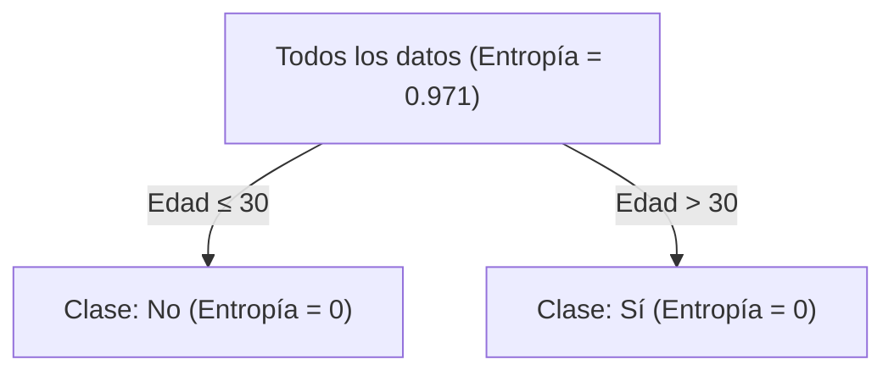

# Tema 2. Sistemas de aprendizaje automático supervisado

## Árboles de Decisión y Bosques Aleatorios

### **Objetivos del Módulo**

1. Comprender los fundamentos de los Árboles de Decisión.
2. Explorar los problemas de overfitting y underfitting en los árboles.
3. Introducir los ensambles y cómo los Random Forests mejoran el rendimiento.
4. Aplicar Árboles de Decisión y Random Forests a problemas reales.
5. Comparar los resultados de ambos modelos en términos de precisión, robustez y eficiencia.

------

### Árboles de Decisión: Introducción

Un **árbol de decisión** es un modelo de aprendizaje supervisado utilizado tanto para tareas de clasificación como de regresión. La estructura del árbol se asemeja a un diagrama jerárquico en el que las decisiones se toman a partir de divisiones sucesivas basadas en las características del dataset. Estas divisiones intentan separar los datos de manera que se minimice la incertidumbre y se mejore la pureza de los grupos resultantes.

La lógica de los árboles de decisión es sencilla: en cada nodo interno, se evalúa una característica para dividir los datos en subconjuntos más homogéneos. Estas posibles divisiones se evalúan en función de una métrica determinada que mide la calidad de la separación. De este modo, el proceso continúa de manera recursiva hasta alcanzar una condición de parada, como por ejemplo, un nivel máximo de profundidad o un número mínimo de datos en los nodos.

#### Ejemplo sencillo: Decidir sobre si salir a hacer deporte según el tiempo

Supongamos que queremos construir un modelo para predecir si salimos a hacer deporte al aire libre en función del tiempo atmosférico. Tenemos un pequeño dataset con tres características: **Tiempo**, **Temperatura** y **Humedad**. La variable objetivo es **Hacer deporte** (Sí o No).

| Tiempo   | Temperatura | Humedad | Hacer deporte |
| -------- | ----------- | ------- | ------------- |
| Soleado  | Calor       | Alta    | No            |
| Soleado  | Calor       | Normal  | Sí            |
| Nublado  | Frío        | Alta    | Sí            |
| Lluvioso | Frío        | Alta    | No            |
| Lluvioso | Templado    | Normal  | Sí            |

Nuestro objetivo es construir un árbol que clasifique correctamente si hacemos deporte o no, basado en este conjunto de datos. Para ello comenzamos evaluando que característica inicial (nodo raíz) proporciona la **mejor división** del dataset. Podríamos usar un criterio sencillo: Tras la división los grupos resultantes han de ser lo más homogéneo posible. Con este criterio en mente, vamos a suponer que el nodo raíz será ocupado por la característica "Tiempo"

A partir de ello iremos creando ramas para cada valor posible (**Soleado**, **Nublado**, **Lluvioso**) y evaluamos cada rama por separado. En la rama **Soleado**  podríamos dividir aún más basándonos en **Humedad**:  

- Si **Humedad = Alta**, entonces **Hacer deporte = No**.

- Si **Humedad = Normal**, entonces **Hacer deporte = Sí**.

En la rama **Nublado** todas las observaciones tienen la misma clase (**Hacer deporte = Sí**). No es necesario dividir más.

Por último, en la rama **Lluvioso** podríamos dividir basándonos en **Temperatura**:  

- Si **Temperatura = Frío**, entonces **Hacer deporte = No**.  

- Si **Temperatura = Templado**, entonces **Hacer deporte = Sí**

Podemos representar el árbol resultante de la siguiente manera:

##### ¿Cómo usar el árbol para predecir?

Para realizar una predicción, seguimos las reglas del árbol según las características de una nueva observación. Por ejemplo:

- Nueva observación: Tiempo = Soleado, Humedad = Alta.
  
  Seguimos la rama "Soleado" y luego "Humedad = Alta", lo que predice **Hacer deporte = No**.
  
- Nueva observación: Clima = Lluvioso, Temperatura = Frío. 
  
  Seguimos la rama "Lluvioso" y luego "Temperatura = Frío", lo que predice **Hacer deporte = No**.

##### Algunas reflexiones

Este ejemplo les permite ver cómo se construye un árbol paso a paso. Pero se pueden discutir preguntas como:

> **¿Por qué elegimos "Clima" como el nodo raíz?** 

> **¿Qué sucede si un grupo sigue siendo muy heterogéneo después de una división?**  

#### Estructura de los árboles de decisión y tipos

En un árbol de decisión, cada uno de sus elementos tiene un papel fundamental en el proceso de tomar decisiones y generar predicciones. El primer componente esencial es el **nodo**, que representa un punto donde se evalúa una característica del dataset para dividir los datos en subconjuntos más homogéneos. Estos nodos actúan como las encrucijadas del árbol, estableciendo reglas claras basadas en los valores de las características.

A partir de los nodos surgen las **ramas**, que conectan un nodo con otros nodos o con las hojas del árbol. Cada rama refleja un posible resultado de la decisión tomada en el nodo que la origina. Por ejemplo, si un nodo evalúa si la temperatura es **"fría"**, las ramas podrían representar las opciones "Sí" o "No", guiando a las observaciones hacia diferentes rutas según sus características.

En los extremos del árbol se encuentran las **hojas**, que son los nodos terminales y representan el resultado final del proceso de decisión. En el caso de un problema de clasificación, las hojas indican una clase específica (como "Apto" o "No apto"), mientras que en un problema de regresión, contienen un valor numérico continuo que es la predicción final.

Un aspecto crítico del árbol es su **profundidad**, que mide el número máximo de niveles desde el nodo raíz hasta las hojas. La profundidad determina cuán complejas pueden ser las reglas del modelo. Un árbol más profundo puede aprender patrones muy detallados del dataset, pero también **corre el riesgo de ajustarse demasiado** a los datos de entrenamiento, capturando ruido en lugar de patrones generalizables. Por otro lado, un árbol poco profundo puede ser demasiado simple, incapaz de modelar relaciones importantes, lo que lleva al subajuste. Por ello, encontrar la profundidad adecuada es crucial para equilibrar la capacidad del árbol para aprender patrones complejos y evitar el sobreajuste.

Los árboles de decisión son modelos versátiles que pueden adaptarse a diferentes tipos de problemas y escenarios según su diseño y la naturaleza de la variable objetivo. Aunque todos los árboles comparten principios básicos de funcionamiento, existen varias tipologías que los distinguen en función de su objetivo, estructura o configuración. A continuación, exploramos las principales categorías de árboles de decisión.

#### Tipos de árboles de decisión

Según el objetivo del problema que se quiera resolver podremos distinguir entre dos tipos de árboles de decisión: Los **árboles de clasificación** y los **árboles de regresión** 

##### Árboles de clasificación

Los árboles de clasificación son aquellos diseñados para resolver problemas donde la variable objetivo es **categórica**. Su propósito es dividir los datos en grupos homogéneos que correspondan predominantemente a una sola clase. Este tipo de árbol evalúa las divisiones basándose en métricas como la **entropía**, el **índice de Gini** o la **ganancia de información**, y busca maximizar la pureza de las clases en los nodos hijos.

Las **aplicaciones comunes** de este tipo de árboles pueden ser el diagnóstico médico (¿El paciente tiene una enfermedad o no?), la detección de fraudes (¿Una transacción es legítima o fraudulenta?) o la clasificación de textos (¿Un correo es spam o no?).

> **Ejemplo**: Un árbol de clasificación podría predecir si un cliente comprará un producto basándose en características como edad, ingreso y frecuencia de visitas a la tienda.

##### Árboles de regresión

En contraste, los árboles de regresión se utilizan para problemas donde la variable objetivo es **continua**. En este caso, el objetivo del árbol es dividir los datos en grupos donde los valores de la variable objetivo sean lo más compactos posible alrededor de su promedio. Las métricas utilizadas para evaluar las divisiones incluyen la **varianza** o el **error cuadrático medio (MSE)**, buscando minimizar la dispersión dentro de los nodos hijos.

Igualmente existen **aplicaciones comunes** para este tipo de árboles como pueden ser la predicción de precios (precio de viviendas, acciones, etc.), la estimación de demanda (ventas esperadas de un producto) o el modelado de variables continuas en ciencias naturales (temperatura, precipitación, etc.).

> **Ejemplo**: Un árbol de regresión podría predecir el precio de una casa basándose en características como el número de habitaciones, la superficie y la ubicación.

Podemos también establecer una clasificación en los árboles de decisión teniendo en cuenta el número de ramas que sale de cada nodo. Así, podríamos distinguir entre **árboles binarios** y **árboles multinarios**.

##### Árboles binarios

Los árboles binarios son una tipología estructural donde cada nodo se divide en exactamente **dos ramas**. Este diseño es el más común y facilita el proceso de división recursiva al evaluar cada característica con un único umbral. Sus ventajas son principalmente la simplicidad en la implementación y cálculo y la mayor compatibilidad con algoritmos de ensamble, como Random Forests.

> **Ejemplo**:
> Un árbol binario que evalúe la característica "Edad" podría dividir los datos según la condición "¿Edad > 30?".

##### Árboles multinarios

En los árboles multinarios, los nodos pueden dividirse en más de dos ramas, lo que es especialmente útil para variables categóricas con múltiples niveles. Por ejemplo, una característica como "Región" podría dar lugar a ramas para "Norte", "Sur", "Este" y "Oeste". Estos árboles tienden a ser más compactos, pero pueden complicar el análisis y la interpretación. Es cierto que tienen ciertas ventajas, como por ejemplo, la reducción en la profundidad del árbol o que permiten resolver problemas donde existen características categóricas con muchos valores posibles.

> **Ejemplo**: Un árbol multinario podría dividir los datos según el "Departamento de trabajo" en un dataset de empleados, generando ramas para "Recursos Humanos", "Finanzas", "Ventas" y "Producción".

### Modelos paramétricos vs. modelos no paramétricos

Los árboles de decisión, a diferencia de otros modelos como los de regresión, **no son modelos paramétricos**. Para comprender esta cuestión, es importante analizar qué significa que un modelo sea paramétrico y cómo los árboles de decisión se diferencian de esta categoría.

Los **modelos paramétricos** son aquellos que asumen una estructura funcional fija (como una ecuación matemática) para describir la relación entre las variables de entrada y la salida. Esta estructura está determinada por un número finito y fijo de **parámetros** que se ajustan durante el entrenamiento. Por ejemplo, en una regresión lineal, la relación entre las características y la variable objetivo está definida por una ecuación de la forma:

$$
y = \beta_0 + \beta_1x_1 + \beta_2x_2 + \dots + \beta_nx_n
$$

Aquí, los parámetros $\beta_i$ se ajustan para minimizar el error en los datos. Una vez ajustados, el modelo utiliza estos mismos parámetros para realizar predicciones, independientemente de la complejidad o el tamaño del dataset.

En contraste, los árboles de decisión **no asumen una forma funcional fija** entre las características y la variable objetivo. En lugar de ajustar un conjunto finito de parámetros, los árboles construyen su estructura de forma adaptativa en función de los datos. Este proceso implica decidir qué características usar, cómo dividirlas y hasta qué profundidad crecer el árbol. La estructura resultante del árbol, incluyendo las reglas de decisión y las particiones del espacio, depende completamente del dataset específico con el que se entrena.

Por esta razón, los árboles de decisión tienen un número de parámetros **que no está fijado a priori**. El tamaño y la complejidad del modelo (es decir, el número de nodos, hojas y divisiones) dependen directamente del dataset y de las configuraciones de hiperparámetros como la profundidad máxima, el número mínimo de muestras por nodo, o los criterios de división.

Al ser no paramétricos, los árboles de decisión tienen varias características distintivas: Primero, su **mayor flexibilidad**, ya que pueden capturar relaciones complejas, no lineales y altamente interactivas entre las características sin necesidad de especificar explícitamente estas relaciones. Esto contrasta con los modelos paramétricos, que suelen necesitar términos adicionales (como polinomios o interacciones) para manejar este tipo de datos. En segundo lugar, la **dependencia del dataset** es muy alta, dependiendo por completo la estructura del árbol de los datos utilizados en el entrenamiento. Si el dataset cambia significativamente (por ejemplo, se añaden nuevas observaciones), es posible que el árbol necesite reconstruirse desde cero. En tercer lugar hay que tener en cuenta que existe una importante **escalabilidad con los datos**, ya que los árboles tienden a ser más efectivos en datasets grandes. Ello es debido a que cuentan con suficiente información para dividir el espacio de características de manera significativa. En datasets pequeños, su flexibilidad puede llevar al sobreajuste. Por último, a diferencia de un modelo paramétrico, el **número de parámetros es variable** y no está predeterminado. En su lugar, depende del número de divisiones realizadas y, por lo tanto, del tamaño del árbol final.

> [!NOte]
>
> ##### Comparación práctica con modelos paramétricos
>
> Un modelo paramétrico, como la regresión lineal, funciona bien cuando los datos cumplen los supuestos del modelo (como la linealidad). Sin embargo, si las relaciones son no lineales o hay interacciones complejas, este tipo de modelo puede fallar sin modificaciones significativas. Por el contrario, un árbol de decisión no necesita que el analista especifique relaciones o interacciones de antemano; las descubrirá automáticamente durante el proceso de construcción.
>
> Por ejemplo, en un problema donde las ventas de un producto dependen del precio y la estacionalidad, un modelo paramétrico tendría que incluir términos específicos como polinomios o interacciones (e.g., $precio \times estacionalidad$) para capturar la dinámica del sistema. En cambio, un árbol de decisión crearía divisiones adaptativas basadas en estos factores sin necesidad de transformaciones adicionales.
>

### Enfoque local vs. enfoque global

Hemos visto en la introducción como los árboles de decisión tienen la capacidad de **dividir el espacio muestral** en regiones más pequeñas y homogéneas. En efecto,  los modelos como la regresión lineal o logística utilizan una única ecuación matemática que abarca todo el espacio de datos. Esta ecuación genera un único conjunto de coeficientes que describe cómo cada predictor afecta la variable objetivo, sin diferenciar entre diferentes regiones del espacio muestral. Si los datos presentan patrones locales o interacciones complejas, estos modelos suelen ser menos efectivos, a menos que se introduzcan manualmente términos adicionales. Esta forma de abordar el problema se denomina en machine learning **enfoque global**.

Por contra, los árboles de decisión trabajan bajo lo que se denomina **enfoque local**. Con ello nos referimos a la capacidad de estos modelos para tomar decisiones basadas en **subconjuntos específicos** del espacio de características, en lugar de aplicar una fórmula o regla global que abarque todo el espacio muestral. Este enfoque permite que los árboles adapten su estructura a las particularidades de los datos en distintas regiones del espacio, lo que los hace flexibles y efectivos en escenarios complejos. Esta flexibilidad permite capturar patrones que serían difíciles de modelar con aproximaciones globales, como las utilizadas en modelos lineales.

El enfoque local de los árboles también elimina la necesidad de asumir **relaciones rígidas entre las variables**. A diferencia de los modelos que dependen de supuestos como la linealidad o la normalidad, los árboles de decisión trabajan directamente con los datos tal como se presentan. Esta propiedad los hace resistentes a datos atípicos o relaciones complejas que escapan a las limitaciones de una fórmula global.

Otra cuestión interesante a tener en cuenta es la **interpretación de los coeficientes**. En modelos globales como la regresión lineal, cada predictor tiene un coeficiente que indica cómo influye en la variable objetivo, pero esta influencia se asume constante en todo el espacio muestral. Si bien los coeficientes pueden ser interpretables matemáticamente, su significado práctico puede ser difícil de entender en situaciones donde los datos son heterogéneos o donde hay interacciones no explícitas entre las variables. Por el contrario, los árboles de decisión ajustan las reglas a regiones específicas del espacio de datos, lo que hace que la interpretación sea más relevante para cada subconjunto. Además, no requieren términos adicionales o transformaciones complejas para capturar interacciones o patrones no lineales.

Por último mencionar que su estructura intuitiva y la claridad de las reglas que generan, provee a los árboles de decisión de una importante **ventaja interpretativa** que los hace accesibles tanto para expertos como para usuarios sin un conocimiento técnico profundo. A diferencia de otros modelos más abstractos (como redes neuronales o incluso regresiones con muchas variables e interacciones), los árboles presentan un razonamiento explícito que puede ser seguido paso a paso. Los árboles de decisión se construyen como diagramas jerárquicos, comenzando desde un **nodo raíz** y dividiéndose en ramas que representan decisiones basadas en los valores de las características del dataset. Cada nodo interno contiene una regla simple y cada hoja proporciona un resultado final. Este diseño permite que cualquier observador pueda rastrear cómo se llega a una predicción específica. Es más, esta estructura en divisiones sucesivas resalta de forma natural las **características más importantes** para la predicción. Al observar las divisiones principales del árbol, es posible identificar qué variables tienen mayor impacto en el modelo, lo que es particularmente útil en escenarios donde el objetivo no es solo predecir, sino también entender qué factores subyacen en un fenómeno.

### División recursiva y criterios de división

La construcción de un árbol de decisión se basa en un proceso de **división recursiva**, donde los datos se separan iterativamente **en subconjuntos más homogéneos** según las características evaluadas. En cada paso, el algoritmo determina cuál característica utilizar para dividir los datos, basándose en una métrica que mide la calidad de la separación. El objetivo de estas métricas es identificar las divisiones que reduzcan al máximo la incertidumbre o el desorden en los grupos resultantes.

Un conjunto se considera **puro** cuando todas las observaciones pertenecen a una sola clase, y la **ganancia de homogeneidad** refleja cuánto más cerca estamos de esa pureza después de realizar una división.

#### ¿Qué significa homogeneidad?

Imagina un conjunto de datos donde queremos predecir si las personas compran o no un producto. Al principio, el grupo es heterogéneo: algunas personas compran (clase "Sí") y otras no (clase "No"). Si logramos dividir el conjunto en grupos más homogéneos —por ejemplo, un grupo donde casi todos compran y otro donde casi nadie compra—, hemos ganado homogeneidad.

En términos prácticos, la **ganancia de homogeneidad** mide cuánto más simples y predecibles son los grupos que creamos después de una división en comparación con el conjunto original.

> **Ejemplo:** Piensa en una bolsa de caramelos de diferentes colores: rojo, verde y amarillo. Al principio, los caramelos están mezclados al azar en la bolsa, lo que refleja alta incertidumbre o desorden. Ahora, si divides los caramelos en tres bolsas separadas por color (una para los rojos, otra para los verdes, y una para los amarillos), cada bolsa será homogénea. Al realizar esta separación, has reducido el desorden y aumentado la pureza de los grupos.
>
> En un árbol de decisión, el algoritmo busca realizar algo similar con los datos: encontrar divisiones que agrupen las observaciones de manera que las clases sean lo más homogéneas posible dentro de cada grupo.

En conclusión: La división recursiva está impulsada por el concepto de **ganancia de homogeneidad**, que mide cuánto más ordenado es el dataset después de una división. Este concepto universal es aplicable tanto en árboles de clasificación como de regresión, aunque la forma exacta de medirlo (como entropía, índice de Gini o varianza) depende del tipo de problema. El objetivo principal de cada división es maximizar esta ganancia, asegurando que los nodos hijos representen subconjuntos más homogéneos y, por ende, más fáciles de predecir. Este principio guía todo el proceso de construcción del árbol, desde el nodo raíz hasta las hojas terminales. Aunque la manera de medir esta homogeneidad puede variar dependiendo del tipo de árbol, existen elementos estructurales del proceso que son comunes a todos ellos.

#### Selección de características y umbrales

El proceso comienza evaluando todas las características disponibles y determinando los **umbrales** o valores que mejor separen los datos en subconjuntos más homogéneos. Si la característica es numérica, el algoritmo considera divisiones del tipo "Edad > 30" o "Ingresos < 50.000". Para características categóricas, las divisiones pueden basarse en niveles, como "Género = Masculino" o "Estado = Aprobado".

El objetivo en este paso es encontrar la combinación característica-umbral que genere nodos hijos con la mayor ganancia de homogeneidad posible, es decir, donde los valores de la variable objetivo sean más uniformes o predecibles.

#### Criterio para medir la calidad de la división

Para decidir qué división aplicar, el algoritmo utiliza una **métrica** que evalúa la calidad de las particiones. Este criterio mide cuánto se redujo la heterogeneidad o incertidumbre al pasar del nodo padre a los nodos hijos. Aunque la métrica específica depende del tipo de problema (clasificación o regresión), el concepto subyacente es universal: se prefieren **divisiones que agrupan observaciones más similares entre sí**.

Por ejemplo, en problemas de clasificación, esta homogeneidad puede evaluarse en términos de pureza de las clases dentro de los nodos. Por su parte, en problemas de regresión, se mide la compactación de los valores continuos alrededor de un promedio.

La calidad de la división no solo depende de la homogeneidad dentro de los nodos hijos, sino también de su tamaño relativo: **nodos más grandes tienen un peso mayor en el cálculo**.

#### Recursividad en la construcción del árbol

Una vez que se selecciona la mejor división en un nodo, el proceso se repite de manera recursiva para cada nodo hijo. En cada paso, se aplican las mismas reglas: evaluar las posibles divisiones y seleccionar la que optimice la homogeneidad. Este enfoque recursivo continúa hasta que se cumplen ciertas condiciones de parada.

Esta naturaleza jerárquica y recursiva permite a los árboles de decisión capturar interacciones complejas entre las características y dividir el espacio de datos en regiones que reflejan patrones subyacentes en la variable objetivo.

#### Condiciones de parada

El proceso de división no puede continuar indefinidamente, ya que esto podría llevar a un modelo que memorice el dataset de entrenamiento (sobreajuste). Para evitarlo, se imponen restricciones que definen cuándo debe detenerse la recursividad. Normalmente podemos encontrarnos con tres situaciones. La primera, un escenario de **pureza máxima**. Esto es, si todos los ejemplos en un nodo pertenecen a la misma clase (en clasificación) o tienen el mismo valor (en regresión), la división se detiene. La segunda posibilidad es limitar la **profundidad máxima** del árbol, es decir, limitar la cantidad de niveles del árbol para evitar que se vuelva demasiado complejo. Por último, se puede definir un **tamaño mínimo del nodo**, de modo que, si un nodo tiene menos ejemplos que un umbral predefinido, no se permite una nueva división.

Estas condiciones garantizan que el árbol tenga un equilibrio entre su capacidad de aprender patrones complejos y su capacidad de generalizar a nuevos datos.

---

> [!important]
>
> La división recursiva y la ganancia de homogeneidad son los pilares comunes que sustentan a todos los tipos de árboles de decisión. Aunque los criterios específicos varían según el tipo de problema, el enfoque general busca dividir los datos de manera progresiva y eficiente, creando una estructura jerárquica que facilita la predicción y captura patrones significativos en los datos. Este proceso metódico asegura que los árboles sean herramientas versátiles y efectivas tanto en problemas de clasificación como de regresión.

#### Ejemplo práctico: ¿Cómo se mide la ganancia de homogeneidad?

Para fijar ideas vamos a suponer un ejemplo práctico de un árbol de decisión en una tarea de clasificación. En este caso , la ganancia de homogeneidad se mediría **comparando el desorden antes y después de una división**. La diferencia entre el desorden inicial y el final nos da la **ganancia de información**, o lo que es lo mismo, la ganancia de homogeneidad.

Supongamos que tenemos el siguiente dataset de frutas que queremos clasificar como "Comestible" o "No comestible":

| Color    | Tamaño  | Comestible |
| -------- | ------- | ---------- |
| Rojo     | Grande  | Sí         |
| Rojo     | Pequeño | Sí         |
| Verde    | Grande  | No         |
| Verde    | Pequeño | No         |
| Amarillo | Grande  | Sí         |

En el dataset original, hay tres frutas comestibles y dos no comestibles. Las clases están mezcladas, lo que refleja un nivel moderado de desorden.

Si dividimos las frutas según su color, obtenemos los siguientes grupos:

1. **Grupo "Rojo"**: {Sí, Sí} → Completamente homogéneo (todas las frutas son comestibles)
2. **Grupo "Verde"**: {No, No} → Completamente homogéneo (ninguna fruta es comestible)
3. **Grupo "Amarillo"**: {Sí} → También homogéneo 

La ganancia de información en este caso es máxima porque la división ha creado grupos perfectamente homogéneos.

##### Dividimos por Tamaño

Si en lugar de dividir por **Color** usamos **Tamaño**, obtenemos:

1. **Grupo "Grande"**: {Sí, No, Sí} → Mezclado (dos comestibles, uno no comestible). Entropía > 0.
2. **Grupo "Pequeño"**: {Sí, No} → Mezclado (uno comestible, uno no comestible). Entropía > 0.

En este caso, los grupos resultantes son menos homogéneos, lo que implica una menor ganancia de información en comparación con la división por **Color**

##### Contraejemplo: Mala división de las clases

Imagina que intentamos dividir las frutas por una característica irrelevante, como el peso exacto (en gramos). Esto podría generar muchos grupos pequeños con una mezcla aleatoria de clases en cada grupo. En este caso los subconjuntos resultantes tienen alto desorden porque las clases siguen mezcladas. La ganancia de homogeneidad sería mínima, lo que indica que esta característica no es adecuada para dividir los datos.

> [!tip]
>
> La ganancia de homogeneidad es el objetivo clave de cada división en un árbol de decisión. Al medir la calidad de las divisiones, el algoritmo asegura que las características seleccionadas sean las que mejor separen las clases, creando grupos lo más homogéneos posible. Esta capacidad de transformar un conjunto desordenado en grupos organizados y predecibles es lo que hace a los árboles de decisión herramientas poderosas para la clasificación y la regresión.

### Criterios de división: Árboles de regresión vs. árboles de clasificación

La división recursiva y la ganancia de homogeneidad son conceptos fundamentales en los árboles de decisión, pero su implementación y evaluación varían según el tipo de problema que se aborde. Mientras que los árboles de clasificación se enfocan en maximizar la pureza de las clases dentro de los nodos, los árboles de regresión buscan reducir la variabilidad de los valores continuos. En cualquier caso, el objetivo es crear nodos más homogéneos, lo que facilita predicciones más precisas y generalizables.

#### Árboles de regresión

En los árboles de regresión, donde **la variable objetivo es continua**, el objetivo principal de cada división es minimizar la **variabilidad** de los valores dentro de los nodos resultantes. A través de la división recursiva, el árbol busca agrupar los datos de manera que los valores de la variable objetivo sean lo más homogéneos posible dentro de cada nodo, logrando así que las predicciones sean más precisas.

Así, la calidad de una división en árboles de regresión se mide evaluando cómo afecta a la **dispersión** de los valores continuos de la variable objetivo en los nodos hijos. Las métricas más comunes incluyen: **Varianza, error cuadrático medio (MSE) y reducción de la suma de errores**

La ganancia de homogeneidad en árboles de regresión tiene  dos ventajas interesantes: Por un lado, genera  predicciones más precisas, ya que,  al reducir la variabilidad dentro de los nodos, el promedio de cada nodo se convierte en una estimación más representativa. Por otro lado, se pueden captura patrones locales. En efecto, al dividir los datos en regiones con valores similares, el árbol puede adaptarse a relaciones complejas entre las características y la variable objetivo.

##### **Varianza**  

La **varianza** mide cuánto se dispersan los valores de la variable objetivo en un nodo respecto a su promedio. La fórmula para la varianza de un nodo $S$ es:

$$
\text{Varianza}(S) = \frac{1}{|S|} \sum_{i=1}^{|S|} (y_i - \bar{y})^2
$$

Donde:
- $y_i$ son los valores individuales de la variable objetivo.
- $\bar{y}$ es el promedio de los valores en el nodo.

Al realizar una división, el objetivo es **reducir la suma ponderada de las varianzas en los nodos hijos**. Esto asegura que los valores en cada nodo sean más compactos alrededor de sus promedios.

##### **Error cuadrático medio (MSE)**  

El **MSE** es otra métrica común que evalúa la calidad de las divisiones considerando el error promedio entre los valores reales de la variable objetivo y el promedio de cada nodo hijo. Matemáticamente, el MSE se define como:

$$
	\text{MSE} = \frac{1}{N} \sum_{i=1}^N (y_i - \hat{y})^2
$$

Donde:
- $y_i$ son los valores reales de la variable objetivo.
- $\hat{y}$ es el valor promedio en el nodo correspondiente.

Al igual que la varianza, el objetivo es minimizar el MSE ponderado de los nodos hijos.

##### **Reducción de la suma de errores (RSS)** 

La **RSS** mide cuánto se reduce la suma total de errores al realizar una división. Su cálculo implica evaluar la diferencia entre el error del nodo padre y la suma de los errores de los nodos hijos:

$$
\text{RSS} = \sum_{i \in S} (y_i - \bar{y})^2 - \sum_{j=1}^k \sum_{i \in S_j} (y_i - \bar{y_j})^2
$$

Donde $\bar{y}$ es el promedio en el nodo padre y $\bar{y_j}$ es el promedio en cada nodo hijo.

> ##### Ejemplo práctico: Predicción del precio de viviendas
>
> Supongamos que estamos construyendo un árbol de regresión para predecir el precio de una vivienda ($Precio$) basándonos en una única característica numérica: **Superficie** (en metros cuadrados). Nuestro dataset contiene las siguientes observaciones:
>
> | Superficie (m²) | Precio (en miles) |
> | --------------- | ----------------- |
> | 50              | 150               |
> | 60              | 180               |
> | 70              | 210               |
> | 80              | 240               |
> | 90              | 270               |
>
> ###### Paso 1: Varianza inicial
>
> Primero calculamos la varianza de los valores de $Precio$ en el nodo raíz (que contiene todos los datos). La fórmula para la varianza es:
>
> $$
> \text{Varianza} = \frac{1}{N} \sum_{i=1}^N (y_i - \bar{y})^2
> $$
>
> Donde:
> - $y_i$ son los valores de la variable objetivo ($Precio$),
> - $\bar{y}$ es el promedio de los valores en el nodo,
> - $N$ es el número de observaciones.
>
> El promedio de los precios es:
> 
> $$
> \bar{y} = \frac{150 + 180 + 210 + 240 + 270}{5} = 210
> $$
>
> La varianza inicial es:
> 
> $$
> \text{Varianza} = \frac{1}{5} \left[(150 - 210)^2 + (180 - 210)^2 + (210 - 210)^2 + (240 - 210)^2 + (270 - 210)^2 \right]
> $$
>
> Calculando:
> 
> $$
> \text{Varianza} = \frac{1}{5} \left[3600 + 900 + 0 + 900 + 3600 \right] = \frac{9000}{5} = 1800
> $$
>
> ###### Paso 2: Evaluar divisiones posibles
>
> El algoritmo probará diferentes umbrales para dividir los datos según la **Superficie**. Vamos a calcular el efecto de dividir en **Superficie ≤ 70** y **Superficie > 70**.
>
> **División 1: Superficie ≤ 70 y Superficie > 70**
>
> <u>**Nodo 1 (Superficie ≤ 70):**</u>
> 
> Datos: {50, 60, 70} 
> 
> Precios: {150, 180, 210} 
> 
> Promedio:
> 
> $$
> \bar{y}_{\text{Nodo 1}} = \frac{150 + 180 + 210}{3} = 180
> $$
>
> Varianza:
> 
> $$
> \text{Varianza}_{\text{Nodo 1}} = \frac{1}{3} \left[(150 - 180)^2 + (180 - 180)^2 + (210 - 180)^2 \right]
> $$
> 
> $$
> = \frac{1}{3} \left[900 + 0 + 900 \right] = \frac{1800}{3} = 600
> $$
>
> <u>**Nodo 2 (Superficie > 70):**</u> 
> 
> Datos: {80, 90} 
> 
> Precios: {240, 270} 
> 
> Promedio:
> 
> $$
> \bar{y}_{\text{Nodo 2}} = \frac{240 + 270}{2} = 255
> $$
>
> Varianza:
> 
> $$
> \text{Varianza}_{\text{Nodo 2}} = \frac{1}{2} \left[(240 - 255)^2 + (270 - 255)^2 \right]
> $$
> 
> $$
> = \frac{1}{2} \left[225 + 225 \right] = \frac{450}{2} = 225
> $$
>
> **Varianza ponderada después de la división**
>
> La varianza ponderada total tras la división es:
> 
> $$
> \text{Varianza ponderada} = \frac{3}{5} \cdot 600 + \frac{2}{5} \cdot 225
> $$
> 
> $$
> = 360 + 90 = 450
> $$
>
> ###### Paso 3: Ganancia de homogeneidad
>
> La ganancia de homogeneidad (reducción de varianza) se calcula como:
> 
> $$
> \text{Ganancia de homogeneidad} = \text{Varianza inicial} - \text{Varianza ponderada}
> $$
> 
> $$
> = 1800 - 450 = 1350
> $$
>
> La división **Superficie ≤ 70 y Superficie > 70** reduce significativamente la varianza, por lo que el algoritmo seleccionará esta división.
>
> ###### Paso 4: Repetir el proceso recursivamente
>
> El árbol continuará dividiendo los datos dentro de cada nodo hijo, buscando nuevas divisiones que reduzcan aún más la variabilidad en los valores de $Precio$.
>
> ###### Representación del árbol resultante (hasta este paso)
>
> 

> [!important]
>
> El enfoque de los árboles de regresión para maximizar la homogeneidad minimizando la variabilidad asegura que las divisiones sean óptimas en términos de precisión predictiva. Este proceso recursivo permite a los árboles de regresión ajustarse a patrones complejos en los datos, ofreciendo una solución robusta para problemas de predicción de variables continuas.

#### Árboles de clasificación

En los árboles de clasificación, donde la variable objetivo es categórica, el objetivo principal es maximizar la **pureza de las clases** en los nodos resultantes. A través de la división recursiva, el árbol evalúa diversas características y umbrales para dividir los datos, buscando crear grupos donde una sola clase predomine. La calidad de estas divisiones se mide utilizando métricas específicas que evalúan la **homogeneidad de las clases**. En este sentido, las métricas más comunes para evaluar la calidad de las divisiones son la **entropía**, el **índice de Gini** o el **error de clasificación.**

##### **Entropía y ganancia de información**

La **entropía** es una métrica que mide el nivel de desorden o incertidumbre en un conjunto de datos. Un nodo es completamente puro (entropía = 0) si todas las observaciones pertenecen a una sola clase. En cambio, si las clases están distribuidas uniformemente, la entropía es máxima.

La fórmula para la entropía es:

$$
H(S) = -\sum_{i=1}^C p_i \log_2(p_i)
$$

Donde:
- $C$ es el número de clases.
- $p_i$ es la proporción de observaciones pertenecientes a la clase $i$.

Después de realizar una división, la **ganancia de información** mide cuánto se redujo la entropía. La fórmula es:

$$
\text{Ganancia de información} = H(S) - \sum_{j=1}^k \frac{|S_j|}{|S|} H(S_j)
$$

Donde:
- $H(S)$ es la entropía del nodo original (padre).
- $H(S_j)$ es la entropía de cada nodo hijo.
- $\frac{|S_j|}{|S|}$ es el peso del nodo hijo basado en su tamaño relativo.

La ganancia de información selecciona divisiones que maximizan la reducción de incertidumbre, favoreciendo aquellas que producen nodos más homogéneos.

##### **Índice de Gini**

El **índice de Gini** mide la probabilidad de clasificar incorrectamente una observación si se elige al azar del nodo. Al igual que la entropía, un valor de Gini cercano a 0 indica alta homogeneidad.

La fórmula del índice de Gini es:

$$
Gini(S) = 1 - \sum_{i=1}^C p_i^2
$$

Donde:
- $p_i$ es la proporción de observaciones en la clase $i$.

A diferencia de la entropía, el índice de Gini penaliza menos las clases dominantes, por lo que a veces genera divisiones ligeramente diferentes.

##### **Error de clasificación**

El error de clasificación mide la proporción de observaciones que no pertenecen a la clase mayoritaria dentro de un nodo. Aunque menos común que la entropía o Gini, es útil como criterio simple para evaluar la pureza de un nodo:
$$
\text{Error de clasificación} = 1 - \max(p_i)
$$

Donde $\max(p_i)$ es la proporción de observaciones en la clase mayoritaria.

##### Ejemplo práctico: Clasificación de clientes

Supongamos que queremos construir un árbol para predecir si un cliente comprará un producto basado en su **Edad**. Nuestro dataset es:

| Edad | Compra |
| ---- | ------ |
| 25   | No     |
| 30   | No     |
| 35   | Sí     |
| 40   | Sí     |
| 50   | Sí     |

###### Paso 1: Entropía inicial

Primero calculamos la entropía del nodo raíz. La proporción de clases es:
- "No" = $\frac{2}{5}$
- "Sí" = $\frac{3}{5}$

La entropía inicial es:

$$
H(S) = -\left(\frac{2}{5} \log_2 \frac{2}{5} + \frac{3}{5} \log_2 \frac{3}{5}\right)
$$

$$
H(S) \approx -\left(0.4 \cdot -1.322 + 0.6 \cdot -0.737\right) = 0.971
$$

###### Paso 2: Evaluar divisiones

Consideremos el umbral **Edad ≤ 30** para dividir los datos:

**Nodo 1 (Edad ≤ 30):** {No, No}

$$
H(S_1) = -\left(\frac{2}{2} \cdot \log_2 \frac{2}{2}\right) = 0 \quad (\text{grupo homogéneo})
$$

**Nodo 2 (Edad > 30):** {Sí, Sí, Sí}

$$
H(S_2) = -\left(\frac{3}{3} \cdot \log_2 \frac{3}{3}\right) = 0 \quad (\text{grupo homogéneo})
$$

###### Paso 3: Ganancia de información

La ganancia de información se calcula como:

$$
\text{Ganancia de información} = H(S) - \left(\frac{2}{5} \cdot H(S_1) + \frac{3}{5} \cdot H(S_2)\right)
$$

$$
\text{Ganancia de información} = 0.971 - \left(\frac{2}{5} \cdot 0 + \frac{3}{5} \cdot 0\right) = 0.971
$$

Esta división maximiza la ganancia de información porque produce nodos perfectamente homogéneos.

###### Representación del árbol resultante

### Ventajas y limitaciones en el uso de árboles de decisión

Los árboles de decisión son modelos versátiles que destacan por su simplicidad y capacidad para abordar una amplia gama de problemas. Sin embargo, como cualquier herramienta, presentan ventajas y limitaciones que deben ser consideradas al decidir su uso en un proyecto de aprendizaje supervisado.

#### Ventajas

Una de las características más destacadas de los árboles de decisión es su naturaleza **intuitiva y fácil de interpretar**. Cada predicción se basa en un conjunto claro de reglas que pueden ser seguidas desde el nodo raíz hasta una hoja terminal. Esto los convierte en herramientas transparentes, donde los usuarios pueden entender cómo y por qué se tomó una decisión. Esta cualidad es especialmente valiosa en contextos donde la explicabilidad del modelo es crucial, como en medicina, finanzas o sistemas legales.

Otra fortaleza importante es su **versatilidad**. Los árboles pueden aplicarse tanto en problemas de clasificación, donde la variable objetivo es categórica, como en regresión, donde se predicen valores continuos. Esto los hace útiles en una amplia gama de aplicaciones, desde la predicción de ventas hasta el diagnóstico médico.

Además, los árboles de decisión tienen la capacidad de manejar **datos categóricos y numéricos** de forma natural, sin necesidad de preprocesamiento complejo. A diferencia de otros modelos, como las regresiones lineales, no requieren transformar variables categóricas en valores numéricos (codificación). Esto simplifica considerablemente el flujo de trabajo en problemas con datos heterogéneos.

#### Limitaciones

A pesar de sus ventajas, los árboles de decisión también presentan algunas limitaciones importantes. Una de las principales es su **propensión al sobreajuste**. Un árbol sin restricciones puede crecer excesivamente, ajustándose a los patrones específicos del conjunto de entrenamiento, incluyendo el ruido. Este fenómeno hace que el modelo pierda su capacidad de generalización y funcione mal en datos nuevos.

Los árboles también son **sensibles a datasets pequeños**. Cuando el número de observaciones es limitado, las divisiones pueden estar influenciadas por valores atípicos o ruido, produciendo ramas inestables y poco fiables. Esto puede llevar a resultados inconsistentes que no reflejan patrones generalizables en los datos.

En problemas complejos, los árboles de decisión **tienden a ser superados por modelos avanzados**, como los ensambles de árboles (Random Forests, Gradient Boosting) o modelos de aprendizaje profundo. Estos métodos combinan múltiples árboles o aplican técnicas más sofisticadas para mejorar la precisión y reducir el sobreajuste. Aunque un árbol individual puede ser un buen punto de partida, es posible que no sea suficiente en escenarios donde se requiere un rendimiento óptimo.

> **Ejemplo:** 
>
> Consideremos un dataset que contiene información sobre clientes de una tienda y su decisión de comprar un producto. Las características incluyen **edad**, **ingreso** y **frecuencia de visitas al sitio web**. Un árbol de decisión podría dividir los datos inicialmente según la edad, creando una rama para "Menores de 30 años" y otra para "30 años o más". Posteriormente, dentro de cada grupo, el modelo podría usar el ingreso para determinar si es probable que el cliente compre el producto. Esta estructura jerárquica permite descomponer un problema complejo en reglas simples y comprensibles.

##### Para reflexionar...

> **¿Por qué los árboles de decisión son propensos al sobreajuste en datasets pequeños?**
> **Clave**: Piensa en cómo un árbol con muchas divisiones puede memorizar patrones específicos del conjunto de entrenamiento, especialmente cuando los datos son escasos o contienen ruido. Reflexiona sobre la importancia de limitar la profundidad del árbol o el tamaño mínimo de los nodos para mejorar la capacidad de generalización.

