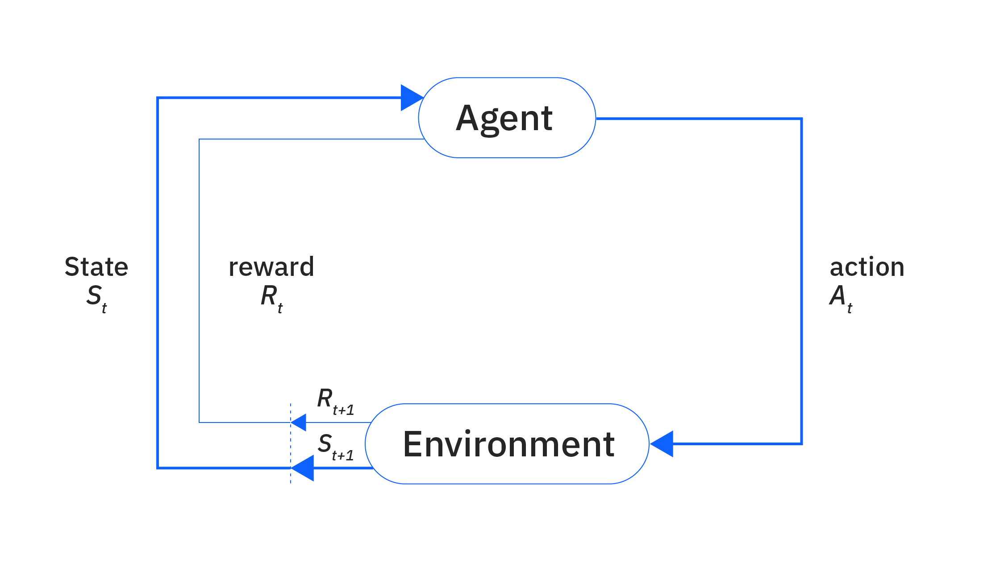
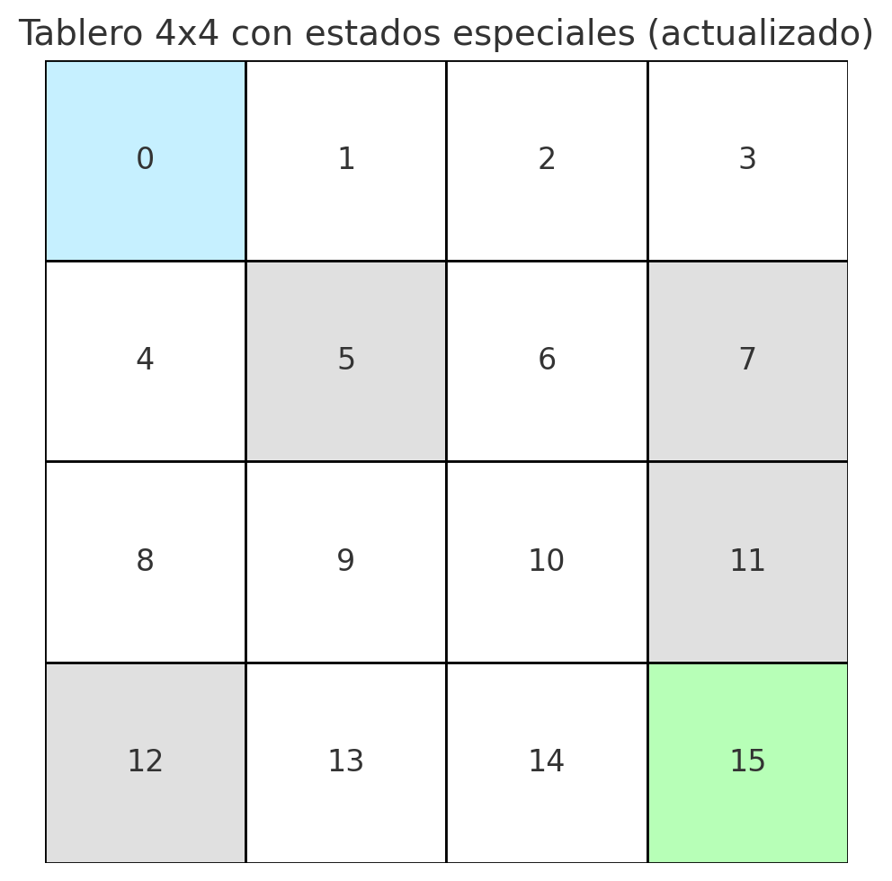
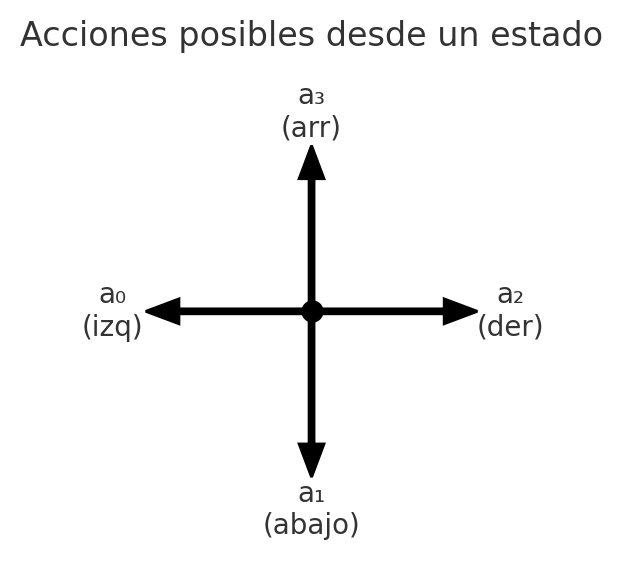

# Tema 4. Sistemas de aprendizaje automático por refuerzo

## Fundamentos del Aprendizaje por Refuerzo

### Objetivos del módulo

> - Comprender qué es el aprendizaje por refuerzo y cómo se diferencia del aprendizaje supervisado y no supervisado.
> - Identificar los elementos clave de un problema de RL: agente, entorno, estados, acciones y recompensas.
> - Analizar el ciclo de interacción agente-entorno y el problema exploración-explotación.
> - Formalizar problemas de RL mediante **Procesos de Decisión de Markov (MDP)** y sus propiedades.
> - Estudiar la ecuación de Bellman y su papel en la estimación de funciones de valor.
> - Explorar métodos básicos para resolver MDPs: programación dinámica y Monte Carlo.

---

### **Introducción**

Un niño que aprende a andar en bicicleta no sigue una lista de instrucciones detalladas, sino que prueba diferentes movimientos y estrategias. Cae, se levanta y ajusta su equilibrio con cada intento. Si gira demasiado rápido, puede caer; si pedalea con estabilidad, avanza sin problemas. Con el tiempo, su cerebro asocia ciertas acciones con mejores resultados y ajusta su comportamiento en consecuencia. Este proceso intuitivo de prueba, error y ajuste puede equiparse al funcionamiento del **aprendizaje por refuerzo (Reinforcement Learning, RL)**.

Un definición muy sencilla del **aprendizaje por refuerzo** podría enunciarse así: 

> Paradigma de **aprendizaje automático** en el que un **agente** interactúa con un **entorno**, toma **acciones** y recibe **recompensas**, ajustando su estrategia para maximizar las ganancias a largo plazo.

Así pues, el aprendizaje por refuerzo es un marco matemático para la **toma de decisiones secuenciales**. Un **agente** explora su entorno, realiza acciones y recibe **recompensas** o **penalizaciones**, ajustando su comportamiento en función de la experiencia acumulada. Su objetivo es aprender una **política óptima**, es decir, una estrategia que maximice las recompensas a lo largo del tiempo.

Al final, todo este enfoque se fundamenta en la idea de **exploración y explotación**. El agente debe decidir entre explorar nuevas acciones para descubrir mejores resultados o explotar el conocimiento actual para obtener recompensas inmediatas.

> **Ejemplo 1** :
>  Un robot autónomo que navega en una fábrica puede moverse en distintas direcciones. Si choca con un obstáculo, recibe una penalización; si llega a su destino, obtiene una recompensa. Con el tiempo, aprende a evitar los obstáculos y elegir la ruta más eficiente.

> **Ejemplo 2**:
>  En un videojuego, un agente de RL aprende a jugar explorando distintas estrategias, ganando puntos por acciones exitosas y perdiéndolos por errores. No tiene instrucciones explícitas sobre cómo ganar, pero mejora su desempeño con la experiencia.

#### **Diferencias entre el aprendizaje por refuerzo y otros paradigmas de Machine Learning**

El aprendizaje por refuerzo (RL) es un paradigma distinto dentro del Machine Learning que se diferencia tanto del **aprendizaje supervisado** como del **aprendizaje no supervisado** en la forma en que el modelo adquiere conocimiento y toma decisiones. Mientras que en el aprendizaje supervisado los modelos aprenden a partir de datos etiquetados y en el no supervisado buscan estructuras ocultas en los datos, el aprendizaje por refuerzo aprende **mediante la interacción con un entorno**, ajustando su comportamiento en función de las recompensas obtenidas.

En efecto, en el **aprendizaje supervisado**, un modelo se entrena con un conjunto de datos etiquetados donde cada entrada tiene una salida esperada. El objetivo es minimizar el error de predicción comparando los resultados del modelo con las etiquetas verdaderas a través de la minimización de una *función de pérdida*. En contraste, en **RL no hay un conjunto de datos fijos ni etiquetas predefinidas**. En su lugar, un **agente** interactúa con el entorno y aprende a tomar decisiones **basándose en la recompensa obtenida a lo largo del tiempo**. En vez de ajustar pesos para minimizar una función de pérdida, el agente busca maximizar el retorno acumulado en un horizonte temporal.

> **Ejemplo**:
>  En un sistema de reconocimiento de voz basado en aprendizaje supervisado, el modelo aprende a transcribir audio a texto a partir de ejemplos etiquetados. En cambio, en un asistente virtual que usa RL, el sistema ajusta sus respuestas en función de cómo el usuario interactúa, optimizando la experiencia según el nivel de satisfacción detectado.

La diferencia clave es la **retroalimentación**. En aprendizaje supervisado, el modelo recibe correcciones inmediatas (errores entre predicciones y etiquetas), mientras que en el RL, las recompensas pueden estar **diferidas en el tiempo**, lo que implica que el agente debe aprender **estrategias a largo plazo**.

Por otra parte, ya sabemos que el **aprendizaje no supervisado** se fundamenta en la detección de patrones sin necesidad de aportar etiquetas. En este escenario los modelos buscan estructuras ocultas en los datos. Pero a diferencia del aprendizaje no supervisado, en RL **no se busca estructurar datos, sino aprender una política de acción**. El agente explora su entorno y ajusta su comportamiento en función de la recompensa acumulada, mientras que un algoritmo no supervisado solo analiza relaciones entre datos sin actuar sobre ellos.

> **Ejemplo**:
>  Un modelo no supervisado puede analizar el comportamiento de los clientes en un e-commerce y agruparlos según patrones de compra. Sin embargo, un sistema basado en RL optimiza la **estrategia de recomendación de productos**, aprendiendo a mostrar ofertas personalizadas en función de la interacción del usuario para maximizar las conversiones.

En la siguiente tabla se resumen las diferencias clave entre los tres enfoques de machine learning vistos hasta ahora en el curso

| Característica           | Aprendizaje supervisado       | Aprendizaje no supervisado       | Aprendizaje por refuerzo                    |
| ------------------------ | ----------------------------- | -------------------------------- | ------------------------------------------- |
| Datos de entrenamiento   | Etiquetados                   | Sin etiquetas                    | Generados por interacción                   |
| Objetivo del aprendizaje | Minimizar error de predicción | Encontrar estructuras ocultas    | Maximizar recompensa acumulada              |
| Retroalimentación        | Corrección inmediata          | No hay retroalimentación directa | Recompensa diferida                         |
| Ejemplo típico           | Clasificación de imágenes     | Clustering de clientes           | Un agente que aprende a jugar un videojuego |

##### Para reflexionar...

> **¿En qué situaciones el aprendizaje por refuerzo puede ser más ventajoso que los enfoques supervisados o no supervisados?**
>  **Clave**: Piensa en problemas donde la mejor estrategia se aprende a través de prueba y error, sin datos etiquetados previamente.

#### **Aplicaciones y casos de uso**

El aprendizaje por refuerzo ha demostrado su potencial en múltiples sectores, donde la toma de decisiones secuenciales es clave para mejorar el rendimiento y la eficiencia. Su capacidad para aprender estrategias óptimas a partir de la interacción con un entorno lo hace especialmente útil en escenarios donde las reglas no están completamente definidas o donde la exploración es fundamental para el éxito.

Uno de los ámbitos donde RL ha tenido un impacto significativo es la **robótica**. Los robots autónomos aprenden a manipular objetos, navegar en entornos desconocidos y adaptarse a situaciones cambiantes. En lugar de programar manualmente cada movimiento, un agente de RL puede explorar distintas estrategias hasta encontrar la mejor manera de alcanzar su objetivo, como un brazo robótico que aprende a ensamblar piezas sin necesidad de instrucciones precisas.

En el mundo de los **juegos y el entretenimiento**, RL ha logrado hitos sorprendentes. Algoritmos como AlphaGo han superado a los mejores jugadores humanos en juegos complejos como *Go* y *ajedrez*, descubriendo estrategias innovadoras que antes no se habían considerado. Además, en los videojuegos, agentes de RL han aprendido a jugar títulos de estrategia en tiempo real sin instrucciones explícitas, simplemente experimentando y ajustando su comportamiento en función de las recompensas obtenidas.

En el ámbito de la **optimización de procesos**, muchas empresas utilizan RL para mejorar la eficiencia en logística y cadena de suministro. Por ejemplo, en la planificación de rutas de entrega, un agente puede aprender a minimizar los tiempos de transporte y reducir costos operativos explorando diferentes combinaciones de rutas y evaluando su impacto en el rendimiento general del sistema.

En el sector **financiero**, RL se ha aplicado con éxito en la creación de estrategias de inversión automatizadas. Dado que los mercados financieros son dinámicos e impredecibles, los agentes de RL pueden aprender a ajustar sus decisiones en función de la evolución de los datos, optimizando la asignación de recursos para maximizar el retorno de inversión.

Por último, en el área de **salud**, el aprendizaje por refuerzo se ha utilizado para personalizar tratamientos médicos y optimizar terapias. Un modelo de RL puede aprender cuál es la mejor secuencia de decisiones para ajustar la dosis de un medicamento o definir un plan de tratamiento adaptado a cada paciente, maximizando la efectividad y minimizando los efectos adversos.

En todos estos casos, el aprendizaje por refuerzo permite que los sistemas evolucionen a partir de la experiencia, descubriendo soluciones óptimas en entornos dinámicos donde las reglas no siempre están claras desde el principio.

##### Para reflexionar...

> **¿Qué características comparten los problemas donde el aprendizaje por refuerzo ha demostrado ser más efectivo?**
>  **Clave**: Analiza cómo la interacción con el entorno y la optimización de largo plazo influyen en la toma de decisiones.

### **Elementos fundamentales del aprendizaje por refuerzo**

Para comprender cómo funciona el aprendizaje por refuerzo, es esencial identificar los componentes básicos que definen la interacción entre el agente y el entorno. Estos elementos forman la estructura formal de un problema de RL y son los que permiten modelar matemáticamente la toma de decisiones secuenciales.

#### Agente, entorno, estados, acciones y recompensas

En un problema de aprendizaje por refuerzo, el **agente** es la entidad que toma decisiones. Su objetivo es aprender una **política de comportamiento** que le permita maximizar la recompensa acumulada a lo largo del tiempo. Para ello, el agente debe interactuar con un **entorno** que le proporciona información sobre su estado actual y las consecuencias de sus acciones.

Un **estado** representa la información relevante del entorno en un instante dado. Puede ser observable completamente (como la posición de una pieza en un tablero de ajedrez), estar parcialmente oculto, o depender de un factor aleatorio, lo que introduce incertidumbre. En cada estado, el agente puede ejecutar una o varias **acciones** disponibles, dependiendo de la situación.

Cada acción que toma el agente provoca una **transición de estado** en el entorno, que responde devolviendo un nuevo estado y una **recompensa**. Esta recompensa es un valor numérico que cuantifica el beneficio (o penalización) asociado a la acción tomada. Este proceso se repite a lo largo del tiempo, generando una trayectoria o episodio de interacción.

> **Ejemplo**: 
> Imaginemos un robot móvil que se desplaza por una cuadrícula. El **estado** puede ser su posición actual, las **acciones** son los movimientos posibles (arriba, abajo, izquierda, derecha), y la **recompensa** podría ser +1 al llegar a una casilla objetivo y 0 o negativo en el resto. El **entorno** es la cuadrícula con sus obstáculos, y el **agente** es el software de control que decide cada movimiento. 

#### Ciclo de interacción agente-entorno 

El aprendizaje por refuerzo se estructura como un ciclo continuo de interacción entre el agente y el entorno. En cada instante de tiempo $t$, el agente: 

1. Observa el estado actual $s_t$ del entorno.
2. Selecciona una acción $a_t$ según su política de decisión.
3. Ejecuta la acción y recibe del entorno:
   - Una recompensa $r_{t+1}$ que evalúa la acción.
   - El nuevo estado $s_{t+1}$ resultante de la transición.

Este ciclo se repite a lo largo de múltiples pasos o episodios, permitiendo al agente **ajustar su política** en función de la experiencia acumulada. El objetivo final es aprender a elegir las acciones que **maximicen la suma total de recompensas** recibidas en el tiempo.

> **Ejemplo**:
> En un videojuego, el estado puede representar la situación del jugador en la pantalla, la acción es el movimiento realizado, y la recompensa puede depender de si se ha evitado un obstáculo o se ha alcanzado un objetivo. Tras cada acción, el entorno cambia (aparecen enemigos, se modifican obstáculos) y el agente, que en este caso es la pieza de software en sí, debe adaptarse a estos cambios para seguir avanzando.

#### **Exploración y explotación**

Uno de los desafíos más característicos del aprendizaje por refuerzo es el equilibrio entre **exploración** y **explotación**. Explotar significa utilizar el conocimiento actual para elegir aquellas acciones que se estiman más prometedoras en cuanto a la recompensa inmediata. En cambio, explorar implica tomar decisiones alternativas que, aunque inicialmente puedan parecer subóptimas, permiten descubrir nuevas estrategias que podrían ser más beneficiosas a largo plazo.

Este equilibrio es esencial porque un agente que únicamente explota puede quedar atrapado en soluciones locales no óptimas, mientras que uno que se dedica exclusivamente a explorar puede no llegar nunca a consolidar una política eficaz. Para abordar este problema, se diseñan estrategias de exploración específicas, como el método $\epsilon$-greedy o enfoques basados en la estimación de incertidumbre, que permiten modular este compromiso de forma adaptativa.

> **Ejemplo**: 
> Un agente que aprende a jugar al ajedrez puede descubrir una estrategia ganadora rápida, pero si nunca explora nuevas aperturas o movimientos, podría perder la oportunidad de encontrar combinaciones más potentes. Alternar entre probar jugadas conocidas y experimentar nuevas es clave para alcanzar un juego experto.

##### Para reflexionar...
> **¿Por qué es necesario que un agente de RL explore incluso cuando ya tiene una política aparentemente buena?** 
> **Clave**: Reflexiona sobre cómo la falta de exploración puede impedir encontrar soluciones más eficientes o adaptarse a cambios en el entorno.

### **Formalización matemática del aprendizaje por refuerzo: ****Procesos de Decisión de Markov (MDP)**

La base matemática del aprendizaje por refuerzo se construye sobre el marco de los **Procesos de Decisión de Markov (MDP)**. Este formalismo permite modelar situaciones en las que un agente debe tomar decisiones secuenciales en un entorno, donde el resultado de cada acción puede ser incierto y depender del estado actual. A partir de esta formulación, se definen funciones que cuantifican la utilidad esperada de las acciones, y se desarrollan métodos para aprender políticas óptimas que maximicen las recompensas acumuladas.

Perfecto. A continuación te presento la introducción al formalismo de los **Procesos de Decisión de Markov (MDP)** en formato **apuntes**, siguiendo el enfoque didáctico y riguroso que has indicado. Esta sección está pensada como paso previo a la definición formal completa del MDP, construyendo el razonamiento de forma progresiva y técnica.

#### Elementos presentes en un MDP

Recapitulemos lo visto hasta ahora. El objetivo del aprendizaje por refuerzo, tal y como hemos comentado, es que un agente aprenda a tomar decisiones en un entorno con el fin de maximizar una señal de recompensa acumulada. Esta formulación, aunque intuitiva, implica una serie de requisitos formales que deben ser tenidos en cuenta para definir adecuadamente el problema desde el punto de vista matemático.  

En primer lugar, es importante destacar el **carácter secuencial** del aprendizaje por refuerzo. A diferencia de otros paradigmas de aprendizaje automático donde la tarea consiste en predecir una salida a partir de una entrada estática, en RL el agente **interactúa con el entorno a lo largo del tiempo**, generando una sucesión de decisiones que afectan a su situación futura. Esta dimensión temporal es inherente al problema y condiciona tanto los objetivos como la manera de representar el entorno y el conocimiento adquirido.  

Además, el objetivo del agente no se limita a optimizar su comportamiento en un instante concreto, sino que debe considerar **la evolución de su desempeño en el tiempo**. Es decir, el aprendizaje por refuerzo busca encontrar una política de actuación que sea **óptima** en el sentido de que maximiza la suma esperada de recompensas futuras, no simplemente las inmediatas. Esta optimización intertemporal requiere una modelización explícita del paso del tiempo y de cómo las acciones presentes condicionan los estados futuros.

Así, para formalizar este tipo de problemas, podríamos introducimos los tres primeros componentes fundamentales:

En primer lugar el conjunto de **estados** del entorno, denotado como $\mathcal{S}$, que representa todas las configuraciones posibles en las que puede encontrarse el agente en cada instante de tiempo, $s_t$

En segundo lugar, el conjunto de **acciones** posibles, $\mathcal{A}$, que contiene todas las decisiones que el agente puede tomar a partir de cualquier estado $s_t$ y que denotaremos por $a_t$

Por último el conjunto de **recompensas** posibles, $\mathcal{R}$, que describe los valores numéricos que el entorno puede entregar al agente como consecuencia de su interacción. Es decir en cada instante de tiempo el agente obtendrá una recompensa $r_t$.
$$
s_0 
\xrightarrow{a_0,\, r_1} 
s_1 
\xrightarrow{a_1,\, r_2} 
s_2 
\xrightarrow{a_2,\, r_3} 
\cdots 
\xrightarrow{a_{n-1},\, r_n} 
s_n
$$
Estos conjuntos proporcionan la base para describir la dinámica del sistema, pero no son suficientes por sí solos. Es necesario considerar que, en la mayoría de problemas relevantes, **el entorno es estocástico**: la misma acción tomada en un mismo estado puede conducir a diferentes resultados.

Este comportamiento incierto se representa mediante una función de probabilidad de transición:

$$
\mathcal{P}(s' \mid s, a)
$$

que define la **probabilidad de que el entorno transite al estado $s' \in \mathcal{S}$ tras ejecutar la acción $a \in \mathcal{A}$ en el estado actual $s \in \mathcal{S}$**. Esta función es, desde el punto de vista formal, una **probabilidad condicionada**, lo que significa que está definida bajo la condición de que el sistema se encuentra en un estado concreto $s$ y el agente decide ejecutar una acción concreta $a$.

Este tipo de función cumple la propiedad:

$$
\sum_{s' \in \mathcal{S}} \mathcal{P}(s' \mid s, a) = 1 \quad \text{para todo } s \in \mathcal{S},\ a \in \mathcal{A}
$$

lo que garantiza que, ante cualquier situación posible, el sistema siempre transita a algún estado del espacio.

> **Ejemplo**: 
> Supongamos que un robot se mueve en un terreno con superficies irregulares. Aunque intente avanzar en línea recta, puede desviarse debido al desnivel o deslizamiento. En este caso, incluso si el estado inicial y la acción son los mismos, el estado siguiente puede variar. Esta incertidumbre en el resultado se refleja precisamente en la función $\mathcal{P}(s' \mid s, a)$.

Este carácter estocástico obliga a razonar en términos de expectativas: el agente no puede garantizar un resultado concreto para cada acción, sino que debe tomar decisiones considerando la **distribución de probabilidades sobre los posibles resultados**. Así, su comportamiento debe estar orientado a **maximizar la recompensa esperada** a largo plazo, teniendo en cuenta la incertidumbre del entorno.

En resumen, la formalización del aprendizaje por refuerzo parte de:

- Un sistema de decisión secuencial, donde el tiempo y el historial importan.
- Un objetivo óptimo a largo plazo, basado en la recompensa acumulada.
- Un entorno estocástico, cuya evolución se modela mediante funciones de transición probabilísticas.

A partir de estos elementos, es posible definir de forma precisa un modelo general que describa formalmente este tipo de problemas. Este modelo es el **Proceso de Decisión de Markov (MDP)**, cuya definición abordaremos a continuación. Sin embargo, antes de seguir, es importante entender una propiedad de este tipo de procesos y que los hace singulares.

##### La propiedad de Markov

La **propiedad de Markov** es una de las ideas centrales en la formalización del aprendizaje por refuerzo. Su función es simplificar la dinámica del entorno para que sea tratable matemáticamente, sin perder generalidad en muchos contextos aplicables.

De forma intuitiva, esta propiedad establece que **el futuro del sistema depende únicamente del estado actual y la acción tomada, y no del camino seguido hasta llegar allí**. Es decir, **no es necesario recordar el historial completo de estados y acciones anteriores** para predecir cuál será el siguiente estado; basta con conocer la situación presente y la decisión tomada.

Formalmente, esta propiedad se expresa mediante una igualdad entre probabilidades condicionadas:

$$
\mathbb{P}(s_{t+1} \mid s_t, a_t, s_{t-1}, a_{t-1}, \dots, s_0, a_0) = \mathbb{P}(s_{t+1} \mid s_t, a_t)
$$

El lado izquierdo representa la probabilidad de pasar al estado $s_{t+1}$ sabiendo todo el historial pasado del agente. El lado derecho dice que esta probabilidad es la misma si solo se conoce el **estado actual $s_t$ y la acción actual $a_t$**, lo que implica que el resto del pasado es irrelevante para describir la evolución del sistema.

> **Ejemplo**: 
> Supongamos que un robot se encuentra en una sala rectangular y decide moverse hacia la derecha. Para predecir su nueva posición, solo necesitamos saber **dónde está ahora** y qué acción ejecuta. No importa si llegó allí tras una secuencia larga de pasos o de forma directa. Si la posición actual es la misma y la acción también, el resultado tendrá la misma probabilidad. Esto es precisamente la propiedad de Markov.

Esta propiedad es lo que convierte al entorno en un **proceso de Markov**, y es lo que permite construir modelos como los MDP, donde la dinámica del sistema se especifica completamente mediante la función de transición $\mathcal{P}(s' \mid s, a)$. Si el entorno no cumpliera esta propiedad, sería necesario mantener en memoria todo el historial de interacción para decidir correctamente, lo que complicaría considerablemente el análisis y la implementación de algoritmos.

> [!note]
>
> A lo largo de esta sección hemos construido progresivamente los elementos que permiten formalizar un problema de aprendizaje por refuerzo como un sistema de decisión secuencial bajo incertidumbre. A continuación sintetizamos los componentes clave sobre los que se apoya esta formulación:
>
> - $\mathcal{S}$: **Espacio de estados**. Conjunto de todas las configuraciones posibles del entorno. Cada estado $s \in \mathcal{S}$ resume toda la información relevante en un instante de tiempo.
>
> - $\mathcal{A}$: **Espacio de acciones**. Conjunto de decisiones que el agente puede tomar. Las acciones pueden depender del estado, es decir, no todas las acciones están necesariamente disponibles en todos los estados.
>
> - $\mathcal{R}$: **Espacio de recompensas**. Conjunto de valores que cuantifican la utilidad inmediata de una acción. En general, las recompensas se modelan como variables aleatorias, cuya media puede depender del estado y la acción.
>
> - $\mathcal{P}(s' \mid s, a)$: **Función de probabilidad de transición**. Describe la dinámica del entorno. Es una probabilidad condicionada que indica la probabilidad de alcanzar un estado $s'$ si el agente toma la acción $a$ desde el estado $s$.
>
> - **Propiedad de Markov**: La evolución del sistema es tal que la probabilidad del siguiente estado solo depende del estado y acción actuales, no del historial completo:
>
>   $$
>   \mathbb{P}(s_{t+1} \mid s_t, a_t, s_{t-1}, a_{t-1}, \dots) = \mathbb{P}(s_{t+1} \mid s_t, a_t)
>   $$
>
> Estos elementos nos permiten formalizar matemáticamente el entorno del aprendizaje por refuerzo bajo una estructura coherente y tractable. En el siguiente apartado presentaremos esta estructura de forma precisa mediante la definición general de un **Proceso de Decisión de Markov (MDP)**.
>

#### **Definición formal de un Proceso de Decisión de Markov (MDP)**

Un **Proceso de Decisión de Markov** (MDP, por sus siglas en inglés) es un modelo matemático que permite describir formalmente problemas de decisión secuencial bajo incertidumbre, donde un agente interactúa con un entorno cuya dinámica puede ser estocástica y donde el objetivo es maximizar alguna forma de recompensa acumulada en el tiempo.  

Formalmente, un MDP se define como una 5-tupla:

$$
\mathcal{M} = (\mathcal{S}, \mathcal{A}, \mathcal{P}, \mathcal{R})
$$

donde:

- $\mathcal{S}$ es el **conjunto de estados** posibles del entorno.  
- $\mathcal{A}$ es el **conjunto de acciones** disponibles para el agente.  
- $\mathcal{P}: \mathcal{S} \times \mathcal{A} \times \mathcal{S} \rightarrow [0,1]$ es la **función de transición** del entorno, que asigna a cada tripleta $(s, a, s')$ la probabilidad $\mathcal{P}(s' \mid s, a)$ de transitar al estado $s'$ al ejecutar la acción $a$ en el estado $s$.  
- $\mathcal{R}: \mathcal{S} \times \mathcal{A} \rightarrow \mathbb{R}$ es la **función de recompensa esperada**, que asigna a cada par $(s, a)$ el valor esperado de la recompensa obtenida al realizar la acción $a$ en el estado $s$.  

Este modelo asume que el proceso satisface la **propiedad de Markov**, lo que garantiza que la dinámica del entorno depende únicamente del estado y la acción actuales, sin necesidad de tener en cuenta el historial completo.

> **Interpretación**: 
> Un MDP describe un entorno interactivo donde, en cada paso temporal $t$, el agente observa el estado actual $s_t$, selecciona una acción $a_t$, recibe una recompensa $r_{t+1}$ y el entorno transita a un nuevo estado $s_{t+1}$ con una probabilidad determinada por $\mathcal{P}(s_{t+1} \mid s_t, a_t)$. El objetivo del agente es aprender una política de actuación que maximice la recompensa acumulada esperada a lo largo del tiempo.

Este marco formal constituye la base sobre la cual se desarrollan los algoritmos de aprendizaje por refuerzo, ya que permite modelar la evolución del sistema, cuantificar el comportamiento del agente y definir criterios óptimos de decisión.

#### Formalización de un proceso de Markov (I): El tablero unidimensional

Para ilustrar el concepto de MDP, consideramos un entorno muy simple: un **tablero unidimensional** compuesto por tres casillas:

- $s_0$: representa un hueco (estado no deseado).
- $s_1$: es la **posición inicial del agente**.
- $s_2$: es el **estado objetivo** o casilla meta.

El agente puede tomar dos posibles acciones:

- $a_0$: moverse a la izquierda.
- $a_1$: moverse a la derecha.

Desde el estado $s_1$, el agente puede transicionar a $s_0$ o $s_2$ dependiendo de la acción que elija. El resto de estados son **terminales**, es decir, una vez alcanzados, no permiten más transiciones.

La **recompensa** está definida de la siguiente manera:

- Si el agente se encuentra en $s_1$, elige la acción $a_1$ (derecha), y transita a $s_2$, recibe una recompensa de $1$.
- En cualquier otro caso, la recompensa es $0$.

Vamos a considerar que este proceso es **determinista**, por lo que no habrá incertidumbre en las transiciones.

El entorno podrá formalizarse a través de los siguientes elementos

- $\mathcal{S} = \{s_0, s_1, s_2\}$
- $\mathcal{A} = \{a_0, a_1\}$
- $\mathcal{P}(s' \mid s, a) \in {0, 1}$
- $\mathcal{R}(s, a) = 1$ si $(s = s_1, a = a_1)$ y $s' = s_2$; $0$ en cualquier otro caso.

Vamos ahora con la representamos de la función $\mathcal{P}(s' \mid s, a)$ como una tabla, donde cada fila define una transición posible con probabilidad 1. Si una combinación $(s, a)$ no está listada, se asume que el sistema permanece en el mismo estado sin recompensa.

| Estado actual $s$ | Acción $a$ | Estado siguiente $s'$ | $\mathcal{P}(s' \mid s, a)$ | Recompensa $\mathcal{R}(s, a)$ |
| ----------------- | ---------- | --------------------- | --------------------------- | ------------------------------ |
| $s_1$             | $a_0$      | $s_0$                 | 1                           | 0                              |
| $s_1$             | $a_1$      | $s_2$                 | 1                           | 1                              |
| $s_0$             | $a_0$      | $s_0$                 | 1                           | 0                              |
| $s_0$             | $a_1$      | $s_0$                 | 1                           | 0                              |
| $s_2$             | $a_0$      | $s_2$                 | 1                           | 0                              |
| $s_2$             | $a_1$      | $s_2$                 | 1                           | 0                              |

> **Nota**: en este ejemplo se asume que los estados $s_0$ y $s_2$ son **absorbentes**: cualquier acción tomada desde ellos lleva al mismo estado sin cambio y sin recompensa.

---

Retomemos el entorno del ejemplo anterior, pero esta vez introduciendo un **componente de incertidumbre** en las transiciones. Esto nos permitirá ilustrar cómo el formalismo de los MDP permite modelar dinámicas probabilísticas, reflejando entornos donde el resultado de una acción no está completamente determinado.

Como antes, el entorno consiste en un **tablero unidimensional de tres casillas**:

- $s_0$: representa un hueco (estado no deseado).
- $s_1$: es la posición inicial del agente.
- $s_2$: es el estado objetivo o casilla meta.

Las **acciones** disponibles para el agente siguen siendo:

- $a_0$: moverse a la izquierda.
- $a_1$: moverse a la derecha.

La principal diferencia con respecto al caso determinista es que ahora **las acciones tienen un comportamiento probabilístico**. En concreto:

- Si el agente está en $s_1$ y ejecuta $a_0$, llega a $s_0$ con probabilidad 0,8 y a $s_2$ con probabilidad 0,2.
- Si está en $s_1$ y ejecuta $a_1$, llega a $s_2$ con probabilidad 0,8 y a $s_0$ con probabilidad 0,2.
- Los estados $s_0$ y $s_2$ siguen siendo absorbentes: cualquier acción tomada desde ellos deja al agente en el mismo estado con probabilidad 1.

La función de recompensa también refleja esta estocasticidad:

- La acción $a_1$ aplicada en $s_1$ proporciona una **recompensa esperada** de $0{,}8 \times 1 + 0{,}2 \times 0 = 0{,}8$.
- La acción $a_0$ aplicada en $s_1$ tiene **recompensa esperada** cero, ya que aunque ocasionalmente lleva a $s_2$, no se recompensa esa transición.

El entorno podrá formalizarse a través de los siguientes elementos:

- $\mathcal{S} = \{s_0, s_1, s_2\}$
- $\mathcal{A} = \{a_0, a_1\}$
- $\mathcal{P}(s' \mid s, a) \in [0, 1]$
- $\mathcal{R}(s, a) = \mathbb{E}[r_{t+1} \mid s_t = s, a_t = a]$

------

A continuación presentamos la función de transición $\mathcal{P}(s' \mid s, a)$ y la recompensa $\mathcal{R}(s, a)$ en formato tabular.

| Estado actual $s$ | Acción $a$ | Estado siguiente $s'$ | $\mathcal{P}(s' \mid s, a)$ | Recompensa $\mathcal{R}(s, a)$ |
| ----------------- | ---------- | --------------------- | --------------------------- | ------------------------------ |
| $s_1$             | $a_0$      | $s_0$                 | 0,8                         | 0                              |
| $s_1$             | $a_0$      | $s_2$                 | 0,2                         | 0                              |
| $s_1$             | $a_1$      | $s_2$                 | 0,8                         | 1                              |
| $s_1$             | $a_1$      | $s_0$                 | 0,2                         | 0                              |
| $s_0$             | $a_0$      | $s_0$                 | 1,0                         | 0                              |
| $s_0$             | $a_1$      | $s_0$                 | 1,0                         | 0                              |
| $s_2$             | $a_0$      | $s_2$                 | 1,0                         | 0                              |
| $s_2$             | $a_1$      | $s_2$                 | 1,0                         | 0                              |

> **Nota**: los estados $s_0$ y $s_2$ siguen siendo **estados absorbentes**, incluso en el caso estocástico.

> [!note]
>
> En las situaciones reales siempre tendremos un componente de aleatoriedad que corresponde a aquellos elementos que no se pueden controlar en cada transición entre estados

Perfecto. A continuación te presento una introducción formal y didáctica al nuevo ejemplo, en **formato apuntes**, que plantea un proceso de decisión de Markov en un entorno **bidimensional 4x4**, incluyendo la idea de **episodios** y una descripción general del tablero. No se define aún la función de transición ni la recompensa: esperamos tus instrucciones para ello.

------

### Formalización de un proceso de Markov (II): El tablero bidimensional

Para ilustrar un caso más complejo y realista, vamos a modelar un entorno donde el agente se mueve en un **tablero bidimensional de 4x4**, con posiciones numeradas de $0$ a $15$, dispuestas de izquierda a derecha y de arriba a abajo. La posición inicial es la casilla $0$, y el objetivo se encuentra en la casilla $12$. El entorno contiene además varios **estados absorbentes**: una vez alcanzados, el episodio finaliza. En este caso, los estados $5$, $7$, $11$ y $12$ son absorbentes.

Este entorno nos permite introducir de forma natural el concepto de **episodio**, entendido como la **secuencia de transiciones** que se inicia en el estado inicial y finaliza cuando se alcanza un estado terminal (absorbente). Cada episodio puede contener múltiples pasos y el agente puede experimentar distintos trayectos dependiendo de las decisiones tomadas y de la dinámica estocástica del entorno.

A continuación se muestra la disposición de las casillas, numeradas de $0$ a $15$, donde:

- La casilla **inicio** es $0$.
- La casilla **meta** es la $15$
- Las casillas **absorbentes** están sombreadas y no permiten transiciones posteriores.

El agente puede ejecutar cuatro acciones posibles desde cualquier estado no absorbente:

- $a_0$: moverse a la **izquierda**
- $a_1$: moverse **abajo**
- $a_2$: moverse a la **derecha**
- $a_3$: moverse **arriba**

La ejecución de cada acción es **estocástica**: existe un 33% de probabilidad de que la acción se realice con éxito (es decir, en la dirección deseada), y el 67% restante se distribuye **uniformemente entre las dos direcciones ortogonales**. La dirección opuesta a la deseada nunca ocurre.

> **Ejemplo**: si el agente intenta moverse a la derecha ($a_2$), hay un 33% de probabilidad de que realmente se desplace a la derecha, un 33% de moverse hacia arriba ($a_3$) y un 33% hacia abajo ($a_1$). Nunca se moverá a la izquierda en ese caso.

Las transiciones que llevarían al agente fuera del tablero (por ejemplo, moverse a la izquierda desde una casilla de la columna izquierda) hacen que el agente permanezca en el mismo estado.

Este planteamiento da lugar a un entorno suficientemente rico para estudiar aspectos clave del aprendizaje por refuerzo como:

- La dinámica estocástica del entorno y su impacto en el aprendizaje.
- La duración esperada de los episodios.
- El diseño de políticas óptimas en presencia de estados no deseables y absorbentes.

A partir de aquí, podremos formalizar los distintos componentes del MDP: el espacio de estados $\mathcal{S}$, las acciones $\mathcal{A}$, la función de transición $\mathcal{P}$ y las recompensas $\mathcal{R}$, de acuerdo a los objetivos que establezcamos para el agente.

