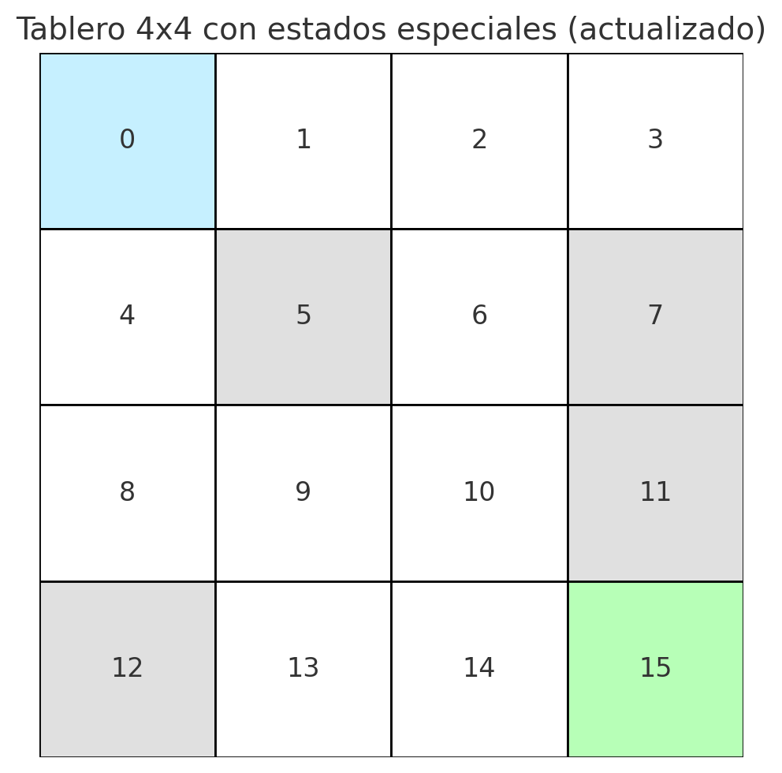

# Tema 4. Sistemas de aprendizaje automático por refuerzo

## Fundamentos del Aprendizaje por Refuerzo

### Objetivos del módulo

> - Comprender qué es el aprendizaje por refuerzo y cómo se diferencia del aprendizaje supervisado y no supervisado.
> - Identificar los elementos clave de un problema de RL: agente, entorno, estados, acciones y recompensas.
> - Analizar el ciclo de interacción agente-entorno y el problema exploración-explotación.
> - Formalizar problemas de RL mediante **Procesos de Decisión de Markov (MDP)** y sus propiedades.
> - Estudiar la ecuación de Bellman y su papel en la estimación de funciones de valor.

---

### **Introducción**

Un niño que aprende a andar en bicicleta no sigue una lista de instrucciones detalladas, sino que prueba diferentes movimientos y estrategias. Cae, se levanta y ajusta su equilibrio con cada intento. Si gira demasiado rápido, puede caer; si pedalea con estabilidad, avanza sin problemas. Con el tiempo, su cerebro asocia ciertas acciones con mejores resultados y ajusta su comportamiento en consecuencia. Este proceso intuitivo de prueba, error y ajuste puede equiparse al funcionamiento del **aprendizaje por refuerzo (Reinforcement Learning, RL)**.

Un definición muy sencilla del **aprendizaje por refuerzo** podría enunciarse así: 

> Paradigma de **aprendizaje automático** en el que un **agente** interactúa con un **entorno**, toma **acciones** y recibe **recompensas**, ajustando su estrategia para maximizar las ganancias a largo plazo.

Así pues, el aprendizaje por refuerzo es un marco matemático para la **toma de decisiones secuenciales**. Un **agente** explora su entorno, realiza acciones y recibe **recompensas** o **penalizaciones**, ajustando su comportamiento en función de la experiencia acumulada. Su objetivo es aprender una **política óptima**, es decir, una estrategia que maximice las recompensas a lo largo del tiempo.

Al final, todo este enfoque se fundamenta en la idea de **exploración y explotación**. El agente debe decidir entre explorar nuevas acciones para descubrir mejores resultados o explotar el conocimiento actual para obtener recompensas inmediatas.

> **Ejemplo 1** :
>  Un robot autónomo que navega en una fábrica puede moverse en distintas direcciones. Si choca con un obstáculo, recibe una penalización; si llega a su destino, obtiene una recompensa. Con el tiempo, aprende a evitar los obstáculos y elegir la ruta más eficiente.

> **Ejemplo 2**:
>  En un videojuego, un agente de RL aprende a jugar explorando distintas estrategias, ganando puntos por acciones exitosas y perdiéndolos por errores. No tiene instrucciones explícitas sobre cómo ganar, pero mejora su desempeño con la experiencia.

#### **Diferencias entre el aprendizaje por refuerzo y otros paradigmas de Machine Learning**

El aprendizaje por refuerzo (RL) es un paradigma distinto dentro del Machine Learning que se diferencia tanto del **aprendizaje supervisado** como del **aprendizaje no supervisado** en la forma en que el modelo adquiere conocimiento y toma decisiones. Mientras que en el aprendizaje supervisado los modelos aprenden a partir de datos etiquetados y en el no supervisado buscan estructuras ocultas en los datos, el aprendizaje por refuerzo aprende **mediante la interacción con un entorno**, ajustando su comportamiento en función de las recompensas obtenidas.

En efecto, en el **aprendizaje supervisado**, un modelo se entrena con un conjunto de datos etiquetados donde cada entrada tiene una salida esperada. El objetivo es minimizar el error de predicción comparando los resultados del modelo con las etiquetas verdaderas a través de la minimización de una *función de pérdida*. En contraste, en **RL no hay un conjunto de datos fijos ni etiquetas predefinidas**. En su lugar, un **agente** interactúa con el entorno y aprende a tomar decisiones **basándose en la recompensa obtenida a lo largo del tiempo**. En vez de ajustar pesos para minimizar una función de pérdida, el agente busca maximizar el retorno acumulado en un horizonte temporal.

> **Ejemplo**:
>  En un sistema de reconocimiento de voz basado en aprendizaje supervisado, el modelo aprende a transcribir audio a texto a partir de ejemplos etiquetados. En cambio, en un asistente virtual que usa RL, el sistema ajusta sus respuestas en función de cómo el usuario interactúa, optimizando la experiencia según el nivel de satisfacción detectado.

La diferencia clave es la **retroalimentación**. En aprendizaje supervisado, el modelo recibe correcciones inmediatas (errores entre predicciones y etiquetas), mientras que en el RL, las recompensas pueden estar **diferidas en el tiempo**, lo que implica que el agente debe aprender **estrategias a largo plazo**.

Por otra parte, ya sabemos que el **aprendizaje no supervisado** se fundamenta en la detección de patrones sin necesidad de aportar etiquetas. En este escenario los modelos buscan estructuras ocultas en los datos. Pero a diferencia del aprendizaje no supervisado, en RL **no se busca estructurar datos, sino aprender una política de acción**. El agente explora su entorno y ajusta su comportamiento en función de la recompensa acumulada, mientras que un algoritmo no supervisado solo analiza relaciones entre datos sin actuar sobre ellos.

> **Ejemplo**:
>  Un modelo no supervisado puede analizar el comportamiento de los clientes en un e-commerce y agruparlos según patrones de compra. Sin embargo, un sistema basado en RL optimiza la **estrategia de recomendación de productos**, aprendiendo a mostrar ofertas personalizadas en función de la interacción del usuario para maximizar las conversiones.

En la siguiente tabla se resumen las diferencias clave entre los tres enfoques de machine learning vistos hasta ahora en el curso

| Característica           | Aprendizaje supervisado       | Aprendizaje no supervisado       | Aprendizaje por refuerzo                    |
| ------------------------ | ----------------------------- | -------------------------------- | ------------------------------------------- |
| Datos de entrenamiento   | Etiquetados                   | Sin etiquetas                    | Generados por interacción                   |
| Objetivo del aprendizaje | Minimizar error de predicción | Encontrar estructuras ocultas    | Maximizar recompensa acumulada              |
| Retroalimentación        | Corrección inmediata          | No hay retroalimentación directa | Recompensa diferida                         |
| Ejemplo típico           | Clasificación de imágenes     | Clustering de clientes           | Un agente que aprende a jugar un videojuego |

##### Para reflexionar...

> **¿En qué situaciones el aprendizaje por refuerzo puede ser más ventajoso que los enfoques supervisados o no supervisados?**
>  **Clave**: Piensa en problemas donde la mejor estrategia se aprende a través de prueba y error, sin datos etiquetados previamente.

#### **Aplicaciones y casos de uso**

El aprendizaje por refuerzo ha demostrado su potencial en múltiples sectores, donde la toma de decisiones secuenciales es clave para mejorar el rendimiento y la eficiencia. Su capacidad para aprender estrategias óptimas a partir de la interacción con un entorno lo hace especialmente útil en escenarios donde las reglas no están completamente definidas o donde la exploración es fundamental para el éxito.

Uno de los ámbitos donde RL ha tenido un impacto significativo es la **robótica**. Los robots autónomos aprenden a manipular objetos, navegar en entornos desconocidos y adaptarse a situaciones cambiantes. En lugar de programar manualmente cada movimiento, un agente de RL puede explorar distintas estrategias hasta encontrar la mejor manera de alcanzar su objetivo, como un brazo robótico que aprende a ensamblar piezas sin necesidad de instrucciones precisas.

En el mundo de los **juegos y el entretenimiento**, RL ha logrado hitos sorprendentes. Algoritmos como AlphaGo han superado a los mejores jugadores humanos en juegos complejos como *Go* y *ajedrez*, descubriendo estrategias innovadoras que antes no se habían considerado. Además, en los videojuegos, agentes de RL han aprendido a jugar títulos de estrategia en tiempo real sin instrucciones explícitas, simplemente experimentando y ajustando su comportamiento en función de las recompensas obtenidas.

En el ámbito de la **optimización de procesos**, muchas empresas utilizan RL para mejorar la eficiencia en logística y cadena de suministro. Por ejemplo, en la planificación de rutas de entrega, un agente puede aprender a minimizar los tiempos de transporte y reducir costos operativos explorando diferentes combinaciones de rutas y evaluando su impacto en el rendimiento general del sistema.

En el sector **financiero**, RL se ha aplicado con éxito en la creación de estrategias de inversión automatizadas. Dado que los mercados financieros son dinámicos e impredecibles, los agentes de RL pueden aprender a ajustar sus decisiones en función de la evolución de los datos, optimizando la asignación de recursos para maximizar el retorno de inversión.

Por último, en el área de **salud**, el aprendizaje por refuerzo se ha utilizado para personalizar tratamientos médicos y optimizar terapias. Un modelo de RL puede aprender cuál es la mejor secuencia de decisiones para ajustar la dosis de un medicamento o definir un plan de tratamiento adaptado a cada paciente, maximizando la efectividad y minimizando los efectos adversos.

En todos estos casos, el aprendizaje por refuerzo permite que los sistemas evolucionen a partir de la experiencia, descubriendo soluciones óptimas en entornos dinámicos donde las reglas no siempre están claras desde el principio.

##### Para reflexionar...

> **¿Qué características comparten los problemas donde el aprendizaje por refuerzo ha demostrado ser más efectivo?**
>  **Clave**: Analiza cómo la interacción con el entorno y la optimización de largo plazo influyen en la toma de decisiones.

### **Elementos fundamentales del aprendizaje por refuerzo**

Para comprender cómo funciona el aprendizaje por refuerzo, es esencial identificar los componentes básicos que definen la interacción entre el agente y el entorno. Estos elementos forman la estructura formal de un problema de RL y son los que permiten modelar matemáticamente la toma de decisiones secuenciales.

#### Agente, entorno, estados, acciones y recompensas

En un problema de aprendizaje por refuerzo, el **agente** es la entidad que toma decisiones. Su objetivo es aprender una **política de comportamiento** que le permita maximizar la recompensa acumulada a lo largo del tiempo. Para ello, el agente debe interactuar con un **entorno** que le proporciona información sobre su estado actual y las consecuencias de sus acciones.

Un **estado** representa la información relevante del entorno en un instante dado. Puede ser observable completamente (como la posición de una pieza en un tablero de ajedrez), estar parcialmente oculto, o depender de un factor aleatorio, lo que introduce incertidumbre. En cada estado, el agente puede ejecutar una o varias **acciones** disponibles, dependiendo de la situación.

Cada acción que toma el agente provoca una **transición de estado** en el entorno, que responde devolviendo un nuevo estado y una **recompensa**. Esta recompensa es un valor numérico que cuantifica el beneficio (o penalización) asociado a la acción tomada. Este proceso se repite a lo largo del tiempo, generando una trayectoria o episodio de interacción.

> **Ejemplo**: 
> Imaginemos un robot móvil que se desplaza por una cuadrícula. El **estado** puede ser su posición actual, las **acciones** son los movimientos posibles (arriba, abajo, izquierda, derecha), y la **recompensa** podría ser +1 al llegar a una casilla objetivo y 0 o negativo en el resto. El **entorno** es la cuadrícula con sus obstáculos, y el **agente** es el software de control que decide cada movimiento. 

#### Ciclo de interacción agente-entorno 

El aprendizaje por refuerzo se estructura como un ciclo continuo de interacción entre el agente y el entorno. En cada instante de tiempo $t$, el agente: 

1. Observa el estado actual $s_t$ del entorno.
2. Selecciona una acción $a_t$ según su política de decisión.
3. Ejecuta la acción y recibe del entorno:
   - Una recompensa $r_{t+1}$ que evalúa la acción.
   - El nuevo estado $s_{t+1}$ resultante de la transición.

Este ciclo se repite a lo largo de múltiples pasos o episodios, permitiendo al agente **ajustar su política** en función de la experiencia acumulada. El objetivo final es aprender a elegir las acciones que **maximicen la suma total de recompensas** recibidas en el tiempo.

> **Ejemplo**:
> En un videojuego, el estado puede representar la situación del jugador en la pantalla, la acción es el movimiento realizado, y la recompensa puede depender de si se ha evitado un obstáculo o se ha alcanzado un objetivo. Tras cada acción, el entorno cambia (aparecen enemigos, se modifican obstáculos) y el agente, que en este caso es la pieza de software en sí, debe adaptarse a estos cambios para seguir avanzando.

#### **Exploración y explotación**

Uno de los desafíos más característicos del aprendizaje por refuerzo es el equilibrio entre **exploración** y **explotación**. Explotar significa utilizar el conocimiento actual para elegir aquellas acciones que se estiman más prometedoras en cuanto a la recompensa inmediata. En cambio, explorar implica tomar decisiones alternativas que, aunque inicialmente puedan parecer subóptimas, permiten descubrir nuevas estrategias que podrían ser más beneficiosas a largo plazo.

Este equilibrio es esencial porque un agente que únicamente explota puede quedar atrapado en soluciones locales no óptimas, mientras que uno que se dedica exclusivamente a explorar puede no llegar nunca a consolidar una política eficaz. Para abordar este problema, se diseñan estrategias de exploración específicas, como el método $\epsilon$-greedy o enfoques basados en la estimación de incertidumbre, que permiten modular este compromiso de forma adaptativa.

> **Ejemplo**: 
> Un agente que aprende a jugar al ajedrez puede descubrir una estrategia ganadora rápida, pero si nunca explora nuevas aperturas o movimientos, podría perder la oportunidad de encontrar combinaciones más potentes. Alternar entre probar jugadas conocidas y experimentar nuevas es clave para alcanzar un juego experto.

##### Para reflexionar...
> **¿Por qué es necesario que un agente de RL explore incluso cuando ya tiene una política aparentemente buena?** 
> **Clave**: Reflexiona sobre cómo la falta de exploración puede impedir encontrar soluciones más eficientes o adaptarse a cambios en el entorno.

### Formalización matemática del aprendizaje por refuerzo: Procesos de Decisión de Markov (MDP)

La base matemática del aprendizaje por refuerzo se construye sobre el marco de los **Procesos de Decisión de Markov (MDP)**. Este formalismo permite modelar situaciones en las que un agente debe tomar decisiones secuenciales en un entorno, donde el resultado de cada acción puede ser incierto y depender del estado actual. A partir de esta formulación, se definen funciones que cuantifican la utilidad esperada de las acciones, y se desarrollan métodos para aprender políticas óptimas que maximicen las recompensas acumuladas.

Perfecto. A continuación te presento la introducción al formalismo de los **Procesos de Decisión de Markov (MDP)** en formato **apuntes**, siguiendo el enfoque didáctico y riguroso que has indicado. Esta sección está pensada como paso previo a la definición formal completa del MDP, construyendo el razonamiento de forma progresiva y técnica.

#### Elementos presentes en un MDP

Recapitulemos lo visto hasta ahora. El objetivo del aprendizaje por refuerzo, tal y como hemos comentado, es que un agente aprenda a tomar decisiones en un entorno con el fin de maximizar una señal de recompensa acumulada. Esta formulación, aunque intuitiva, implica una serie de requisitos formales que deben ser tenidos en cuenta para definir adecuadamente el problema desde el punto de vista matemático.  

En primer lugar, es importante destacar el **carácter secuencial** del aprendizaje por refuerzo. A diferencia de otros paradigmas de aprendizaje automático donde la tarea consiste en predecir una salida a partir de una entrada estática, en RL el agente **interactúa con el entorno a lo largo del tiempo**, generando una sucesión de decisiones que afectan a su situación futura. Esta dimensión temporal es inherente al problema y condiciona tanto los objetivos como la manera de representar el entorno y el conocimiento adquirido.  

Además, el objetivo del agente no se limita a optimizar su comportamiento en un instante concreto, sino que debe considerar **la evolución de su desempeño en el tiempo**. Es decir, el aprendizaje por refuerzo busca encontrar una política de actuación que sea **óptima** en el sentido de que maximiza la suma esperada de recompensas futuras, no simplemente las inmediatas. Esta optimización intertemporal requiere una modelización explícita del paso del tiempo y de cómo las acciones presentes condicionan los estados futuros.

Así, para formalizar este tipo de problemas, podríamos introducimos los tres primeros componentes fundamentales:

En primer lugar el conjunto de **estados** del entorno, denotado como $\mathcal{S}$, que representa todas las configuraciones posibles en las que puede encontrarse el agente en cada instante de tiempo, $s_t$

En segundo lugar, el conjunto de **acciones** posibles, $\mathcal{A}$, que contiene todas las decisiones que el agente puede tomar a partir de cualquier estado $s_t$ y que denotaremos por $a_t$

Por último el conjunto de **recompensas** posibles, $\mathcal{R}$, que describe los valores numéricos que el entorno puede entregar al agente como consecuencia de su interacción. Es decir en cada instante de tiempo el agente obtendrá una recompensa $r_t$.

$$
s_0 
\xrightarrow{a_0,\, r_1} 
s_1 
\xrightarrow{a_1,\, r_2} 
s_2 
\xrightarrow{a_2,\, r_3} 
\cdots 
\xrightarrow{a_{n-1},\, r_n} 
s_n
$$

Estos conjuntos proporcionan la base para describir la dinámica del sistema, pero no son suficientes por sí solos. Es necesario considerar que, en la mayoría de problemas relevantes, **el entorno es estocástico**: la misma acción tomada en un mismo estado puede conducir a diferentes resultados.

Este comportamiento incierto se representa mediante una función de probabilidad de transición:

$$
\mathcal{P}(s' \mid s, a)
$$

que define la **probabilidad de que el entorno transite al estado $s' \in \mathcal{S}$ tras ejecutar la acción $a \in \mathcal{A}$ en el estado actual $s \in \mathcal{S}$**. Esta función es, desde el punto de vista formal, una **probabilidad condicionada**, lo que significa que está definida bajo la condición de que el sistema se encuentra en un estado concreto $s$ y el agente decide ejecutar una acción concreta $a$.

Este tipo de función cumple la propiedad:

$$
\sum_{s' \in \mathcal{S}} \mathcal{P}(s' \mid s, a) = 1 \quad \text{para todo } s \in \mathcal{S},\ a \in \mathcal{A}
$$

lo que garantiza que, ante cualquier situación posible, el sistema siempre transita a algún estado del espacio.

> **Ejemplo**: 
> Supongamos que un robot se mueve en un terreno con superficies irregulares. Aunque intente avanzar en línea recta, puede desviarse debido al desnivel o deslizamiento. En este caso, incluso si el estado inicial y la acción son los mismos, el estado siguiente puede variar. Esta incertidumbre en el resultado se refleja precisamente en la función $\mathcal{P}(s' \mid s, a)$.

Este carácter estocástico obliga a razonar en términos de expectativas: el agente no puede garantizar un resultado concreto para cada acción, sino que debe tomar decisiones considerando la **distribución de probabilidades sobre los posibles resultados**. Así, su comportamiento debe estar orientado a **maximizar la recompensa esperada** a largo plazo, teniendo en cuenta la incertidumbre del entorno.

En resumen, la formalización del aprendizaje por refuerzo parte de:

- Un sistema de decisión secuencial, donde el tiempo y el historial importan.
- Un objetivo óptimo a largo plazo, basado en la recompensa acumulada.
- Un entorno estocástico, cuya evolución se modela mediante funciones de transición probabilísticas.

A partir de estos elementos, es posible definir de forma precisa un modelo general que describa formalmente este tipo de problemas. Este modelo es el **Proceso de Decisión de Markov (MDP)**, cuya definición abordaremos a continuación. Sin embargo, antes de seguir, es importante entender una propiedad de este tipo de procesos y que los hace singulares.

##### La propiedad de Markov

La **propiedad de Markov** es una de las ideas centrales en la formalización del aprendizaje por refuerzo. Su función es simplificar la dinámica del entorno para que sea tratable matemáticamente, sin perder generalidad en muchos contextos aplicables.

De forma intuitiva, esta propiedad establece que **el futuro del sistema depende únicamente del estado actual y la acción tomada, y no del camino seguido hasta llegar allí**. Es decir, **no es necesario recordar el historial completo de estados y acciones anteriores** para predecir cuál será el siguiente estado; basta con conocer la situación presente y la decisión tomada.

Formalmente, esta propiedad se expresa mediante una igualdad entre probabilidades condicionadas:

$$
\mathbb{P}(s_{t+1} \mid s_t, a_t, s_{t-1}, a_{t-1}, \dots, s_0, a_0) = \mathbb{P}(s_{t+1} \mid s_t, a_t)
$$

El lado izquierdo representa la probabilidad de pasar al estado $s_{t+1}$ sabiendo todo el historial pasado del agente. El lado derecho dice que esta probabilidad es la misma si solo se conoce el **estado actual $s_t$ y la acción actual $a_t$**, lo que implica que el resto del pasado es irrelevante para describir la evolución del sistema.

> **Ejemplo**: 
> Supongamos que un robot se encuentra en una sala rectangular y decide moverse hacia la derecha. Para predecir su nueva posición, solo necesitamos saber **dónde está ahora** y qué acción ejecuta. No importa si llegó allí tras una secuencia larga de pasos o de forma directa. Si la posición actual es la misma y la acción también, el resultado tendrá la misma probabilidad. Esto es precisamente la propiedad de Markov.

Esta propiedad es lo que convierte al entorno en un **proceso de Markov**, y es lo que permite construir modelos como los MDP, donde la dinámica del sistema se especifica completamente mediante la función de transición $\mathcal{P}(s' \mid s, a)$. Si el entorno no cumpliera esta propiedad, sería necesario mantener en memoria todo el historial de interacción para decidir correctamente, lo que complicaría considerablemente el análisis y la implementación de algoritmos.

> [!note]
>
> A lo largo de esta sección hemos construido progresivamente los elementos que permiten formalizar un problema de aprendizaje por refuerzo como un sistema de decisión secuencial bajo incertidumbre. A continuación sintetizamos los componentes clave sobre los que se apoya esta formulación:
>
> - $\mathcal{S}$: **Espacio de estados**. Conjunto de todas las configuraciones posibles del entorno. Cada estado $s \in \mathcal{S}$ resume toda la información relevante en un instante de tiempo.
>
> - $\mathcal{A}$: **Espacio de acciones**. Conjunto de decisiones que el agente puede tomar. Las acciones pueden depender del estado, es decir, no todas las acciones están necesariamente disponibles en todos los estados.
>
> - $\mathcal{R}$: **Espacio de recompensas**. Conjunto de valores que cuantifican la utilidad inmediata de una acción. En general, las recompensas se modelan como variables aleatorias, cuya media puede depender del estado y la acción.
>
> - $\mathcal{P}(s' \mid s, a)$: **Función de probabilidad de transición**. Describe la dinámica del entorno. Es una probabilidad condicionada que indica la probabilidad de alcanzar un estado $s'$ si el agente toma la acción $a$ desde el estado $s$.
>
> - **Propiedad de Markov**: La evolución del sistema es tal que la probabilidad del siguiente estado solo depende del estado y acción actuales, no del historial completo:
>
>$$
>\mathbb{P}(s_{t+1} \mid s_t, a_t, s_{t-1}, a_{t-1}, \dots) = \mathbb{P(s_{t+1} \mid s_t, a_t)}tab
>$$
>
> Estos elementos nos permiten formalizar matemáticamente el entorno del aprendizaje por refuerzo bajo una estructura coherente y tractable. En el siguiente apartado presentaremos esta estructura de forma precisa mediante la definición general de un **Proceso de Decisión de Markov (MDP)**.
>

#### **Definición formal de un Proceso de Decisión de Markov (MDP)**

Un **Proceso de Decisión de Markov** (MDP, por sus siglas en inglés) es un modelo matemático que permite describir formalmente problemas de decisión secuencial bajo incertidumbre, donde un agente interactúa con un entorno cuya dinámica puede ser estocástica y donde el objetivo es maximizar alguna forma de recompensa acumulada en el tiempo.  

Formalmente, un MDP se define como una 5-tupla:

$$
\mathcal{M} = (\mathcal{S}, \mathcal{A}, \mathcal{P}, \mathcal{R})
$$

donde:

- $\mathcal{S}$ es el **conjunto de estados** posibles del entorno.  
- $\mathcal{A}$ es el **conjunto de acciones** disponibles para el agente.  
- $\mathcal{P}: \mathcal{S} \times \mathcal{A} \times \mathcal{S} \rightarrow [0,1]$ es la **función de transición** del entorno, que asigna a cada tripleta $(s, a, s')$ la probabilidad $\mathcal{P}(s' \mid s, a)$ de transitar al estado $s'$ al ejecutar la acción $a$ en el estado $s$.  
- $\mathcal{R}: \mathcal{S} \times \mathcal{A} \rightarrow \mathbb{R}$ es la **función de recompensa esperada**, que asigna a cada par $(s, a)$ el valor esperado de la recompensa obtenida al realizar la acción $a$ en el estado $s$.  

Este modelo asume que el proceso satisface la **propiedad de Markov**, lo que garantiza que la dinámica del entorno depende únicamente del estado y la acción actuales, sin necesidad de tener en cuenta el historial completo.

> [!note]
>
> **Los procesos de decisión de Markov y la idea de “memoria”**
>
> Una afirmación frecuente al introducir los modelos de decisión secuencial es que los **Procesos de Decisión de Markov (MDP)** "no tienen memoria". Esta expresión, aunque útil como atajo conceptual, requiere una interpretación cuidadosa desde el punto de vista técnico para evitar malentendidos.
>
> La clave de esta afirmación radica en la **propiedad de Markov**, que establece que **la probabilidad de transición hacia el siguiente estado depende únicamente del estado actual y de la acción ejecutada**, y no del historial completo del proceso. Formalmente, esta propiedad se expresa como:
> 
> $$
>\mathbb{P}(s{t+1} \mid s_t, a_t, s{t-1}, a{t-1}, \dots, s_0, a_0) = \mathbb{P}(s{t+1} \mid s_t, a_t)
> $$
> 
> Esto significa que el entorno puede ser descrito completamente por una función de transición $\mathcal{P}(s' \mid s, a)$ sin necesidad de considerar el pasado. En este sentido estricto, **los MDP son modelos sin memoria explícita**: no acumulan ni utilizan el historial de transiciones en su dinámica probabilística.
>
> Sin embargo, es importante destacar que esta falta de memoria se refiere **al entorno y a su evolución**, no necesariamente al comportamiento del agente. De hecho, un agente que interactúa con un entorno Markoviano puede disponer de memoria interna para mejorar su comportamiento. Por ejemplo, puede utilizar buffers de experiencias pasadas, estructuras de planificación, o redes recurrentes que mantienen un estado oculto. Lo esencial es que **el entorno no lo exige**: la decisión sobre el siguiente estado es independiente del trayecto seguido hasta llegar al estado actual.
>
> Este contraste se hace aún más evidente cuando se estudian entornos **parcialmente observables**, en los que el agente no puede identificar directamente el estado $s_t$, sino que recibe observaciones indirectas o ruidosas. En tales contextos, la propiedad de Markov ya no se cumple sobre las observaciones, y se requiere memoria explícita o inferencia para reconstruir un estado oculto efectivo. Esta generalización da lugar a los **Procesos de Decisión de Markov Parcialmente Observables (POMDP)**.
>
> Por esto es por lo que conviene precisar que los MDP “no tienen memoria” únicamente en el sentido de que **no dependen del pasado** para definir la transición entre estados. Esta es una propiedad estructural del modelo, no una limitación del agente que aprende.

> **Interpretación**: 
> Un MDP describe un entorno interactivo donde, en cada paso temporal $t$, el agente observa el estado actual $s_t$, selecciona una acción $a_t$, recibe una recompensa $r_{t+1}$ y el entorno transita a un nuevo estado $s_{t+1}$ con una probabilidad determinada por $\mathcal{P}(s_{t+1} \mid s_t, a_t)$. El objetivo del agente es aprender una política de actuación que maximice la recompensa acumulada esperada a lo largo del tiempo.

Este marco formal constituye la base sobre la cual se desarrollan los algoritmos de aprendizaje por refuerzo, ya que permite modelar la evolución del sistema, cuantificar el comportamiento del agente y definir criterios óptimos de decisión.

### Formalización de un proceso de Markov (I): El tablero unidimensional

Para ilustrar el concepto de MDP, consideramos un entorno muy simple: un **tablero unidimensional** compuesto por tres casillas:

- $s_0$: representa un hueco (estado no deseado).
- $s_1$: es la **posición inicial del agente**.
- $s_2$: es el **estado objetivo** o casilla meta.

El agente puede tomar dos posibles acciones:

- $a_0$: moverse a la izquierda.
- $a_1$: moverse a la derecha.

Desde el estado $s_1$, el agente puede transicionar a $s_0$ o $s_2$ dependiendo de la acción que elija. El resto de estados son **terminales**, es decir, una vez alcanzados, no permiten más transiciones.

La **recompensa** está definida de la siguiente manera:

- Si el agente se encuentra en $s_1$, elige la acción $a_1$ (derecha), y transita a $s_2$, recibe una recompensa de $1$.
- En cualquier otro caso, la recompensa es $0$.

Vamos a considerar que este proceso es **determinista**, por lo que no habrá incertidumbre en las transiciones.

El entorno podrá formalizarse a través de los siguientes elementos

- $\mathcal{S} = \{s_0, s_1, s_2\}$
- $\mathcal{A} = \{a_0, a_1\}$
- $\mathcal{P}(s' \mid s, a) \in {0, 1}$
- $\mathcal{R}(s, a) = 1$ si $(s = s_1, a = a_1)$ y $s' = s_2$; $0$ en cualquier otro caso.

Vamos ahora con la representamos de la función $\mathcal{P}(s' \mid s, a)$ como una tabla, donde cada fila define una transición posible con probabilidad 1. Si una combinación $(s, a)$ no está listada, se asume que el sistema permanece en el mismo estado sin recompensa.

| Estado actual $s$ | Acción $a$ | Estado siguiente $s'$ | $\mathcal{P}(s' \mid s, a)$ | Recompensa $\mathcal{R}(s, a)$ |
| ----------------- | ---------- | --------------------- | --------------------------- | ------------------------------ |
| $s_1$             | $a_0$      | $s_0$                 | 1                           | 0                              |
| $s_1$             | $a_1$      | $s_2$                 | 1                           | 1                              |
| $s_0$             | $a_0$      | $s_0$                 | 1                           | 0                              |
| $s_0$             | $a_1$      | $s_0$                 | 1                           | 0                              |
| $s_2$             | $a_0$      | $s_2$                 | 1                           | 0                              |
| $s_2$             | $a_1$      | $s_2$                 | 1                           | 0                              |

> **Nota**: en este ejemplo se asume que los estados $s_0$ y $s_2$ son **absorbentes**: cualquier acción tomada desde ellos lleva al mismo estado sin cambio y sin recompensa.

---

Retomemos el entorno del ejemplo anterior, pero esta vez introduciendo un **componente de incertidumbre** en las transiciones. Esto nos permitirá ilustrar cómo el formalismo de los MDP permite modelar dinámicas probabilísticas, reflejando entornos donde el resultado de una acción no está completamente determinado.

Como antes, el entorno consiste en un **tablero unidimensional de tres casillas**:

- $s_0$: representa un hueco (estado no deseado).
- $s_1$: es la posición inicial del agente.
- $s_2$: es el estado objetivo o casilla meta.

Las **acciones** disponibles para el agente siguen siendo:

- $a_0$: moverse a la izquierda.
- $a_1$: moverse a la derecha.

La principal diferencia con respecto al caso determinista es que ahora **las acciones tienen un comportamiento probabilístico**. En concreto:

- Si el agente está en $s_1$ y ejecuta $a_0$, llega a $s_0$ con probabilidad 0,8 y a $s_2$ con probabilidad 0,2.
- Si está en $s_1$ y ejecuta $a_1$, llega a $s_2$ con probabilidad 0,8 y a $s_0$ con probabilidad 0,2.
- Los estados $s_0$ y $s_2$ siguen siendo absorbentes: cualquier acción tomada desde ellos deja al agente en el mismo estado con probabilidad 1.

La función de recompensa también refleja esta estocasticidad:

- La acción $a_1$ aplicada en $s_1$ proporciona una **recompensa esperada** de $0{,}8 \times 1 + 0{,}2 \times 0 = 0{,}8$.
- La acción $a_0$ aplicada en $s_1$ tiene **recompensa esperada** cero, ya que aunque ocasionalmente lleva a $s_2$, no se recompensa esa transición.

El entorno podrá formalizarse a través de los siguientes elementos:

- $\mathcal{S} = \{s_0, s_1, s_2\}$
- $\mathcal{A} = \{a_0, a_1\}$
- $\mathcal{P}(s' \mid s, a) \in [0, 1]$
- $\mathcal{R}(s, a) = \mathbb{E}[r_{t+1} \mid s_t = s, a_t = a]$

------

A continuación presentamos la función de transición $\mathcal{P}(s' \mid s, a)$ y la recompensa $\mathcal{R}(s, a)$ en formato tabular.

| Estado actual $s$ | Acción $a$ | Estado siguiente $s'$ | $\mathcal{P}(s' \mid s, a)$ | Recompensa $\mathcal{R}(s, a)$ |
| ----------------- | ---------- | --------------------- | --------------------------- | ------------------------------ |
| $s_1$             | $a_0$      | $s_0$                 | 0,8                         | 0                              |
| $s_1$             | $a_0$      | $s_2$                 | 0,2                         | 0                              |
| $s_1$             | $a_1$      | $s_2$                 | 0,8                         | 1                              |
| $s_1$             | $a_1$      | $s_0$                 | 0,2                         | 0                              |
| $s_0$             | $a_0$      | $s_0$                 | 1,0                         | 0                              |
| $s_0$             | $a_1$      | $s_0$                 | 1,0                         | 0                              |
| $s_2$             | $a_0$      | $s_2$                 | 1,0                         | 0                              |
| $s_2$             | $a_1$      | $s_2$                 | 1,0                         | 0                              |

> **Nota**: los estados $s_0$ y $s_2$ siguen siendo **estados absorbentes**, incluso en el caso estocástico.

> [!note]
>
> En las situaciones reales siempre tendremos un componente de aleatoriedad que corresponde a aquellos elementos que no se pueden controlar en cada transición entre estados

Perfecto. A continuación te presento una introducción formal y didáctica al nuevo ejemplo, en **formato apuntes**, que plantea un proceso de decisión de Markov en un entorno **bidimensional 4x4**, incluyendo la idea de **episodios** y una descripción general del tablero. No se define aún la función de transición ni la recompensa: esperamos tus instrucciones para ello.

------

### Formalización de un proceso de Markov (II): El tablero bidimensional

Para ilustrar un caso más complejo y realista, vamos a modelar un entorno donde el agente se mueve en un **tablero bidimensional de 4x4**, con posiciones numeradas de $0$ a $15$, dispuestas de izquierda a derecha y de arriba a abajo. La posición inicial es la casilla $0$, y el objetivo se encuentra en la casilla $12$. El entorno contiene además varios **estados absorbentes**: una vez alcanzados, el episodio finaliza. En este caso, los estados $5$, $7$, $11$ y $12$ son absorbentes.

Este entorno nos permite introducir de forma natural el concepto de **episodio**, entendido como la **secuencia de transiciones** que se inicia en el estado inicial y finaliza cuando se alcanza un estado terminal (absorbente). Cada episodio puede contener múltiples pasos y el agente puede experimentar distintos trayectos dependiendo de las decisiones tomadas y de la dinámica estocástica del entorno.

A continuación se muestra la disposición de las casillas, numeradas de $0$ a $15$, donde:

- La casilla **inicio** es $0$.
- La casilla **meta** es la $15$
- Las casillas **absorbentes** están sombreadas y no permiten transiciones posteriores.

El agente puede ejecutar cuatro acciones posibles desde cualquier estado no absorbente:

- $a_0$: moverse a la **izquierda**
- $a_1$: moverse **abajo**
- $a_2$: moverse a la **derecha**
- $a_3$: moverse **arriba**

La ejecución de cada acción es **estocástica**: existe un 33% de probabilidad de que la acción se realice con éxito (es decir, en la dirección deseada), y el 67% restante se distribuye **uniformemente entre las dos direcciones ortogonales**. La dirección opuesta a la deseada nunca ocurre.

> **Ejemplo**: si el agente intenta moverse a la derecha ($a_2$), hay un 33% de probabilidad de que realmente se desplace a la derecha, un 33% de moverse hacia arriba ($a_3$) y un 33% hacia abajo ($a_1$). Nunca se moverá a la izquierda en ese caso.

Las transiciones que llevarían al agente fuera del tablero (por ejemplo, moverse a la izquierda desde una casilla de la columna izquierda) hacen que el agente permanezca en el mismo estado.

Este planteamiento da lugar a un entorno suficientemente rico para estudiar aspectos clave del aprendizaje por refuerzo como:

- La dinámica estocástica del entorno y su impacto en el aprendizaje.
- La duración esperada de los episodios.
- El diseño de políticas óptimas en presencia de estados no deseables y absorbentes.

A partir de aquí, podremos formalizar los distintos componentes del MDP: el espacio de estados $\mathcal{S}$, las acciones $\mathcal{A}$, la función de transición $\mathcal{P}$ y las recompensas $\mathcal{R}$, de acuerdo a los objetivos que establezcamos para el agente.

##### El espacio de estados

El primer componente que debemos definir en este problema, y formalmente en cualquier MDP es el **espacio de estados** $\mathcal{S}$, que representa el conjunto de todas las configuraciones posibles en las que puede encontrarse el agente dentro del entorno.

En este caso, el entorno es un **tablero bidimensional de 4x4**, por lo que el espacio de estados está compuesto por **16 casillas**, numeradas de $0$ a $15$ en orden fila-columna, comenzando desde la parte superior izquierda. Así, podemos definir formalmente:

$$
\mathcal{S} = \{s_0, s_1, s_2, \dots, s_15\}
$$

o, de forma equivalente,

$$
\mathcal{S} = \{s_t, t \in \mathbb{N} \mid 0 \leq t \leq 15\}
$$

Cada estado $s_t \in \mathcal{S}$ identifica una posición específica del agente en el tablero. En este modelo, **el estado codifica únicamente la posición actual del agente**, sin necesidad de almacenar memoria del historial ni otras variables internas. Esto es posible porque el sistema cumple la **propiedad de Markov**, lo que garantiza que la información contenida en el estado actual es suficiente para describir la dinámica futura del entorno.

Es interesante reparar en una cuestión importante respecto al espacio de estados. En este caso concreto puede decirse que dicho espacio es **discreto** y **finito** y ello significa que:

- Existen un número limitado de configuraciones posibles ($|\mathcal{S}| = 16$).
- Los estados están etiquetados con identificadores enteros, y no se requiere ningún tipo de representación continua.

Esta característica tiene importantes implicaciones desde el punto de vista computacional:

- Permite representar la función de transición y las políticas como **tablas indexadas por estados**, lo cual simplifica la implementación de algoritmos.
- Hace viable el uso de **técnicas tabulares** para estimar funciones de valor y políticas óptimas, especialmente en entornos pequeños como este.

Sin embargo, es importante señalar que **no todos los problemas de aprendizaje por refuerzo tienen espacios de estados finitos ni discretos**. En entornos más complejos, como la robótica continua, los juegos con múltiples entidades o los problemas de control físico, el estado puede venir representado por vectores reales (posición, velocidad, sensores, etc.), dando lugar a espacios **continuos o incluso infinitos**. En estos casos, los algoritmos tabulares no son aplicables directamente, y se recurre a representaciones funcionales más generales como **aproximadores de función**, como por ejemplo redes neuronales.

Perfecto. A continuación integro al texto anterior la explicación sobre la **dimensionalidad del espacio de acciones**, y lo extiendo para contextualizar su relevancia en el diseño de algoritmos de aprendizaje por refuerzo. Todo está estructurado en **formato apuntes** y adaptado al entorno del tablero 4x4 que estamos modelando.

##### El espacio de acciones

El segundo componente fundamental en la formulación de un proceso de decisión de Markov es el **espacio de acciones** $\mathcal{A}$, que describe el conjunto de decisiones que el agente puede tomar en cada estado. En el entorno que estamos estudiando, el agente se desplaza sobre una cuadrícula bidimensional de tamaño $4 \times 4$ y dispone de las siguientes acciones elementales:

- $a_0$: moverse a la **izquierda**.
- $a_1$: moverse **abajo**.
- $a_2$: moverse a la **derecha**.
- $a_3$: moverse **arriba**.

Formalmente, el espacio de acciones es:

$$
\mathcal{A} = \{a_0, a_1, a_2, a_3\}
$$

Cada acción corresponde a un desplazamiento potencial en una de las direcciones cardinales, siempre que la geometría del entorno lo permita. Si el agente se encuentra en una casilla situada junto a un borde del tablero y ejecuta una acción que lo llevaría fuera del mismo, se asume que **permanece en su estado actual**.

El conjunto $\mathcal{A}$ tiene **dimensión 1** en el sentido de que sus elementos son **acciones atómicas y mutuamente excluyentes**; el agente selecciona **una sola acción en cada instante de decisión**. La **cardinalidad** de este espacio es:

$$
|\mathcal{A}| = 4
$$

Esta dimensionalidad finita y discreta permite representar políticas, funciones de valor o modelos de transición como **tablas bidimensionales indexadas por pares $(s, a)$**. Este enfoque tabular es muy eficiente en entornos de baja dimensión, como el que estamos considerando.

No obstante, en entornos más complejos, el espacio de acciones puede tener **dimensiones más altas** o incluso ser **continuo**. Por ejemplo, en un sistema de control robótico, una acción puede definirse como un vector de fuerzas aplicado en varios ejes:

$$
\mathcal{A} \subseteq \mathbb{R}^n
$$

En esos casos, el agente no selecciona una acción de un conjunto finito, sino que elige **parámetros reales continuos**, lo que implica un espacio de acciones de **dimensión $n$**. Esto introduce nuevos desafíos, ya que las técnicas tabulares dejan de ser viables y deben utilizarse métodos basados en aproximación funcional, como redes neuronales o funciones kernel.

De forma análoga, el concepto de **dimensionalidad** se puede aplicar también a los espacios de estados y recompensas:

- En nuestro entorno, el espacio de estados $\mathcal{S}$ es de dimensión 1 con cardinalidad 16, pero en otros problemas puede representar vectores de múltiples variables (posición, velocidad, energía, etc.).
- El espacio de recompensas $\mathcal{R}$, aunque en este caso es escalar y discreto (por ejemplo, $0$ o $1$), también puede adoptar formas más complejas.

Por esto es por lo que la **dimensionalidad** y la **naturaleza (discreta o continua)** de los espacios involucrados son elementos clave a la hora de diseñar algoritmos de aprendizaje por refuerzo adecuados a cada problema.

##### Función de transición y recompensas

La **función de transición** $\mathcal{P}(s' \mid s, a)$ define la dinámica del entorno. Especifica la **probabilidad de alcanzar un estado $s'$ cuando el agente ejecuta la acción $a$ desde el estado $s$**. Junto con la función de recompensa, esta es la componente estocástica más importante de un proceso de decisión de Markov.

En nuestro entorno, la función de transición captura tres aspectos fundamentales:

- La geometría del tablero: qué acciones permiten movimiento efectivo y cuáles están bloqueadas.
- La naturaleza estocástica: cada acción tiene una probabilidad de éxito del 33%, y el resto de la probabilidad se reparte entre las direcciones ortogonales.
- La presencia de estados absorbentes: una vez alcanzados, no se permite ninguna transición efectiva.

A partir de aquí podemos representar la función de transición de forma tabular. En un entorno con $|\mathcal{S}| = 16$ estados y $|\mathcal{A}| = 4$ acciones por estado, la tabla completa que describe la función de transición tendría hasta $16 \times 4 = 64$ combinaciones $(s, a)$ posibles. Para cada una de ellas, se podría transitar a hasta 3 estados distintos (deseado + ortogonales), lo que da lugar a una tabla de **hasta 192 filas** si se representa en forma totalmente desglosada.

No obstante, muchos estados tienen transiciones triviales (por ejemplo, los estados absorbentes siempre se transitan a sí mismos), por lo que en la práctica no es necesario almacenar ni analizar todas las filas. Para propósitos didácticos, es suficiente ilustrar el comportamiento del sistema con una **selección representativa de estados**, que permita comprender la estructura de la dinámica y su interacción con la recompensa.

A continuación mostramos tres ejemplos ilustrativos:

- El estado inicial $s_0$
- Un estado absorbente $s_5$
- El estado $s_{14}$, que es el único desde el cual puede alcanzarse la casilla meta $s_{15}$ y obtener recompensa.

###### **Estado inicial $s_0$**

Desde $s_0$ el agente está en la esquina superior izquierda. El tablero limita dos direcciones: no se puede ir ni a la izquierda ($a_0$) ni arriba ($a_3$). En estos casos, moverse fuera del tablero implica permanecer en el mismo estado. La estocasticidad se modela así:

- Acción deseada: 33%  
- Dos direcciones ortogonales: 33% cada una  
- Dirección opuesta: no se considera

| Acción $a$ | $s'$ alcanzable          | $\mathcal{P}(s' \mid s_0, a)$ | $\mathcal{R}(s_0, a)$ |
| ---------- | ------------------------ | ----------------------------- | --------------------- |
| $a_0$      | $s_0$ (borde izq)        | 0,33                          | 0                     |
|            | $s_1$ (der, ortogonal)   | 0,33                          | 0                     |
|            | $s_4$ (abajo, ortogonal) | 0,33                          | 0                     |
| $a_1$      | $s_4$ (abajo)            | 0,33                          | 0                     |
|            | $s_0$ (izq, ortogonal)   | 0,33                          | 0                     |
|            | $s_1$ (der, ortogonal)   | 0,33                          | 0                     |
| $a_2$      | $s_1$ (der)              | 0,33                          | 0                     |
|            | $s_0$ (izq, ortogonal)   | 0,33                          | 0                     |
|            | $s_4$ (abajo, ortogonal) | 0,33                          | 0                     |
| $a_3$      | $s_0$ (borde sup)        | 0,33                          | 0                     |
|            | $s_1$ (der, ortogonal)   | 0,33                          | 0                     |
|            | $s_4$ (abajo, ortogonal) | 0,33                          | 0                     |

###### **Estado absorbente $s_5$**

$s_5$ es un estado absorbente. Cualquier acción que se intente desde este estado deja al agente en $s_5$ con probabilidad 1, sin recompensa.

| Acción $a$ | $s'$ alcanzable | $\mathcal{P}(s' \mid s_5, a)$ | $\mathcal{R}(s_5, a)$ |
| ---------- | --------------- | ----------------------------- | --------------------- |
| $a_0$      | $s_5$           | 1,0                           | 0                     |
| $a_1$      | $s_5$           | 1,0                           | 0                     |
| $a_2$      | $s_5$           | 1,0                           | 0                     |
| $a_3$      | $s_5$           | 1,0                           | 0                     |

###### **Estado $s_{14}$ (adyacente a la meta)**

$s_{14}$ se encuentra en la penúltima casilla de la fila inferior. Desde aquí, la acción $a_2$ (derecha) puede llevar a la meta $s_{15}$ con recompensa 1. El resto de transiciones son sin recompensa.

| Acción $a$ | $s'$ alcanzable           | $\mathcal{P}(s' \mid s_{14}, a)$ | $\mathcal{R}(s_{14}, a)$ |
| ---------- | ------------------------- | -------------------------------- | ------------------------ |
| $a_0$      | $s_{13}$ (izq)            | 0,33                             | 0                        |
|            | $s_{10}$ (arr, ortogonal) | 0,33                             | 0                        |
|            | $s_{14}$ (borde inf)      | 0,33                             | 0                        |
| $a_1$      | $s_{14}$ (borde inf)      | 0,33                             | 0                        |
|            | $s_{13}$ (izq, ortogonal) | 0,33                             | 0                        |
|            | $s_{15}$ (der, ortogonal) | 0,33                             | 1                        |
| $a_2$      | $s_{15}$ (der)            | 0,33                             | 1                        |
|            | $s_{14}$ (borde inf)      | 0,33                             | 0                        |
|            | $s_{10}$ (arr, ortogonal) | 0,33                             | 0                        |
| $a_3$      | $s_{10}$ (arr)            | 0,33                             | 0                        |
|            | $s_{13}$ (izq, ortogonal) | 0,33                             | 0                        |
|            | $s_{15}$ (der, ortogonal) | 0,33                             | 1                        |

##### Tiempo y horizonte

Hasta ahora hemos definido los elementos estructurales de un proceso de decisión de Markov: el espacio de estados, las acciones, la función de transición y la recompensa. Sin embargo, para completar el modelo es necesario considerar un aspecto fundamental: **el tiempo**.

En el contexto del aprendizaje por refuerzo y los MDP, el tiempo se estructura en pasos discretos $t = 0, 1, 2, \dots$, donde en cada paso el agente observa el estado $s_t$, ejecuta una acción $a_t$, recibe una recompensa $r_{t+1}$ y transita al siguiente estado $s_{t+1}$. Esta secuencia puede continuar indefinidamente o finalizar tras un número finito de pasos, según el tipo de problema.

Para formalizar este aspecto, se introduce el concepto de **horizonte**.

El **horizonte** se refiere al número máximo de pasos que puede durar un episodio. Su valor define si el problema es **finito** o **infinito** en el tiempo, lo que afecta directamente al tipo de estrategias que el agente debe aprender. Podemos distinguir tres casos:

- **Horizonte finito**: el episodio termina tras un número máximo de pasos $T$. Esto es común en tareas donde existe un límite temporal natural (por ejemplo, un juego con turnos limitados o un contrato temporal).
  
- **Horizonte infinito**: no hay límite preestablecido en la duración del episodio. Es típico en tareas de control continuo o mantenimiento de sistemas.

- **Horizonte variable o inducido por el entorno**: el episodio termina al alcanzar un estado terminal o absorbente, como ocurre en nuestro ejemplo del tablero. Aquí, el tiempo efectivo depende de las decisiones del agente y de la dinámica estocástica del entorno.

El horizonte determina si el agente debe priorizar recompensas **a corto plazo** (si el horizonte es breve) o considerar el **impacto acumulado a largo plazo** (en horizontes largos o infinitos). A mayor horizonte, mayor es la importancia de planificar y valorar las consecuencias futuras de las acciones.

Consideremos cómo afecta el horizonte a nuestro entorno concreto del tablero 4x4:

- **Horizonte = 1**: el agente solo puede ejecutar una acción. En este caso, no tiene posibilidad de alcanzar el estado objetivo $s_{15}$ desde el estado inicial $s_0$, ya que se requieren varios movimientos. El valor de todas las acciones sería 0. Esto ilustra que un horizonte muy corto impide alcanzar soluciones significativas.

- **Horizonte = 3**: el agente puede ejecutar hasta tres acciones antes de que el episodio termine. Esto limita severamente el espacio de trayectorias posibles y podría inducir comportamientos subóptimos si no es posible llegar a un estado con recompensa positiva en ese número de pasos.

- **Horizonte = 10**: es un valor razonable en este entorno, ya que permite alcanzar el objetivo desde el estado inicial en múltiples trayectorias, incluso considerando el componente estocástico. El agente puede explorar y corregir pequeñas desviaciones.

- **Horizonte infinito o inducido por absorción**: en este caso, el episodio solo termina cuando el agente alcanza uno de los estados absorbentes. Este enfoque se ajusta perfectamente al problema planteado, y permite definir estrategias óptimas que maximizan la probabilidad de alcanzar el estado $s_{15}$ y obtener recompensa.

Tengamos en cuenta también que una trayectoria posible y segura desde el estado inicial $s_0$ hasta la meta $s_{15}$ podría ser:

$$
s_0 \rightarrow s_4 \rightarrow s_8 \rightarrow s_9 \rightarrow s_{13} \rightarrow s_{14} \rightarrow s_{15}
$$

Bajo la hipótesis de que todas las acciones se completan correctamente, el número de transiciones necesarias es **6**, por lo que el **horizonte mínimo efectivo** sería 6 o 7 pasos. No obstante, debido a la estocasticidad, es habitual que el agente necesite más pasos para llegar al objetivo, por lo que en la práctica se emplean horizontes de 10 o más.

> [!note]
>
> El concepto de horizonte es, por tanto, clave para modelar la **duración de los episodios** y establecer el tipo de políticas y funciones de valor que deben optimizarse. En problemas de horizonte finito, las políticas pueden depender explícitamente del tiempo restante, mientras que en horizonte infinito se busca invariancia temporal y estrategias estacionarias.

##### El factor de descuento

En los problemas de horizonte finito, el agente conoce de antemano cuántos pasos tiene disponibles, por lo que puede adaptar su política al tiempo restante. Sin embargo, cuando el horizonte es indefinido, o bien el entorno permite secuencias muy largas o incluso infinitas de decisiones (como ocurre en entornos continuos o absorbentes), es necesario incorporar un mecanismo que controle el impacto de las recompensas futuras. Este mecanismo es lo que se conoce como **factor de descuento**.

El factor de descuento se representa mediante un parámetro escalar $\gamma$, con $0 \leq \gamma < 1$, que modula la contribución de las recompensas a medida que se alejan en el tiempo. En concreto, la recompensa obtenida $k$ pasos en el futuro se pondera con un peso $\gamma^k$. Esto significa que el agente no solo maximiza la suma de recompensas, sino que prioriza aquellas que pueden obtenerse en el corto plazo.

El uso de descuento tiene tres justificaciones principales. En primer lugar, **garantiza la convergencia** de los algoritmos de optimización en problemas de horizonte infinito, ya que la suma total de recompensas esperadas estará acotada si $\gamma < 1$. En segundo lugar, **incorpora una preferencia temporal** por recompensas inmediatas, que es coherente con muchos escenarios reales en los que el valor de una recompensa decae con el tiempo (por ejemplo, en decisiones financieras o situaciones con riesgo de terminación). Finalmente, desde el punto de vista computacional, el descuento permite que las soluciones óptimas puedan encontrarse mediante técnicas iterativas con propiedades de contracción.

Aplicado a nuestro entorno del tablero 4×4, el factor de descuento afecta a la valoración de las trayectorias: una política que requiere muchos pasos para alcanzar la meta $s_{15}$ puede ser subóptima si $\gamma$ es bajo, ya que las recompensas que se obtienen al final del episodio serán muy devaluadas. Por el contrario, si $\gamma$ se aproxima a 1, el agente puede permitirse explorar caminos más largos hacia la recompensa, siempre que sean más fiables o seguros. Por ejemplo, dos trayectorias que lleguen a la meta en 7 y 12 pasos, respectivamente, se evaluarán de forma muy distinta según el valor de $\gamma$. En este sentido, el parámetro de descuento actúa como un control de la “paciencia” del agente.

Cabe destacar que $\gamma = 1$ puede usarse en problemas de horizonte finito, ya que la suma total de recompensas permanece finita por definición. No obstante, en problemas de horizonte infinito es imprescindible tomar $\gamma < 1$ para garantizar que la serie geométrica de recompensas converja. Por esto es por lo que el valor del descuento no es solo una elección de diseño, sino una condición estructural en muchos modelos de aprendizaje por refuerzo.

Perfecto. A continuación tienes la sección ajustada según tus indicaciones: nos centramos únicamente en la **expresión del retorno total descontado**, sin introducir todavía el concepto de política, que se abordará posteriormente. El texto está integrado de forma natural al desarrollo previo y sigue el **formato apuntes**.

Una vez establecido el papel del tiempo y el uso del factor de descuento, podemos definir el concepto fundamental que todo agente busca maximizar: el **retorno total** de un episodio. Este retorno representa la **suma acumulada de recompensas obtenidas a lo largo del tiempo**, ponderadas por el descuento temporal.

El retorno total, denotado habitualmente como $G_t$, se define como la suma infinita (o finita, si el episodio termina antes) de recompensas futuras a partir del instante $t$:

$$
G_t = r_{t+1} + \gamma \, r_{t+2} + \gamma^2 \, r_{t+3} + \cdots = \sum_{k=0}^{\infty} \gamma^k \, r_{t+k+1}
$$

Esta expresión cuantifica la **utilidad total** de un episodio desde el paso $t$ en adelante, teniendo en cuenta tanto el valor inmediato de las recompensas como su distancia temporal. Cuanto mayor es el valor de $\gamma$, más importancia se otorga a las recompensas futuras. En el caso extremo $\gamma = 0$, el agente solo valora la recompensa inmediata $r_{t+1}$, mientras que con $\gamma$ próximo a 1, el agente se comporta de manera más estratégica y a largo plazo.

Este retorno es el objeto central de maximización en los problemas de aprendizaje por refuerzo. A lo largo del episodio, el agente busca tomar decisiones que conduzcan a trayectorias con el mayor retorno acumulado posible. La elección de acciones y el diseño de estrategias se orientarán, por tanto, a influir en el valor de $G_t$.

En la siguiente sección abordaremos cómo este concepto de retorno se conecta con la definición formal de estrategias de decisión y funciones de valor asociadas, que permiten modelar y optimizar el comportamiento del agente en entornos inciertos y dinámicos.

### El agente en el entorno: objetivo y formalización del problema

En los procesos de decisión de Markov, el agente es la entidad que **interactúa activamente con el entorno** a lo largo del tiempo, eligiendo acciones en función del estado en que se encuentra. A cada paso temporal $t$, el agente observa el estado actual $s_t$, selecciona una acción $a_t$ del conjunto de acciones disponibles $\mathcal{A}$, y como resultado recibe una recompensa $r_{t+1}$ y transita al nuevo estado $s_{t+1}$.

Esta interacción da lugar a una secuencia temporal de la forma:

$$
s_0, a_0, r_1, s_1, a_1, r_2, s_2, \dots
$$

El entorno está formalizado como un **Proceso de Decisión de Markov (MDP)**, que recordamos se define como una 5-tupla:

$$
\mathcal{M} = (\mathcal{S}, \mathcal{A}, \mathcal{P}, \mathcal{R}, \gamma)
$$

donde:
- $\mathcal{S}$ es el conjunto de estados.
- $\mathcal{A}$ es el conjunto de acciones.
- $\mathcal{P}(s' \mid s, a)$ es la función de transición: determina la probabilidad de llegar al estado $s'$ al ejecutar la acción $a$ en el estado $s$.
- $\mathcal{R}(s, a)$ es la función de recompensa esperada.
- $\gamma$ es el factor de descuento.

En este contexto, el comportamiento del entorno puede ser **determinista o estocástico**, pero en la mayoría de aplicaciones reales se asume la existencia de **incertidumbre** en la transición de estados. Es decir, al ejecutar una misma acción en un mismo estado, el resultado no siempre es el mismo: puede variar según una distribución de probabilidad. Este componente estocástico, representado por $\mathcal{P}$, es esencial para modelar fenómenos como ruido, aleatoriedad ambiental o imprecisión en la ejecución.

El papel del agente es **elegir acciones** que le permitan alcanzar un objetivo. Pero este objetivo no se expresa como un estado concreto a alcanzar, sino como la **maximización del retorno acumulado de recompensas a lo largo del tiempo**. En este sentido, el agente actúa en un entorno incierto con el propósito de obtener, en promedio, la mayor utilidad posible.

Formalmente, el **objetivo del agente** es maximizar el **retorno total esperado**, que como ya se ha definido, es:

$$
G_t = \sum_{k=0}^{\infty} \gamma^k \, r_{t+k+1}
$$

Esta expresión incorpora la recompensa inmediata y todas las futuras, ponderadas por el factor de descuento $\gamma$. El agente debe entonces tomar decisiones que influyan en la secuencia de estados y recompensas, de forma que la suma total $G_t$ sea máxima **en expectativa**.

Por esto es por lo que el problema de decisión se convierte en una cuestión de planificación bajo incertidumbre: dado que el entorno es estocástico, el agente no puede garantizar un resultado único, pero sí puede influir en la distribución de trayectorias para que, en promedio, se obtenga el mayor retorno posible. 

Así, una vez que se entiende que el agente busca maximizar el retorno acumulado esperado en un entorno incierto, surge la necesidad de describir formalmente cómo toma decisiones. Esta interacción entre el agente y el entorno se estructura en torno a tres elementos fundamentales, que permiten modelar, evaluar y optimizar su comportamiento:

- **La política**: es la estrategia de decisión del agente. Describe qué acción tomar en cada estado, pudiendo ser determinista o estocástica. Es el objeto que define el comportamiento del agente y será el núcleo de los algoritmos de aprendizaje.

- **La función estado-valor**: asigna a cada estado $s$ el valor esperado del retorno si el agente comienza en $s$ y sigue su política desde ese punto. Esta función permite evaluar **cuán deseable es estar en un determinado estado**, considerando lo que puede esperarse a futuro.

- **La función acción-valor**: extiende la anterior al par estado-acción $(s, a)$, cuantificando la utilidad esperada de realizar la acción $a$ en el estado $s$, y seguir luego la política del agente. Esta función permite **comparar directamente distintas decisiones** posibles en un mismo estado.

Estos tres componentes —la política, la función de valor y la función de acción-valor— constituyen la base operativa del aprendizaje por refuerzo. Son las herramientas que el agente utiliza para razonar sobre el entorno, predecir consecuencias y mejorar su comportamiento a través de la experiencia o del cálculo.

En las siguientes secciones abordaremos cada uno de ellos con detalle, comenzando por la **definición formal de la política** y su papel en la toma de decisiones.

#### La política ($\pi$): Cómo actua el agente

Una vez que hemos entendido que el agente busca maximizar el retorno acumulado en un entorno incierto, necesitamos responder a la siguiente pregunta fundamental: **¿cómo decide el agente qué acción tomar en cada momento?**. La respuesta a esta pregunta se formaliza mediante el concepto de **política**.

Podemos pensar en la política como el **comportamiento planificado del agente**: una regla que le indica qué hacer en cada estado en que se encuentre. Dado que el agente no controla directamente las transiciones del entorno (son estocásticas), su única herramienta de decisión es elegir las acciones con criterio. La política es, en este sentido, **la estrategia de actuación que define la interacción del agente con el entorno**.

La política se denota como $\pi$, y puede representarse de dos formas, según el tipo de decisión que describa:

- En su forma más general, $\pi(a \mid s)$ es una **función de probabilidad** que indica la **probabilidad de ejecutar la acción $a$ estando en el estado $s$**. Este tipo de política se denomina **estocástica**.

- En el caso más sencillo, $\pi(s)$ es una **función determinista** que asigna a cada estado una única acción. Es decir, el agente tiene una regla fija del tipo “si estoy en el estado $s$, siempre hago la acción $a$”.

Ambas formas son válidas. De hecho, incluso cuando el entorno es determinista, puede ser útil definir políticas estocásticas, por ejemplo para introducir aleatoriedad controlada en la exploración o para facilitar el análisis teórico.

Podemos imaginar que el agente lleva consigo un pequeño “manual de instrucciones” —su política— donde, al llegar a un estado $s$, consulta qué acción le conviene ejecutar. Este manual puede contener reglas precisas (deterministas) o recomendaciones con distintos niveles de confianza (estocásticas). A lo largo del aprendizaje, el agente ajusta este manual con el objetivo de obtener mejores resultados en el futuro.

En muchos entornos simples y completamente observables, una política determinista puede ser suficiente e incluso óptima. Sin embargo, en situaciones donde hay **incertidumbre en las transiciones**, **recompensas variables** o **información parcial**, las políticas estocásticas permiten una toma de decisiones más flexible. También son necesarias en métodos que utilizan muestreo (como Monte Carlo o métodos de gradiente de política), donde se necesita explorar distintas trayectorias.

Una vez definida la política $\pi$, podemos calcular el **retorno esperado** de seguir dicha política desde un estado dado. Esto nos permitirá evaluar si la política actual es buena o necesita ser mejorada. En las próximas secciones introduciremos precisamente estas herramientas: las **funciones de valor**, que cuantifican el rendimiento esperado de una política y permiten compararlas entre sí.

Por esto es por lo que la política no solo es el medio por el cual el agente actúa, sino también el objeto central del aprendizaje: todo el objetivo del aprendizaje por refuerzo consiste, en última instancia, en **encontrar una política que maximice el retorno esperado**.

Perfecto. A continuación tienes la sección dedicada a la **función estado-valor**, cuidadosamente explicada en **formato apuntes**, con un enfoque muy didáctico orientado a estudiantes. Se hace uso del concepto de **retorno esperado**, se incluye un ejemplo basado en el tablero 4×4 previamente definido, y se analiza detalladamente cada uno de los elementos que componen su expresión formal.

#### **La función estado-valor: evaluar la calidad de un estado**

Una vez que el agente ha definido una política $\pi$, es natural preguntarse **cuán buena es esa política** y si conviene mantenerla o modificarla. Para responder a esta cuestión necesitamos herramientas que permitan evaluar su rendimiento. Una de ellas, y posiblemente la más importante, es la **función estado-valor**, también conocida como **función de valor**.

Esta función, denotada como $V^\pi(s)$, asigna a cada estado $s$ el **valor esperado del retorno total** que obtendría el agente **si comenzara en ese estado y siguiera la política $\pi$ en adelante**. Es decir, mide **cuán valioso es estar en un determinado estado**, suponiendo que a partir de ahí el agente se comporta conforme a su política.

Recordemos el anterior ejemplo del tablero bidimensional 4x4 y supongamos que el agente se encuentra en la casilla $s_8$, en la tercera fila de nuestro tablero, y sigue una política $\pi$ que intenta llegar a la casilla meta $s_{15}$. Podemos tratar de representar el **valor esperado de las recompensas acumuladas** que el agente obtendrá si empieza desde $s_8$ y aplica esa política hasta llegar a un estado terminal.

Si la política está bien diseñada, y consigue alcanzar el estado $s_{15}$ en unos 5 pasos con cierta probabilidad, entonces este valor será cercano al valor de la recompensa de la meta, ponderado por el descuento temporal. Si, por el contrario, la política es ineficaz y el agente termina muchas veces en estados absorbentes sin recompensa, entonces el valor esperado será bajo o incluso nulo.

Realmente vemos como este valor no refleja una certeza, sino una **esperanza matemática**, calculada como promedio sobre todas las trayectorias posibles inducidas por la política $\pi$ y por la dinámica estocástica del entorno.

Formalmente, la función estado-valor bajo una política $\pi$ se define como:

$$
V^\pi(s) = \mathbb{E}(\pi) \left[ G_t | s_t = s \right] = \mathbb{E}(\pi) \left[ \sum_{k} \gamma^k \, r_{t+k+1} | s_t = s \right]
$$

Es decir, es el **valor esperado** del **retorno descontado**, condicionado a que el agente comienza en el estado $s$ y sigue la política $\pi$ a partir de ese instante.

Veamos con más detalle cada uno de los elementos presentes en la fórmula de $V^\pi(s)$:

- **$\mathbb{E}_\pi[\cdot]$**: denota una **esperanza matemática** (valor esperado) tomada sobre todas las posibles trayectorias que el agente puede seguir, suponiendo que actúa según la política $\pi$. La esperanza se calcula considerando la estocasticidad del entorno y de la propia política, si esta es probabilística.
- **$s_t = s$**: indica que el agente comienza en el estado $s$ en el instante $t$.
- **$\sum_{k=0}^\infty \gamma^k , r_{t+k+1}$**: es la **definición del retorno total** desde el paso $t$ en adelante. Suma todas las recompensas futuras, cada una multiplicada por un factor $\gamma^k$ que penaliza las recompensas lejanas. Este descuento refleja la preferencia por obtener recompensas lo antes posible.
- **$\gamma \in [0,1)$**: es el **factor de descuento**. Si $\gamma$ es cercano a 1, el agente se comporta de forma más “paciente”, valorando también recompensas futuras. Si $\gamma$ es bajo, se comporta de forma más miope, dando preferencia a resultados inmediatos.
- **$r_{t+k+1}$**: representa la **recompensa recibida** al pasar del estado $s_{t+k}$ al estado $s_{t+k+1}$ tras ejecutar la acción correspondiente.

La función $V^\pi(s)$ cumple un papel crucial: **permite comparar estados entre sí** en términos de su valor futuro. Un estado con un valor alto bajo una política dada es preferible, ya que iniciar desde él conduce a un mayor retorno esperado. Esta función puede ser usada tanto para evaluar la calidad de una política como para guiar la mejora del comportamiento del agente.

En las próximas secciones veremos cómo esta función se relaciona con otra componente clave como es la **función acción-valor**.

Perfecto. A continuación tienes el desarrollo de la **función acción-valor**, con un enfoque didáctico y progresivo, pensado para maximizar la comprensión del estudiante. Primero se introducen los conceptos de manera intuitiva, se apoyan con ejemplos concretos y se reserva la formulación formal para el cierre de la sección, con un análisis detallado de cada uno de sus componentes. Todo ello en **formato apuntes**, sin líneas horizontales innecesarias.

#### **La función acción-valor: evaluar decisiones concretas**

Mientras que la función estado-valor $V^\pi(s)$ nos permite valorar **cuán bueno es estar en un estado** si se sigue una política determinada, a menudo nos interesa ir un paso más allá: **¿qué pasa si el agente se plantea ejecutar una acción concreta en ese estado?**. La respuesta a esta pregunta es lo que proporciona la **función acción-valor**, también conocida como función $Q$.

Esta función permite al agente **comparar distintas decisiones posibles** en un mismo estado antes de ejecutarlas. No se limita a decir “este estado es bueno”, sino que responde a “si en este estado tomo esta acción, ¿qué resultado puedo esperar?”.

Podemos pensar en ella como una especie de “evaluador interno” que estima el impacto futuro de cada acción en cada situación. Este conocimiento es clave cuando el agente necesita elegir entre varias alternativas disponibles, especialmente si la política aún no es definitiva.

Supongamos que el agente se encuentra en la casilla $s_{13}$ del tablero 4×4, justo al lado de la casilla $s_{14}$, que a su vez está adyacente al estado objetivo $s_{15}$. El agente podría tener dos acciones disponibles: moverse a la derecha ($a_2$, que lo lleva a $s_{14}$) o hacia arriba ($a_3$, que lo lleva a $s_9$). La función $Q^\pi(s_{13}, a_2)$ estima el valor esperado de tomar la acción $a_2$ en el estado $s_{13}$, y luego continuar actuando según la política $\pi$ desde $s_{14}$ en adelante. Si este valor es alto, podría indicar que ese camino conduce con buena probabilidad hacia el objetivo. Por el contrario, si $Q^\pi(s_{13}, a_3)$ es bajo, entonces moverse hacia arriba puede alejar al agente de la meta, o incluso acercarlo a estados absorbentes que cancelen el episodio.

Así, mientras $V^\pi(s_{13})$ resume el valor esperado de estar en $s_{13}$ en general, $Q^\pi(s_{13}, a)$ descompone ese valor en función de las distintas **acciones iniciales** disponibles. Esto da al agente un instrumento más fino para **decidir con criterio cuál es la mejor acción en cada situación**.

Cuando el agente dispone de la función $Q^\pi(s, a)$, no necesita conocer $V^\pi(s)$ para actuar: puede elegir directamente la acción con mayor valor esperado entre todas las disponibles en $s$. De hecho, esta función será fundamental cuando tratemos de aprender no solo la política, sino la propia función de valor a partir de la experiencia.

La definición formal de la función acción-valor bajo una política $\pi$ es la siguiente:

$$
Q^\pi(s, a) = \mathbb{E}(\pi) \left[ \sum_{k=0}^\infty \gamma^k , r_{t+k+1} | s_t = s, a_t = a \right]
$$

Esta expresión cuantifica el **retorno esperado descontado** que el agente obtendrá si se encuentra en el estado $s$, ejecuta la acción $a$ en ese instante y luego sigue la política $\pi$ a partir de $t+1$.

Analicemos sus componentes con atención. El estado inicial es $s_t = s$, pero a diferencia de la función $V$, aquí se fija también la acción inicial $a_t = a$. Es decir, se asume que el agente **elige explícitamente** la acción $a$ en ese estado. A partir de ahí, el resto del comportamiento se determina por la política $\pi$, y la esperanza se calcula como el promedio sobre todas las trayectorias posibles inducidas por esta.

El término $\sum_{k=0}^{\infty} \gamma^k \, r_{t+k+1}$ sigue siendo el retorno acumulado, afectado por el factor de descuento $\gamma$, que penaliza las recompensas lejanas. La esperanza $\mathbb{E}_\pi[\cdot]$ tiene en cuenta tanto la estocasticidad de las transiciones del entorno como la posible aleatoriedad de la política a partir del segundo paso.

Esta función será crucial no solo para evaluar políticas, sino también para **mejorarlas**, ya que permite al agente identificar qué acciones tienen mayor potencial en cada estado. En las próximas secciones exploraremos cómo estas funciones se relacionan entre sí y cómo se utilizan para construir algoritmos de planificación y aprendizaje.

Perfecto. A continuación tienes el desarrollo solicitado en **formato apuntes**, con un enfoque **muy didáctico, gradual y riguroso**, diseñado para facilitar la comprensión de los estudiantes en uno de los puntos más abstractos e importantes del módulo: las **ecuaciones de Bellman**. Se parte de una breve recapitulación del marco agente–entorno, se plantea el objetivo que motivará las ecuaciones, y se avanza progresivamente desde las funciones $V^\pi(s)$ y $Q^\pi(s, a)$ hasta las formulaciones recursivas de Bellman. Cada elemento se comenta con claridad, subrayando el papel de las **transiciones entre estados**.

#### **De la interacción al razonamiento: hacia las ecuaciones de Bellman**

A estas alturas, hemos formalizado todos los componentes clave que permiten representar cómo un agente interactúa con un entorno incierto en el marco de los MDP. El agente observa un estado $s_t$, elige una acción $a_t$, recibe una recompensa $r_{t+1}$ y transita a un nuevo estado $s_{t+1}$. Este ciclo se repite a lo largo del tiempo, generando una trayectoria.

Para orientar su comportamiento, el agente sigue una política $\pi$, y evalúa su rendimiento en términos del retorno total esperado. Hemos introducido dos funciones fundamentales que permiten cuantificar este retorno:

- La **función estado-valor** $V^\pi(s)$, que mide cuán buena es una posición inicial $s$ al seguir la política $\pi$.
- La **función acción-valor** $Q^\pi(s, a)$, que estima el retorno esperado si se toma una acción concreta $a$ en el estado $s$ y luego se sigue la política.

Estas funciones describen el rendimiento esperado de la política, pero **no son conocidas de antemano**. Para poder utilizarlas en algoritmos de planificación o mejora de políticas, necesitamos una manera de **calcularlas o aproximarlas**.

Este es precisamente el objetivo de las **ecuaciones de Bellman**: establecer **relaciones recursivas** entre los valores de los estados y acciones, de forma que podamos descomponer el problema global de evaluación de una política en **subproblemas locales** que conectan los estados actuales con sus sucesores.

##### **Punto de partida: la definición del valor esperado**

Recordemos las expresiones que definen formalmente las funciones de valor:

$$
V^\pi(s) = \mathbb{E}(\pi) \left[ \sum_{k=0}^\infty \gamma^k , r_{t+k+1} | s_t = s \right]
$$

$$
Q^\pi(s, a) = \mathbb{E}(\pi) \left[ \sum_{k=0}^\infty \gamma^k , r_{t+k+1} | s_t = s, a_t = a \right]
$$

Ambas funciones miden el **retorno futuro esperado**, pero lo hacen agregando todas las recompensas futuras en una suma infinita. Este tipo de definición no es práctica para el cálculo directo, ya que **depende de toda la trayectoria completa**.

La idea de Bellman fue proponer un enfoque recursivo: dado que el retorno $G_t$ es una suma, podemos expresar la recompensa acumulada **como una recompensa inmediata más el retorno futuro**. Es decir, descomponer:

$$
G_t = r_{t+1} + \gamma \, G_{t+1}
$$

Esta simple identidad es la clave para construir una **relación de consistencia interna** para las funciones de valor. A partir de aquí, se derivan las **ecuaciones de Bellman**, que permiten calcular el valor de un estado en función de sus estados sucesores.

##### **Primera ecuación de Bellman: función estado-valor**

La **ecuación de Bellman para $V^\pi(s)$** nos dice que el valor de un estado bajo una política $\pi$ es igual al **valor esperado de la recompensa inmediata más el valor descontado del siguiente estado**, considerando que el agente sigue la política $\pi$. Se expresa así:

$$
V^\pi(s) = \sum_{a \in \mathcal{A}} \pi(a \mid s) \sum_{s' \in \mathcal{S}} \mathcal{P}(s' \mid s, a) \left[ \mathcal{R}(s, a) + \gamma V^\pi(s') \right]
$$

Comentemos cada componente con atención:

- $\pi(a \mid s)$: es la probabilidad de ejecutar la acción $a$ en el estado $s$ según la política.
- $\mathcal{P}(s' \mid s, a)$: es la probabilidad de transicionar al estado $s'$ al ejecutar la acción $a$ en $s$.
- $\mathcal{R}(s, a)$: es la recompensa esperada al realizar la acción $a$ en $s$.
- $\gamma V^\pi(s')$: es el valor del siguiente estado, descontado por el factor temporal $\gamma$.

Esta ecuación es un promedio ponderado: primero por la política del agente (qué acciones ejecuta) y luego por la estocasticidad del entorno (qué estados se alcanzan). La ecuación de Bellman **expresa el valor de un estado como una combinación de valores de sus estados sucesores**, lo que permite construir algoritmos iterativos para resolverla.

##### **Segunda ecuación de Bellman: función acción-valor**

Análogamente, la **ecuación de Bellman para $Q^\pi(s, a)$** descompone el valor esperado de tomar la acción $a$ en el estado $s$ como:

$$
Q^\pi(s, a) = \sum_{s' \in \mathcal{S}} \mathcal{P}(s' \mid s, a) \left[ \mathcal{R}(s, a) + \gamma \sum_{a' \in \mathcal{A}} \pi(a' \mid s') Q^\pi(s', a') \right]
$$

Aquí también encontramos los tres elementos clave:

- La **recompensa inmediata** $\mathcal{R}(s, a)$.
- La **transición estocástica** al siguiente estado $s'$.
- El **valor esperado de las acciones futuras**, ponderado por la política en el nuevo estado.

En este caso, el agente ya ha ejecutado la acción $a$ en el estado $s$, y a partir de $s'$ continúa siguiendo su política $\pi$. El valor de $Q^\pi(s, a)$ se construye como una combinación de las decisiones futuras posibles desde $s'$, teniendo en cuenta el comportamiento inducido por la política.

Estas ecuaciones constituyen el **núcleo computacional del aprendizaje por refuerzo**. Son las herramientas que permiten:

- Evaluar una política **sin necesidad de simular episodios completos.**
- Propagar información desde los estados sucesores hacia los anteriores.
- Construir algoritmos como **iteración de valores**, **mejora de políticas** o **aprendizaje Q**, que resolveremos en próximos módulos.

Pero, sobre todo, las ecuaciones de Bellman revelan una idea central: **el valor de un estado o acción no se define de forma aislada, sino en función de los estados futuros que se pueden alcanzar desde él**. Esta conexión entre presente y futuro es lo que hace del aprendizaje por refuerzo una disciplina secuencial y predictiva.

Perfecto. A continuación te presento una **aplicación ordenada y didáctica** de las ecuaciones de Bellman en el contexto del **tablero 4×4** que ya hemos definido. Nos centraremos en ilustrar la **ecuación de Bellman para $V^\pi(s)$** y **$Q^\pi(s,a)$** en un estado concreto del entorno, para que los estudiantes vean cómo se utilizan estas ecuaciones en un caso práctico y familiar. Mantenemos el **formato apuntes**, con claridad expositiva y precisión técnica.

#### **Aplicación de las ecuaciones de Bellman al tablero bidimensional 4×4**

Recordemos de nuevo que en el ejemplo del tablero bidimensional nuestro agente se desplazaba sobre un tablero de 16 casillas numeradas de $s_0$ a $s_{15}$. Las acciones posibles eran:

- $a_0$: izquierda  
- $a_1$: abajo  
- $a_2$: derecha  
- $a_3$: arriba

Se supuso un entorno es estocástico: cada acción tenía un 33% de probabilidad de ejecutars de modo natural, y el resto de la probabilidad (67%) se repartía entre las direcciones ortogonales (izquierda/derecha y arriba/abajo según corresponda). Las recompensas se establecieron en 1 al alcanzar la meta ($s_{15}$), 0 en el resto de los casos, y los estados $s_5$, $s_7$, $s_{11}$, $s_{12}$ y $s_{15}$ se etiquetaron como absorbentes.

Supongamos ahora que queremos calcular el valor del estado $s_{14}$ bajo una política $\pi$ que elige **uniformemente entre todas las acciones disponibles**, es decir:

$$
\pi(a \mid s) = \frac{1}{4}, \quad \text{para todo } a \in \{a_0, a_1, a_2, a_3\}
$$

Y tomamos $\gamma = 1$ para simplificar la interpretación del resultado.

La idea entonces es aplicar las ecuaciones de Bellman. La primera nos dice que:

$$
V^\pi(s_{14}) = \sum_{a \in \mathcal{A}} \pi(a \mid s_{14}) \sum_{s'} \mathcal{P}(s' \mid s_{14}, a) \left[ \mathcal{R}(s_{14}, a) + \gamma V^\pi(s') \right]
$$

Como $\pi(a \mid s_{14}) = \frac{1}{4}$ para cada acción, y $\gamma = 1$, la expresión se convierte en:

$$
V^\pi(s_{14}) = \frac{1}{4} \sum_{a \in \mathcal{A}} \sum_{s'} \mathcal{P}(s' \mid s_{14}, a) \left[ \mathcal{R}(s_{14}, a) + V^\pi(s') \right]
$$

Vamos a descomponer esta expresión para cada acción. Elegimos, por ejemplo, la **acción $a_2$ (derecha)**: 
Desde $s_{14}$, moverse a la derecha puede llevar a $s_{15}$ (meta), $s_{10}$ (arriba, ortogonal) o $s_{14}$ (abajo, ortogonal). Suponiendo transiciones equiprobables:

- $\mathcal{P}(s_{15} \mid s_{14}, a_2) = 0{,}33$, $\mathcal{R}(s_{14}, a_2) = 1$  
- $\mathcal{P}(s_{10} \mid s_{14}, a_2) = 0{,}33$, $\mathcal{R} = 0$  
- $\mathcal{P}(s_{14} \mid s_{14}, a_2) = 0{,}33$, $\mathcal{R} = 0$

Entonces:

$$
\sum_{s'} \mathcal{P}(s' \mid s_{14}, a_2) \left[ \mathcal{R}(s_{14}, a_2) + V^\pi(s') \right] = 0{,}33(1 + V^\pi(s_{15})) + 0{,}33(V^\pi(s_{10})) + 0{,}33(V^\pi(s_{14}))
$$

Este procedimiento se repite para las otras tres acciones ($a_0$, $a_1$, $a_3$). En cada caso se sustituye $\mathcal{R}(s_{14}, a)$ y $V^\pi(s')$ según las transiciones posibles desde $s_{14}$ y el modelo estocástico.

Finalmente, sumando los resultados para todas las acciones, se obtiene una expresión completa para $V^\pi(s_{14})$ que puede resolverse iterativamente o por métodos matriciales si se conocen los valores de $V^\pi(s')$ para los estados sucesores.

Hasta aquí el cálculo de $V^\pi(s_{14})$. Veamos ahora cómo calcular directamente $Q^\pi(s_{14}, a_2)$ usando su propia ecuación de Bellman:

$$
Q^\pi(s_{14}, a_2) = \sum_{s'} \mathcal{P}(s' \mid s_{14}, a_2) \left[ \mathcal{R}(s_{14}, a_2) + \sum_{a'} \pi(a' \mid s') Q^\pi(s', a') \right]
$$

Esto significa que para cada posible estado siguiente $s'$ tras ejecutar $a_2$ en $s_{14}$, evaluamos:

1. La recompensa inmediata obtenida: $\mathcal{R}(s_{14}, a_2)$  
2. El valor futuro desde $s'$ según la política, expresado como el promedio de $Q^\pi(s', a')$ para todas las acciones $a'$ disponibles en $s'$

Por ejemplo, si $s' = s_{15}$ es un estado terminal, entonces $Q^\pi(s_{15}, a') = 0$ para toda $a'$, y la contribución a $Q^\pi(s_{14}, a_2)$ sería solo la recompensa inmediata.

A continuación se presenta una **tabla de ejemplo numérica** para ilustrar el cálculo de la **ecuación de Bellman para $V^\pi(s_{14})$**, utilizando valores ficticios pero consistentes con el entorno que hemos definido (tablero 4×4, transiciones estocásticas, política uniforme, $\gamma = 1$). El objeto de esta tabla es fundamentalmente **ver cómo se estructura el cálculo paso a paso**, desglosando cada acción y cada transición posible.

**Hipótesis**:

- Política uniforme: $\pi(a \mid s) = 0{,}25$ para todo $a \in \mathcal{A}$
- Factor de descuento: $\gamma = 1$
- Estados alcanzables desde $s_{14}$ (según las transiciones estocásticas por acción)
- Recompensas definidas por $\mathcal{R}(s,a)$ (sólo positiva al transitar a $s_{15}$)
- Valores aproximados (ficticios) conocidos: 
  $V^\pi(s_{10}) = 0{,}2$, 
  $V^\pi(s_{13}) = 0{,}3$, 
  $V^\pi(s_{14})$ (se calcula), 
  $V^\pi(s_{15}) = 0$ (absorbente), 
  $\mathcal{R}(s_{14}, a_2) = 1$ (al transitar a $s_{15}$), 
  $\mathcal{R} = 0$ en los demás casos.

| Acción $a$     | Estados siguientes $s'$ | $\mathcal{P}(s' \mid s_{14}, a)$ | $\mathcal{R}(s_{14}, a)$ | $V^\pi(s')$ | Aporte al valor            |
| -------------- | ----------------------- | -------------------------------- | ------------------------ | ----------- | -------------------------- |
| $a_0$ (izq)    | $s_{13}$                | 0,33                             | 0                        | 0,3         | $0,33 \cdot 0,3$           |
|                | $s_{10}$                | 0,33                             | 0                        | 0,2         | $0,33 \cdot 0,2$           |
|                | $s_{14}$                | 0,33                             | 0                        | ?           | $0,33 \cdot V^\pi(s_{14})$ |
| $a_1$ (abajo)  | $s_{14}$                | 0,33                             | 0                        | ?           | $0,33 \cdot V^\pi(s_{14})$ |
|                | $s_{13}$                | 0,33                             | 0                        | 0,3         | $0,33 \cdot 0,3$           |
|                | $s_{15}$                | 0,33                             | 1                        | 0           | $0,33 \cdot 1$             |
| $a_2$ (der)    | $s_{15}$                | 0,33                             | 1                        | 0           | $0,33 \cdot 1$             |
|                | $s_{10}$                | 0,33                             | 0                        | 0,2         | $0,33 \cdot 0,2$           |
|                | $s_{14}$                | 0,33                             | 0                        | ?           | $0,33 \cdot V^\pi(s_{14})$ |
| $a_3$ (arriba) | $s_{10}$                | 0,33                             | 0                        | 0,2         | $0,33 \cdot 0,2$           |
|                | $s_{13}$                | 0,33                             | 0                        | 0,3         | $0,33 \cdot 0,3$           |
|                | $s_{15}$                | 0,33                             | 1                        | 0           | $0,33 \cdot 1$             |

Ahora sumamos todos los aportes y recordamos que hay que multiplicar por $0{,}25$ (peso de cada acción por política uniforme):

- Aportes sin $V^\pi(s_{14})$:

$$
\text{Total fijo} = 0{,}25 \cdot \left[(0{,}33 \cdot 0{,}3 + 0{,}33 \cdot 0{,}2) + (0{,}33 \cdot 0{,}3 + 0{,}33 \cdot 1) + (0{,}33 \cdot 1 + 0{,}33 \cdot 0{,}2) + (0{,}33 \cdot 0{,}2 + 0{,}33 \cdot 0{,}3 + 0{,}33 \cdot 1) \right] = 0{,}25 \cdot (0{,}165 + 0{,}429 + 0{,}396 + 0{,}528) = 0{,}25 \cdot 1{,}518 = 0{,}3795
$$

- Aportes con $V^\pi(s_{14})$: 
  Aparecen tres veces con peso $0{,}33$ cada una 
  Total: $0{,}25 \cdot (3 \cdot 0{,}33 \cdot V^\pi(s_{14})) = 0{,}2475 \cdot V^\pi(s_{14})$

Por tanto, la ecuación queda:

$$
V^\pi(s_{14}) = 0{,}3795 + 0{,}2475 \cdot V^\pi(s_{14})
$$

Resolviendo esta ecuación:

$$
V^\pi(s_{14}) \cdot (1 - 0{,}2475) = 0{,}3795 \quad \Rightarrow \quad V^\pi(s_{14}) = \frac{0{,}3795}{0{,}7525} \approx 0{,}504
$$

Este valor nos dice que, bajo la política uniforme, estar en $s_{14}$ tiene un retorno esperado de aproximadamente **0,504**, considerando el acceso cercano a la meta y la posibilidad de desviarse.

Igualmente podemos, para este caso, calcular el valor de $Q^\pi(s_{14}, a_2)$

$$
Q^\pi(s_{14}, a_2) = \sum_{s'} \mathcal{P}(s' \mid s_{14}, a_2) \left[ \mathcal{R}(s_{14}, a_2) + \gamma \sum_{a'} \pi(a' \mid s') Q^\pi(s', a') \right]
$$

Recordemos que:

- La política $\pi$ es uniforme: $\pi(a' \mid s') = \frac{1}{4}$ para todo $a'$  
- El factor de descuento es $\gamma = 1$  
- Desde $s_{14}$, ejecutar $a_2$ (derecha) puede llevar a:
  - $s_{15}$ con probabilidad $0{,}33$ (acción deseada)
  - $s_{10}$ con probabilidad $0{,}33$ (ortogonal arriba)
  - $s_{14}$ con probabilidad $0{,}33$ (ortogonal abajo)

Vamos a suponer los siguientes valores aproximados ya conocidos o estimados:

- $Q^\pi(s_{10}, a') = 0{,}2$ para todo $a'$  
- $Q^\pi(s_{14}, a') = 0{,}5$ para todo $a'$ (valor ya aproximado en el ejemplo anterior)  
- $Q^\pi(s_{15}, a') = 0$ (estado absorbente)  
- $\mathcal{R}(s_{14}, a_2) = 1$ si se transita a $s_{15}$, 0 en los demás casos

Ahora desglosamos cada transición desde $s_{14}$ al ejecutar $a_2$:

- Transición a $s_{15}$ (meta)

  - Probabilidad: $0{,}33$

  - Recompensa inmediata: $\mathcal{R} = 1$

  - Estado absorbente: $Q^\pi(s_{15}, a') = 0$

  La contribución sería

$$
0{,}33 \cdot (1 + 0) = 0{,}33
$$

- Transición a $s_{10}$

  - Probabilidad: $0{,}33$

  - Recompensa inmediata: $\mathcal{R} = 0$

  - Valor esperado de acciones futuras:

$$
\sum_{a'} \pi(a' \mid s_{10}) Q^\pi(s_{10}, a') = \frac{1}{4} \cdot \sum Q^\pi(s_{10}, a') = \frac{1}{4} \cdot (4 \cdot 0{,}2) = 0{,}2
$$

​	La contribución seria:

$$
0{,}33 \cdot (0 + 0{,}2) = 0{,}066
$$

- Transición a $s_{14}$ (permanece)

  - Probabilidad: $0{,}33$

  - Recompensa inmediata: $\mathcal{R} = 0$

  - Valor esperado de acciones futuras:

$$
\sum_{a'} \pi(a' \mid s_{14}) Q^\pi(s_{14}, a') = \frac{1}{4} \cdot \sum Q^\pi(s_{14}, a') = \frac{1}{4} \cdot (4 \cdot 0{,}5) = 0{,}5
$$

​	Y la contribución sería:

$$
0{,}33 \cdot (0 + 0{,}5) = 0{,}165
$$

Sumando todas las contribuciones tendríamos

$$
Q^\pi(s_{14}, a_2) = 0{,}33 + 0{,}066 + 0{,}165 = 0{,}561
$$

Este valor representa la **utilidad esperada** de ejecutar la acción $a_2$ (derecha) en $s_{14}$ bajo la política uniforme: una acción que, con cierta probabilidad, lleva directamente a la meta, pero que también puede mantener al agente en el mismo estado o desviarlo. El valor $0{,}561$ es consistente con la estimación previa de $V^\pi(s_{14}) \approx 0{,}504$, ya que:

$$
V^\pi(s_{14}) = \sum_{a \in \mathcal{A}} \pi(a \mid s_{14}) Q^\pi(s_{14}, a)
$$

y si $Q^\pi(s_{14}, a_2)$ es el más alto, eso eleva el promedio total.

> [!note]
>
> **¿Cómo utilizan las funciones de valor las políticas para mejorar?**
>
> Hasta ahora hemos aprendido a calcular (o estimar) el valor de estar en un estado y el valor de tomar una acción en ese estado, suponiendo que el agente sigue una política $\pi$. Estas funciones resumen, de forma cuantitativa, **la calidad esperada del comportamiento del agente** bajo esa política.
>
> Pero la verdadera potencia de las funciones de valor está en que **no solo permiten evaluar una política, sino también mejorarla**.
>
> La idea fundamental es la siguiente: si el agente conoce (o ha estimado) los valores $Q^\pi(s, a)$ de todas las acciones posibles en un estado, entonces **puede comparar cuál de esas acciones ofrece la mayor recompensa esperada a largo plazo**. De esta forma, el agente puede modificar su comportamiento para favorecer las decisiones que tienen mejor expectativa.
>
> Esto nos lleva a un principio esencial, que es **el principio de mejora de políticas**:  Si desde un estado $s$ existe una acción $a'$ tal que $Q^\pi(s, a') > V^\pi(s)$, entonces el agente puede obtener un mayor retorno si cambia su política para tomar $a'$ en ese estado.
>
> En otras palabras, si la política actual $\pi$ no elige la mejor acción disponible según $Q^\pi(s, a)$, entonces existe margen de mejora.
>
> Podemos imaginar este proceso como una especie de retroalimentación: el agente **evalúa su política actual** mediante las funciones de valor y, si encuentra una mejor opción en algún estado, **ajusta su política** para aprovechar esa información. Esto da lugar a un ciclo iterativo que veremos más adelante, y que es la base de muchos algoritmos de aprendizaje por refuerzo:
>
> 1. **Evaluación de política**: calcular $V^\pi$ y/o $Q^\pi$ para la política actual.
> 2. **Mejora de política**: modificar $\pi$ para tomar mejores decisiones basadas en esos valores.
> 3. Repetir hasta convergencia.
>
> Volviendo a nuestro ejemplo del tablero 4×4: si el agente aprende que tomar la acción $a_2$ (derecha) en $s_{14}$ tiene un valor $Q^\pi(s_{14}, a_2) = 0{,}561$ mientras que el promedio de las demás acciones es inferior, puede **redefinir su política** para tomar $a_2$ con más probabilidad (o de forma determinista) en ese estado. Esa nueva política tendrá un valor esperado más alto, y por tanto será **mejor** que la anterior.
>

